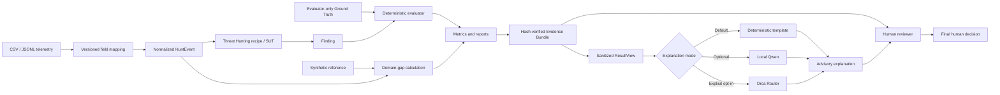
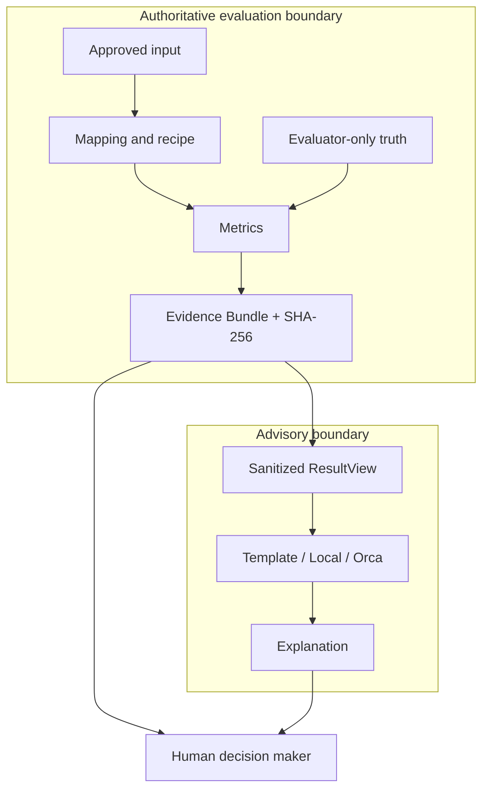
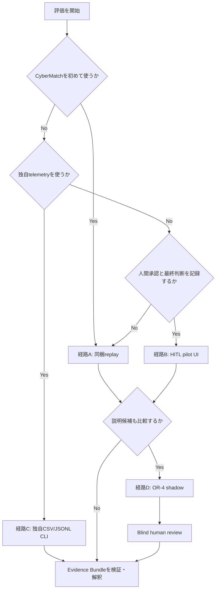
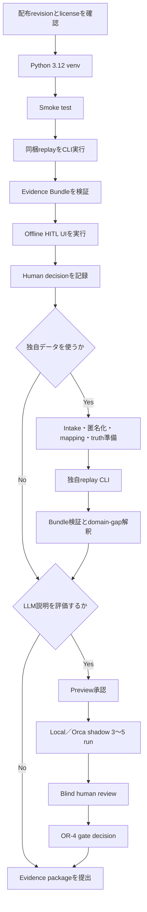

# CyberMatch Framework 外部評価実行手順書

**文書版:** 1.0

**作成日:** 2026-09-15

**対象:** CyberMatch Framework v1.0.1およびOR-0〜OR-4／LOCAL-1までの実装

**想定読者:** 外部評価者、共同研究者、導入検討者、セキュリティ検証担当者

**目的:** リポジトリの取得から、評価実行、Evidence Bundle検証、Human-in-the-Loop判断、任意のLLM shadow比較までを再現可能にする

---

## 1. この手順書で実行できること

本手順書では、外部利用者が次の4つの実行経路から目的に合うものを選択できる。

| 経路 | 主な目的 | 入力 | UI | 外部通信 | 推奨する最初の利用 |
|---|---|---|---:|---:|---:|
| A. 同梱replay再現 | CyberMatchの評価・証跡生成を最短で確認 | 同梱匿名化OCSF | 不要 | 不要 | **最初に必ず実施** |
| B. HITL pilot | 人間承認→評価→説明→最終判断を体験 | 同梱固定catalog | Streamlit | 既定なし | Aの次 |
| C. 独自telemetry評価 | 自組織のCSV／JSONLを評価 | 承認・匿名化済みデータ | 現時点ではCLI | 不要 | mapping準備後 |
| D. LLM shadow比較 | template／local Qwen／Orcaの説明品質比較 | Bで生成した`pilot_result.json` | reviewはartifact | 選択式 | A・B完了後 |

### 1.1 現時点の重要な境界

| 項目 | 現在の対応状況 |
|---|---|
| Python | 3.12以上 |
| 同梱replay | OCSF形式の匿名化済みagentic boundary escape fixture |
| Pilot UI | 同梱replay、mapping、recipe、scenarioに固定 |
| 独自CSV／JSONL | CLIの`run_external_replay.py`で対応 |
| 対応mapping standard | `custom`、`cybermatch`、`opentelemetry`、`ocsf`、`ecs` |
| Evidence class | 標準CLIは`replay-backed`が基本 |
| 外部製品連携 | adapter contractはあるが、標準CLIはreference in-process SUTを使用 |
| Local LLM | Qwen2.5-1.5B-Instruct Q4_K_Mのみ。主にOR-4 shadow用 |
| Orca Router | 明示設定時のみ。free-only policy、resolved-model allowlistあり |
| LLMの責務 | 説明のみ。metric計算、Ground Truth照合、Evidence検証は行わない |
| 外部公開ready | OR-4完了だけでは不可。OR-5、OR-6が別途必要 |

> **ライセンス:** 本softwareはPolyForm Noncommercial License 1.0.0で提供される。評価開始前に`LICENSE`を確認し、利用目的が許諾範囲に入ることを組織内で確認する。

---

## 2. 評価アーキテクチャ



### 2.1 信頼境界



LLM説明が存在しても、authoritativeな結果はEvidence BundleとCyberMatch evaluatorのmetricである。LLM回答を根拠にmetricを書き換えない。

---

## 3. 実行経路の選び方



推奨順序は`A → B → D`である。独自データを使う場合も、先にAを成功させて環境と出力形式を確認する。

---

## 4. 事前準備

### 4.1 必要条件

| 項目 | 必須／任意 | 要件 |
|---|---|---|
| Git | 必須 | 配布元revisionの取得と識別 |
| Python | 必須 | 3.12以上、64-bit推奨 |
| Disk | 必須 | repository、Python依存、評価出力用の空き容量 |
| Browser | UI利用時 | localhostのStreamlitへ接続可能 |
| Network | 条件付き | 初回依存導入、Qwen download、Orca利用時のみ |
| Qwen model領域 | Local LLM時 | 追加で1,117,320,736 bytes以上 |
| Orca API key | Orca利用時 | repositoryへ保存・commitしない |
| データ利用承認 | 独自データ時 | telemetry、Ground Truth、外部provider送信の各範囲を承認 |

### 4.2 配布revisionを固定する

外部評価者へは、OR-0〜OR-4実装を含むcommit、tag、またはhash一覧付きarchiveを配布する。未commitのworking treeだけを前提にしない。

```powershell
git clone <approved-repository-url> cybermatch-framework
cd cybermatch-framework
git checkout <approved-tag-or-commit>
git status --short
git rev-parse HEAD
```

期待結果:

- `git status --short`が空である。
- `git rev-parse HEAD`の値が評価依頼書のrevisionと一致する。
- archive配布の場合は、配布者が提示したarchive SHA-256と一致する。

### 4.3 Python仮想環境を作る

#### Windows PowerShell

```powershell
python --version
python -m venv .venv
.\.venv\Scripts\Activate.ps1
python -m pip install -r requirements-dev.lock
python -m pip install --no-deps -e .
```

#### Linux／macOS

```bash
python3 --version
python3 -m venv .venv
source .venv/bin/activate
python -m pip install -r requirements-dev.lock
python -m pip install --no-deps -e .
```

`requirements-dev.lock`はテスト、Threat Hunting、Streamlit UIを含む再現用環境である。coreだけを組み込む場合は`requirements.lock`を使えるが、本手順の初回評価では`requirements-dev.lock`を推奨する。

### 4.4 環境smoke test

```powershell
python scripts\run_tests.py --smoke
```

Linux／macOSではpath separatorを`/`に置き換える。

合格条件:

- process exit codeが0。
- pytest failureが0。
- compile errorが0。
- warningがあっても、結果末尾のfailed件数が0。

Phase 3部分だけを追加確認する場合:

```powershell
python scripts\run_tests.py --phase phase3
```

---

## 5. 経路A: 同梱replayで評価を再現する

この経路は外部API、LLM、local modelを使わない。CyberMatchのmapping、Threat Hunting、Ground Truth分離、domain gap、Evidence Bundle生成を一度に確認できる。

### 5.1 入力セット

| 種別 | Path | 意味 |
|---|---|---|
| Telemetry | `replays/anonymized/ocsf_boundary_escape_v1.jsonl` | 匿名化済みOCSF形式の観測event |
| Mapping | `mappings/telemetry/ocsf_security_finding_v1.json` | OCSF fieldからHuntEventへの変換 |
| Recipe | `recipes/threat_hunting/agentic_boundary_pressure_v1.json` | tool probe→coordination→egressのsequence |
| Ground Truth | `replays/anonymized/ocsf_boundary_escape_v1.ground_truth.json` | evaluator-only label |
| Synthetic reference | `replays/synthetic_reference/agentic_boundary_pressure_v1.json` | domain gap比較基準 |

### 5.2 一意な評価IDを決める

output pathは既に存在するとfail-closedで停止する。過去結果を上書きせず、一意なIDを使う。

例:

```powershell
$evaluationId = "external-evaluator01-20260915-001"
$outputPath = "output/external-evaluations/$evaluationId"
Test-Path $outputPath
```

`False`であることを確認する。

### 5.3 評価を実行する

```powershell
python scripts\run_external_replay.py `
  --source replays/anonymized/ocsf_boundary_escape_v1.jsonl `
  --mapping mappings/telemetry/ocsf_security_finding_v1.json `
  --recipe recipes/threat_hunting/agentic_boundary_pressure_v1.json `
  --ground-truth replays/anonymized/ocsf_boundary_escape_v1.ground_truth.json `
  --synthetic-reference replays/synthetic_reference/agentic_boundary_pressure_v1.json `
  --output $outputPath `
  --campaign-id phase3-anonymized-replay `
  --scenario-id agentic-boundary-pressure-external `
  --evidence-class replay-backed `
  --seed 0
```

成功時は標準出力へJSON summaryが表示され、exit codeは0になる。失敗時は`failure:`で始まるメッセージがstderrへ出て、exit codeは2になる。

### 5.4 生成物を確認する

```text
output/external-evaluations/<evaluation-id>/
├── evidence_bundle.json
├── replay_manifest.json
├── domain_gap.json
├── phase3_external_validity_summary.json
├── PHASE3_EXTERNAL_VALIDITY_REPORT.md
└── hunting/
    ├── execution_summary.json
    ├── threat_hunting_manifest.json
    ├── hunt_events.jsonl
    ├── findings.json
    ├── findings.csv
    ├── metrics.json
    ├── THREAT_HUNTING_REPORT.md
    └── ground_truth/
        ├── labels.json
        └── matching.json
```

主な確認順序:

1. `PHASE3_EXTERNAL_VALIDITY_REPORT.md`
2. `phase3_external_validity_summary.json`
3. `hunting/THREAT_HUNTING_REPORT.md`
4. `replay_manifest.json`
5. `evidence_bundle.json`

### 5.5 Evidence Bundleを検証する

次のcommandはbundle hashに加え、参照artifactの存在、size、SHA-256を検証する。改変または欠落があれば例外で停止する。

```powershell
python -c "from cybermatch_core.contracts import load_evidence_bundle; bundle=load_evidence_bundle(r'$outputPath'); print(bundle.bundle_hash)"
```

PowerShell変数を使わない場合:

```powershell
python -c "from cybermatch_core.contracts import load_evidence_bundle; bundle=load_evidence_bundle('output/external-evaluations/external-evaluator01-20260915-001'); print(bundle.bundle_hash)"
```

検証後、表示されたbundle hashを評価記録へ転記する。

### 5.6 結果を解釈する

| Metric | 意味 | 注意点 |
|---|---|---|
| `precision` | Findingのうち正解labelと一致した割合 | Ground Truth品質に依存 |
| `recall` | 正解labelのうち検出できた割合 | 未label事象は評価対象外 |
| `f1` | precisionとrecallの調和平均 | 1.0でも本番有効性を証明しない |
| `false_positives_per_100_steps` | 100 step当たりの誤検知 | step定義はmappingの時間粒度に依存 |
| `mean_time_to_detect_steps` | 検知までのstep数 | wall-clock時間ではない場合がある |
| `event_type_js_divergence` | replayとsynthetic referenceのevent分布差 | 0に近いほど類似。普遍的合否閾値ではない |
| `relative_event_count_delta` | referenceに対するevent数差 | データ量差であり品質差とは限らない |
| `evidence_class` | 根拠の種類 | `replay-backed`を本番実証と表現しない |

---

## 6. 経路B: Human-in-the-Loop Pilot UIで実行する

現時点のPilot UIは安全な最初のvertical sliceとして、経路Aと同じ同梱catalogに固定されている。UIから任意path、command、model、endpoint、API keyを入力できない。

### 6.1 既定のoffline modeで起動する

`.env`を作らず、Orca関連環境変数も設定しない。

```powershell
Remove-Item Env:CYBERMATCH_PILOT_LLM_CONFIG -ErrorAction SilentlyContinue
Remove-Item Env:ORCAROUTER_API_KEY -ErrorAction SilentlyContinue
streamlit run apps\pilot_web.py --server.address 127.0.0.1
```

ブラウザでterminalに表示されたlocalhost URLを開く。通常は`http://localhost:8501`である。

### 6.2 UI入力

| UI field | 入力例 | ルール |
|---|---|---|
| What decision do you want to make? | `Is the recorded replay sufficient to justify an internal follow-up evaluation?` | 1〜500文字 |
| Run ID | `partner01-pilot-20260915-001` | 英数字、`_`、`-`。3〜64文字、一意 |
| Approver | 組織内reviewer ID | 1〜100文字。不要な個人情報は書かない |
| Approval checkbox | checked | 表示されたreplay、protocol、evidence class、実行を確認後だけcheck |

`Run approved evaluation`を押す前に、画面のcatalogが次であることを確認する。

| Catalog | 固定値 |
|---|---|
| Source | `ocsf-boundary-escape-fixture-v1` |
| Mapping | `ocsf_security_finding_v1` |
| Recipe | `agentic_boundary_pressure_v1` |
| Scenario | `agentic-boundary-pressure-external` |
| Evidence class | `replay-backed` |

### 6.3 実行結果の確認

画面は次の順に分かれる。

| Section | 種類 | 確認内容 |
|---|---|---|
| Measured CyberMatch result | authoritative | F1、run status、evidence class、bundle hash |
| AI-assisted explanation | advisory | templateまたはaccepted AI回答、limitation、LLM audit |
| Human decision | human-owned | `accept`、`additional_validation`、`reject`と理由 |

offline modeでは`Offline deterministic explanation is active`と表示され、ResultViewは外部送信されない。

### 6.4 最終判断を記録する

| Decision | 使用例 |
|---|---|
| `accept` | このreplayの範囲内で結果を受領する |
| `additional_validation` | 別seed、別dataset、追加Evidenceが必要 |
| `reject` | 根拠不足、条件不一致、重大な誤解がある |

`Decision rationale`へ、Evidenceを確認して判断した理由を書く。`Decision maker`へ組織内識別子を入力し、`Record final human decision`を押す。

同じrun IDに対するdecision fileは一度だけ作成でき、既存fileを上書きしない。

### 6.5 Pilot出力

```text
output/pilot/<run-id>/
├── pilot_result.json
├── human_decision.json
├── evidence_bundle.json
├── replay_manifest.json
├── domain_gap.json
├── phase3_external_validity_summary.json
├── PHASE3_EXTERNAL_VALIDITY_REPORT.md
└── hunting/
```

`pilot_result.json`には次の4領域がある。

| Field | 内容 |
|---|---|
| `run_spec` | 人間承認、decision question、固定catalog、seed |
| `summary` | evaluator summary |
| `result_view` | hash検証後のLLM向けsanitized view |
| `explanation` | answerと非content audit |

`human_decision.json`はbundle hashとLLM audit hashへ結合される。`pilot_result.json`またはEvidence artifactを後から変更すると、decision記録時の検証に失敗する。

---

## 7. 経路C: 独自CSV／JSONLを評価する

### 7.1 この経路を使う前の承認

独自データを扱う前に、`pilots/phase3/PILOT_INTAKE_TEMPLATE.md`をcopyして次を記録する。

- dataset／SUT識別子
- データ利用承認reference
- evidence class
- 比較したいdecision
- evaluator-onlyにする情報
- privacy／security制約
- retentionと削除責任者

production secret、credential、raw payload、不要な個人情報を入力へ含めない。入力は事前に匿名化し、元データとの対応表はCyberMatch repository外で管理する。

### 7.2 入力制約

| 制約 | 現在値 |
|---|---:|
| File形式 | UTF-8 CSVまたはJSON Lines |
| 最大file size | 64 MiB |
| 最大record数 | 100,000 |
| JSONL 1行の最大size | 1 MiB |
| JSONL record | 1行1 JSON object |
| 数値 | finiteのみ。NaN／Infinity不可 |
| Event ID | 正規化後に一意 |
| 時刻 | mapping指定timezoneからUTCへ正規化 |

### 7.3 Mappingを選ぶ

同梱mapping:

| Standard | Path |
|---|---|
| CyberMatch JSONL | `mappings/telemetry/cybermatch_jsonl_v1.json` |
| OpenTelemetry logs | `mappings/telemetry/opentelemetry_logs_v1.json` |
| OCSF | `mappings/telemetry/ocsf_security_finding_v1.json` |
| Elastic ECS | `mappings/telemetry/ecs_event_v1.json` |

mappingの`field_map`は、CyberMatch側field名から入力recordのfield名への対応である。

```json
"field_map": {
  "event_id": "metadata_uid",
  "actor_id": "actor_user_name",
  "event_type": "activity_name",
  "source_node": "src_endpoint_uid",
  "target_node": "dst_endpoint_uid"
}
```

現在のadapterはfield名をliteral keyとして参照する。例えば`event.id`はnested JSON pathではなく、入力object中の`"event.id"`というflat keyを意味する。

#### 必須の正規化情報

| CyberMatch field | 必須条件 | 意味 |
|---|---|---|
| `event_type` | mappingまたはdefaultで必須 | recipeが照合するevent種別 |
| `step` | `step`またはtimestampのどちらか必須 | event順序 |
| `event_id` | 推奨。省略時はstable ID生成 | Evidence参照 |
| `actor_id` | sequence groupingで通常必要 | 行為主体 |
| `source_node`／`target_node` | recipe／Ground Truth依存 | 移動元・移動先 |

`timestamp_field`を使う場合、最古timestampをstep 0とし、経過秒を`step_seconds`で割ってstepへ変換する。

### 7.4 Custom mappingを作る

custom mappingは`src/cybermatch/schemas/telemetry-mapping.schema.json`に従う。例:

```json
{
  "schema_version": "1.0",
  "mapping_id": "partner_flat_events_v1",
  "mapping_version": "1.0.0",
  "standard": "custom",
  "field_map": {
    "event_id": "id",
    "actor_id": "actor",
    "event_type": "type",
    "source_node": "src",
    "target_node": "dst"
  },
  "attribute_map": {
    "severity": "severity"
  },
  "defaults": {
    "signal_class": "telemetry"
  },
  "timezone": "UTC",
  "timestamp_field": "timestamp",
  "timestamp_format": null,
  "step_seconds": 1.0,
  "reject_unknown_fields": false
}
```

custom mappingにはcredentialやendpointを記録しない。versionを上げずに意味を変更しない。

### 7.5 Ground Truthを準備する

Ground TruthはJSON arrayで、各要素は次の形を取る。

```json
{
  "label_id": "truth-001",
  "campaign_id": "partner-campaign-001",
  "label_type": "attacker_success",
  "start_step": 10,
  "end_step": 14,
  "actor_id": "actor-anonymized-7",
  "target_node": 4,
  "severity": "critical",
  "attributes": {
    "event_ids": "event-010,event-011"
  }
}
```

重要事項:

- `campaign_id`を実行時の`--campaign-id`と一致させる。
- `end_step >= start_step`とする。
- actor／node IDをtelemetryの匿名化後IDと一致させる。
- Ground TruthはSUTの実行後にだけevaluatorが読む。
- LLM向けResultViewへGround Truth本文は含まれない。
- `output/hunting`にはevaluator-only artifactが生成されるため、出力directoryへのaccessを制限する。

### 7.6 Recipeとsynthetic referenceを準備する

- recipeは必ず`recipes/threat_hunting/`配下に置く。
- recipeの`event_type`はmapping後の値と一致させる。
- synthetic referenceには同じprotocolで比較可能なmetricsとevent-type distributionを記録する。
- referenceの`evidence_class`は`synthetic-only`とする。
- 比較不能なreferenceを流用せず、差分の意味を評価計画へ記録する。

### 7.7 独自評価を実行する

機密データはGit管理外の承認済みdirectoryへ置き、absolute pathで指定できる。manifestにはrepository外sourceのbasenameとSHA-256が記録される。

```powershell
$evaluationId = "partner01-replay-20260915-001"
$outputPath = "output/external-evaluations/$evaluationId"

python scripts\run_external_replay.py `
  --source D:\approved-evaluation-data\partner01\events.jsonl `
  --mapping D:\approved-evaluation-data\partner01\mapping.json `
  --recipe recipes/threat_hunting/partner_boundary_sequence_v1.json `
  --ground-truth D:\approved-evaluation-data\partner01\ground_truth.json `
  --synthetic-reference D:\approved-evaluation-data\partner01\synthetic_reference.json `
  --output $outputPath `
  --campaign-id partner-campaign-001 `
  --scenario-id partner-boundary-evaluation `
  --evidence-class replay-backed `
  --seed 0
```

成功後は経路Aと同じ方法でEvidence Bundleを検証する。

### 7.8 `external-sut-backed`に関する制限

標準`run_external_replay.py`はreferenceの`InProcessHuntingSUTAdapter`を使用する。この状態で`--evidence-class external-sut-backed`を指定すると意図的に拒否される。

実製品または外部SUTの結果を`external-sut-backed`として扱うには、`ExternalSUTAdapter` contractを実装し、programmatic APIの`run_external_replay_evaluation(..., sut_adapter=...)`へ非reference adapterを渡す必要がある。これは標準CLIのturnkey手順外であり、接続先allowlist、timeout、認証、データ処理、失敗分類を別途reviewする。

---

## 8. 経路D: 説明候補をOR-4 Shadow評価する

Shadow評価は既存`pilot_result.json`のResultViewを使う。評価metricやEvidence Bundleを再計算せず、説明候補だけを同一条件で3〜5回比較する。

### 8.1 候補と利用条件

| Candidate | 利用条件 | 外部通信 | 主な用途 |
|---|---|---:|---|
| Deterministic template | 常時利用可能 | なし | 安全なbaseline／fallback |
| Local Qwen2.5 | pinned GGUFと`llama-cpp-python` | なし | local説明品質比較 |
| Orca Router | config、API key、送信preview承認 | あり | free router説明品質比較 |

Local Qwenは現時点のPilot UI backendではなく、`run_pilot_shadow.py`で比較する候補である。

### 8.2 完全offlineのtemplate評価

```powershell
python scripts\run_pilot_shadow.py `
  --pilot-result output/pilot/<run-id>/pilot_result.json `
  --output output/pilot/shadow/<shadow-id>-template `
  --runs 3 `
  --skip-local `
  --skip-orca
```

### 8.3 Local Qwenを導入する

Local依存を導入する。

```powershell
python -m pip install -e ".[local-llm]"
```

既に取得済みのmodelから検証付きcopyを行う場合:

```powershell
python scripts\setup_qwen25.py `
  --source D:\approved-models\qwen2.5-1.5b-instruct-q4_k_m.gguf `
  --smoke-test
```

固定sourceからdownloadする場合:

```powershell
python scripts\setup_qwen25.py --download --smoke-test
```

検証される固定値:

| 項目 | 値 |
|---|---|
| Model | Qwen2.5-1.5B-Instruct Q4_K_M |
| 配置先 | `models/local_llm/qwen2.5-1.5b-instruct-q4_k_m.gguf` |
| Size | 1,117,320,736 bytes |
| SHA-256 | `6a1a2eb6d15622bf3c96857206351ba97e1af16c30d7a74ee38970e434e9407e` |

Localだけを比較する:

```powershell
python scripts\run_pilot_shadow.py `
  --pilot-result output/pilot/<run-id>/pilot_result.json `
  --output output/pilot/shadow/<shadow-id>-local `
  --runs 3 `
  --skip-orca
```

### 8.4 Orca送信previewを確認する

Orcaを使う前に、運用configのcopyをreviewする。

| Config項目 | 確認内容 |
|---|---|
| `base_url` | 承認済みOrca endpointだけ |
| `model` | `orcarouter/free` |
| `free_only` | `true` |
| `fallback_models` | 空array |
| `allowed_resolved_models` | 人間が確認した現行free modelだけ |
| `max_retries` | 0〜2 |
| `max_response_bytes` | 組織上限内 |
| `usage_log_path` | repository-relative |

API keyを設定せず、configだけ指定してpreviewを作成できる。

```powershell
$env:CYBERMATCH_PILOT_LLM_CONFIG = "configs/pilot/orcarouter.example.json"

python scripts\run_pilot_shadow.py `
  --pilot-result output/pilot/<run-id>/pilot_result.json `
  --output output/pilot/shadow/<shadow-id>-preview `
  --runs 3 `
  --preview-only
```

`provider_send_preview.json`で次を確認する。

- `contains_api_key`が`false`。
- `request_body.messages`にGround Truth、secret、absolute pathがない。
- `model`が承認routeと一致する。
- `response_format.type`が`json_object`。
- ResultViewの`limitations`と`bundle_hash`が正しい。

### 8.5 Orca API keyをprocessだけへ設定する

```powershell
$env:ORCAROUTER_API_KEY = Read-Host -MaskInput "Orca Router API key"
```

または`.env.example`を`.env`へcopyできるが、`.env`は絶対にcommit、添付、画面共有しない。loaderが許可するkeyは`ORCAROUTER_API_KEY`と`CYBERMATCH_PILOT_LLM_CONFIG`だけである。

### 8.6 3候補を統合比較する

```powershell
python scripts\run_pilot_shadow.py `
  --pilot-result output/pilot/<run-id>/pilot_result.json `
  --output output/pilot/shadow/<shadow-id>-three-candidate `
  --runs 3
```

Qwenを使わずOrcaとtemplateだけを比較する場合は`--skip-local`を追加する。

### 8.7 Shadow出力

```text
output/pilot/shadow/<shadow-id>/
├── provider_send_preview.json
├── shadow_evaluation.json
├── shadow_evaluation.md
├── shadow_blind_review.json
└── shadow_blind_review_key.json
```

| Artifact | 用途 |
|---|---|
| `shadow_evaluation.json` | pass率、fallback、latency、token、cost、flag、全answer |
| `shadow_evaluation.md` | 技術結果の要約 |
| `shadow_blind_review.json` | provider名を隠した人間review packet |
| `shadow_blind_review_key.json` | labelとcandidateの対応。採点完了まで隔離 |
| `provider_send_preview.json` | 実送信bodyと同じnon-secret payload |

人間reviewの実施方法は`OR4_BLIND_HUMAN_REVIEW_PROCEDURE_20260915.md`を参照する。

---

## 9. OrcaをPilot UIで使う場合

送信previewとデータ利用承認が完了した後にだけ起動する。

```powershell
$env:CYBERMATCH_PILOT_LLM_CONFIG = "configs/pilot/orcarouter.example.json"
$env:ORCAROUTER_API_KEY = Read-Host -MaskInput "Orca Router API key"
streamlit run apps\pilot_web.py --server.address 127.0.0.1
```

画面上部が次の状態であることを確認する。

```text
AI explanation enabled by operational configuration: orcarouter / orcarouter/free
```

実行後の表示:

| 状態 | 表示／意味 |
|---|---|
| `accepted` | schemaとgroundingを通過したAI回答 |
| `fallback` + failure class | provider、schema、grounding、policy等で拒否しtemplate表示 |
| resolved model allowlist外 | `policy_denied`でtemplateへ縮退 |
| timeout／transport／429／5xx | bounded retryまたは安全fallback |

fallbackは評価自体の失敗ではない。Measured CyberMatch resultとEvidence BundleはLLMの成否に依存しない。

終了後はprocess環境からsecretを削除する。

```powershell
Remove-Item Env:ORCAROUTER_API_KEY -ErrorAction SilentlyContinue
Remove-Item Env:CYBERMATCH_PILOT_LLM_CONFIG -ErrorAction SilentlyContinue
```

---

## 10. 評価結果の合否判定

### 10.1 技術的な最低確認

| Check | 合格条件 |
|---|---|
| Command exit | 0 |
| Run status | `succeeded` |
| Evidence class | 実際の根拠と一致 |
| Evidence Bundle load | hash／size検証成功 |
| Source／mapping provenance | manifestにpathまたはbasename、SHA-256あり |
| Recipe provenance | ID、version、hashあり |
| Ground Truth separation | evaluator-only |
| Result limitation | replayがlive productionを証明しないと明記 |
| Human approval | Pilot UI利用時100% |
| Human decision | Pilot完了時100% |

### 10.2 LLMを利用した場合

| Check | 合格条件 |
|---|---|
| Ground Truth／secret漏えい | 0件 |
| 架空metric／artifact | 0件 |
| Bundle hash不一致 | 0件 |
| Schema／grounding pass率 | 95%以上 |
| 必須limitation保持 | 100% |
| Human review | 100% |
| 重大な過剰主張 | 採用候補では0件 |

### 10.3 判定の表現

| Evidence class | 言ってよいこと | 言ってはいけないこと |
|---|---|---|
| `synthetic-only` | 合成条件下の再現結果 | 実環境での有効性 |
| `replay-backed` | 記録済みdatasetに対する結果 | live productionでの有効性、製品認証 |
| `external-sut-backed` | 明示adapterと記録条件下の外部SUT結果 | 未観測環境・全構成への一般化 |

F1=1.0は、そのGround Truth、mapping、recipe、dataset、seedの範囲内の測定値である。「完全な防御」「本番導入可能」「全攻撃を検出」と読み替えない。

---

## 11. 外部評価者が提出するEvidence package

評価依頼元へ次を提出する。secretとraw機密データは含めない。

| 区分 | 提出物 |
|---|---|
| 実行環境 | OS、Python version、CyberMatch revision、実行日時、timezone |
| 入力provenance | source ID／hash、mapping ID／hash、recipe ID／version、seed |
| 評価結果 | summary、report、domain gap、Threat Hunting report |
| 完全性 | `evidence_bundle.json`、検証済みbundle hash |
| Human record | intake、approval、human decision |
| LLM利用時 | provider preview、LLM audit、shadow report、blind review、gate decision |
| 例外 | warning、fallback、infrastructure error、逸脱理由 |

推奨する提出用summary:

```markdown
## Evaluation identity
- Evaluator ID:
- CyberMatch revision:
- Python version:
- Executed at:
- Evidence class:

## Inputs
- Source ID / SHA-256:
- Mapping ID / SHA-256:
- Recipe ID / version:
- Scenario ID:
- Campaign ID:
- Seed:

## Results
- Status:
- Precision:
- Recall:
- F1:
- False positives per 100 steps:
- Domain-gap JS divergence:
- Evidence Bundle hash:

## Human conclusion
- Decision:
- Rationale:
- Limitation acknowledged:
- Additional validation required:
```

---

## 12. Securityとdata handling

| Risk | 必須対策 |
|---|---|
| Credential混入 | telemetry、mapping、recipe、notesへsecretを含めない |
| Ground Truth漏えい | SUT入力とLLM ResultViewから分離し、output accessを制限 |
| Path traversal | repository配下のrecipeだけを使い、outputは専用directoryにする |
| Prompt injection | telemetry文字列はuntrusted evidenceとして扱う |
| Provider送信 | preview、利用規約、data residency、retentionを人間承認 |
| Key漏えい | process環境またはGit除外`.env`だけ。log／screenshotへ出さない |
| Output改変 | Evidence Bundle loaderでartifact hashを再検証 |
| Cross-run混同 | run ID、bundle hash、ResultView hashを一緒に記録 |
| 過去結果の上書き | 常に新しいoutput pathを使う |
| 個人情報 | 不要な氏名を避け、組織内IDまたはroleを使う |

`output/`、`.env`、GGUF modelはGit管理外である。評価組織のretention、backup、access controlを別途適用する。

---

## 13. Troubleshooting

| 症状 | 主な原因 | 対応 |
|---|---|---|
| `Python 3.12`未満 | unsupported runtime | Python 3.12以上でvenvを再作成 |
| import error | venv未有効、editable install未実施 | activation後にlockと`--no-deps -e .`を再導入 |
| `output path already exists` | 同じ評価IDを再利用 | 既存結果を削除せず、新run IDを使う |
| mapping missing fields | 入力column名とmapping不一致 | flat key、case、timestamp fieldを確認 |
| duplicate event IDs | `event_id`が重複 | source IDを修正、またはstable ID生成条件を見直す |
| timestamp invalid | format／timezone不一致 | mappingの`timestamp_format`と`timezone`を確認 |
| recipe must be below... | recipeが許可directory外 | `recipes/threat_hunting/`配下へ配置 |
| Evidence Bundle verification failed | artifact改変／欠落 | 元runを保持し、新規runで再生成 |
| UIで実行できない | approval未check、必須入力なし、run ID重複 | formとoutput pathを確認 |
| `human approval is required` | statusがdraft | 内容確認後にUI checkboxをcheck |
| decision already exists | 同じrunにdecision記録済み | 既存decisionを保持。再評価は新run |
| Local Qwen unavailable | GGUF不在／hash不一致／runtime不在 | `setup_qwen25.py --smoke-test`を実行 |
| Orca `policy_denied` | resolved modelがallowlist外 | 勝手に許可せず、現行free catalogを人間review |
| Orca `authentication` | API key不正／未設定 | keyをprocess環境で再設定 |
| Orca `rate_limited` | free tier制限 | `Retry-After`に従う。無い場合はprompt-size条件を確認 |
| Orca `transport`／`timeout` | network／provider障害 | Evidence結果は保持し、template fallbackを使用 |
| Orca `invalid_response` | response contract不一致 | `failure_detail`、provider status、adapter testを確認 |

---

## 14. 外部評価完了チェックリスト

### Environment

- [ ] `LICENSE`を確認し、利用目的が許諾範囲内である。
- [ ] 配布revision／archive hashを記録した。
- [ ] Python 3.12以上の独立venvを使った。
- [ ] `python scripts/run_tests.py --smoke`が成功した。

### Input

- [ ] dataset利用承認を記録した。
- [ ] secretと不要な個人情報を除去した。
- [ ] mapping ID、version、field対応をreviewした。
- [ ] Ground TruthをSUT入力から分離した。
- [ ] recipeのevent typeとmapping後eventが一致する。
- [ ] evidence classを実態より強く設定していない。

### Execution

- [ ] 一意なrun IDと新しいoutput pathを使った。
- [ ] command、seed、scenario、campaign IDを記録した。
- [ ] process exit codeが0だった。
- [ ] Evidence Bundleのload／hash検証に成功した。
- [ ] warning、fallback、失敗を隠さず記録した。

### Human-in-the-Loop

- [ ] 実行前approvalを人間が行った。
- [ ] measured resultとAI explanationを分けて読んだ。
- [ ] limitationを確認した。
- [ ] 最終decisionとrationaleを記録した。
- [ ] AIへの不同意も正常な結果として扱った。

### LLMを使った場合

- [ ] provider send previewを人間が確認した。
- [ ] API keyをartifactへ含めていない。
- [ ] resolved modelがallowlist内だった。
- [ ] schema／grounding／limitation gateを確認した。
- [ ] shadow回答をblind reviewした。
- [ ] OR-4 gate decisionを記録した。

### Handoff

- [ ] CyberMatch revisionとPython versionを記録した。
- [ ] input、mapping、recipe、bundleのSHA-256を記録した。
- [ ] Evidence packageからsecret／raw機密を除外した。
- [ ] retention期限、保存先、access権限を設定した。
- [ ] 結論をevidence classの範囲内で表現した。

---

## 15. 最短command一覧

| 目的 | Command |
|---|---|
| 環境確認 | `python scripts/run_tests.py --smoke` |
| Phase 3確認 | `python scripts/run_tests.py --phase phase3` |
| 同梱replay | `python scripts/run_external_replay.py ...` |
| HITL UI（offline） | `streamlit run apps/pilot_web.py --server.address 127.0.0.1` |
| Qwen検証 | `python scripts/setup_qwen25.py --smoke-test` |
| Shadow preview | `python scripts/run_pilot_shadow.py ... --preview-only` |
| Local shadow | `python scripts/run_pilot_shadow.py ... --skip-orca` |
| Orca shadow | `python scripts/run_pilot_shadow.py ... --skip-local` |
| 3候補shadow | `python scripts/run_pilot_shadow.py ... --runs 3` |
| Bundle検証 | `python -c "from cybermatch_core.contracts import load_evidence_bundle; ..."` |

---

## 16. 関連文書

| 文書 | 用途 |
|---|---|
| `README_JP.md` | 機能概要と代表command |
| `ARCHITECTURE.md` | architectureと依存方向 |
| `DEPENDENCY_POLICY.md` | lock／依存運用 |
| `PUBLIC_API.md` | public API境界 |
| `AGENTIC_SECURITY.md` | Agentic Security contract |
| `pilots/phase3/PILOT_INTAKE_TEMPLATE.md` | 外部pilot受付・承認記録 |
| `OR4_BLIND_HUMAN_REVIEW_PROCEDURE_20260915.md` | OR-4 blind human review |
| `src/cybermatch/schemas/telemetry-mapping.schema.json` | mapping schema |
| `src/cybermatch/schemas/pilot-run-spec.schema.json` | Pilot RunSpec schema |
| `src/cybermatch/schemas/pilot-result-view.schema.json` | ResultView schema |
| `src/cybermatch/schemas/pilot-ai-answer.schema.json` | AIAnswer schema |
| `src/cybermatch/schemas/pilot-llm-audit.schema.json` | LLM audit schema |

---

## 17. 推奨する標準実施順序



この順序を守ることで、環境問題、mapping問題、評価問題、LLM説明問題を別々に切り分けられる。最初から外部providerや独自データを同時に導入しない。
