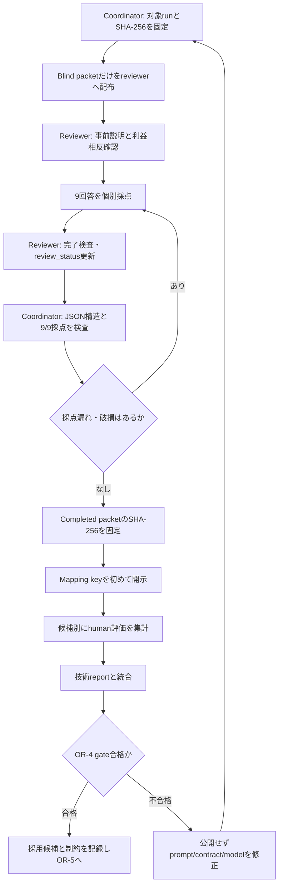
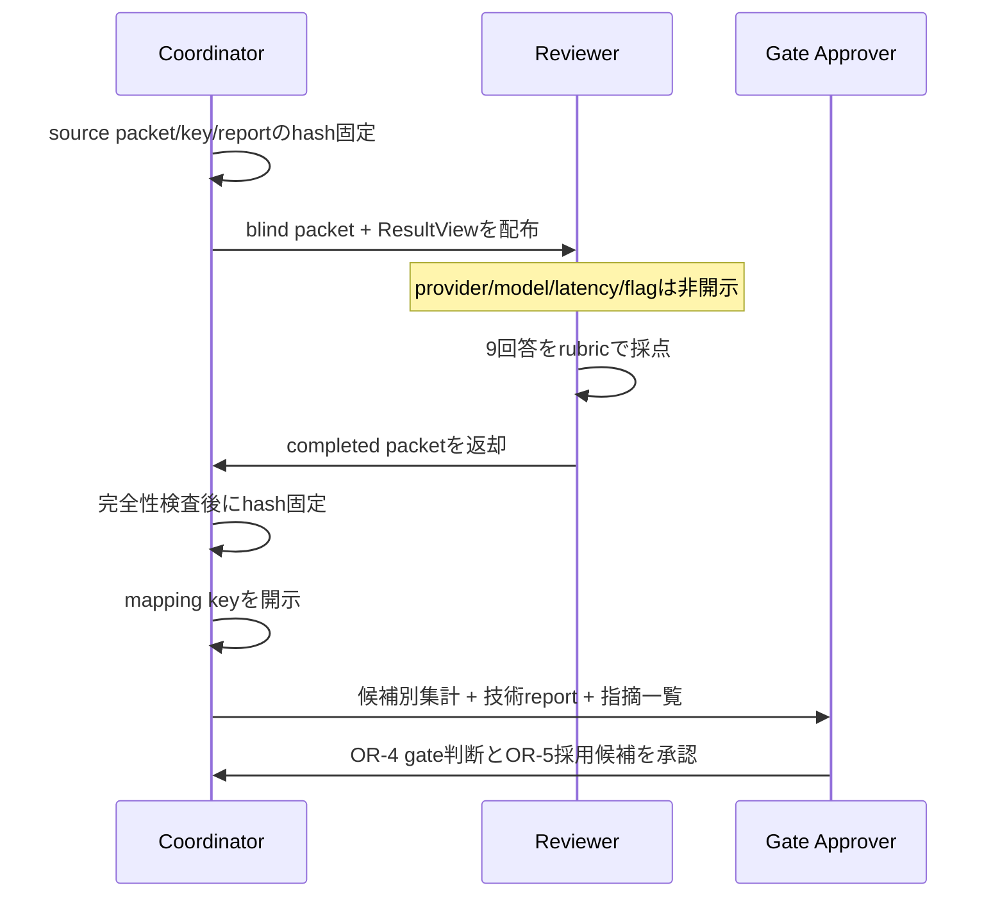
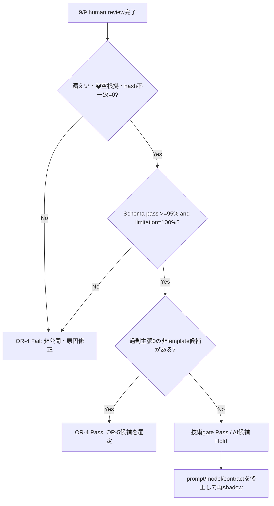

# OR-4 Blind Human Review 実施手順書

**文書版:** 1.0

**作成日:** 2026-09-15

**対象Stage:** OR-4 Shadow evaluation

**対象run:** `output/pilot/shadow/or4-three-candidate-final`

**対象ResultView SHA-256:** `e6877b3b5dba6b3cd9a47d967aff94e9465cc99e60e331ec3c4a55dc34465bb7`

---

## 1. 目的

本手順書は、同一のCyberMatch ResultViewから生成された3候補・各3回答を、人間reviewerが候補の実体を知らずに評価し、OR-4の品質gateを監査可能な形で判定するための運用手順を定める。

このreviewの目的は「好みの文章を選ぶこと」だけではない。次を独立して確認する。

1. 説明が明瞭で、意思決定者が誤読しにくいこと。
2. 主張がResultView内のmetricとartifactへ追跡可能であること。
3. replay結果をlive productionの有効性へ過剰に一般化していないこと。
4. model/provider名を知らない状態でも同じ基準で採点されること。
5. 採点後にだけ候補mappingを開示し、技術指標と人間評価を統合すること。

> **重要:** LLMの説明はadvisoryである。測定結果、Evidence Bundle、ResultViewがauthoritativeであり、reviewerはLLMの推奨を承認する役割ではない。

---

## 2. 対象範囲と完了条件

### 2.1 今回の対象

| 項目 | 値 |
|---|---|
| 候補数 | 3候補（`candidate-A`、`candidate-B`、`candidate-C`） |
| run数 | 各候補3、合計9回答 |
| reviewerに見せるもの | `shadow_blind_review.json`、必要最小限のResultView |
| reviewerに見せないもの | mapping key、provider/model名、latency、cost、自動flag、候補別技術集計 |
| 人間評価項目 | 明瞭性、Evidence追跡可能性、重大な過剰主張、notes |
| 機械評価との統合 | blind採点完了・固定後にcoordinatorが実施 |

### 2.2 OR-4の既定gate

既存計画で定めた必須gateは次のとおりである。

| Gate | 合格条件 | 判定元 |
|---|---:|---|
| Ground Truth／secret漏えい | 0件 | security test、reviewer指摘、coordinator確認 |
| 架空metric／artifact | 0件 | grounding結果、ResultView照合 |
| bundle hash不一致 | 0件 | contract／grounding結果 |
| AIAnswer schema pass率 | 95%以上 | `shadow_evaluation.json` |
| 必須limitation保持率 | 100% | packetとResultView照合 |
| Blind review完了率 | 100%（9/9項目） | completed review packet |

本手順では、人間評価を候補選定に使うため、次の運用基準も追加する。

| 候補適格基準 | 合格条件 |
|---|---:|
| 重大な過剰主張 | 0件／3回答 |
| Evidence追跡可能性 | 中央値4以上、かつ最低点3以上 |
| 明瞭性 | 中央値3以上、かつ最低点2以上 |
| 未採点項目 | 0件 |

OR-4の技術gateとhuman reviewは分けて記録する。技術gateを通過しても、重大な過剰主張が1件でもある候補はOR-5の既定説明候補にしない。

---

## 3. 役割分離

最低2名で実施することを推奨する。同一人物が複数の役割を担う場合でも、blind採点の確定前にmapping keyを開かない。

| 役割 | 主な責務 | 見てよい情報 | 採点前に見てはいけない情報 |
|---|---|---|---|
| Review coordinator | artifact固定、review配布、完了検査、mapping開示、集計 | 全artifact。ただし採点中はkeyを隔離 | reviewerへmappingを伝えない |
| Human reviewer | 9回答を共通rubricで採点 | blind packet、ResultView | key、候補別技術結果、過去の候補別評価 |
| Gate approver | 集計と差戻し／採用判断を承認 | 完了済みpacket、key、技術report | なし。ただしreview採点には介入しない |
| Observer（任意） | 手順逸脱、利益相反、途中開示を記録 | review sessionの操作記録 | reviewerへヒントを与えない |

### 3.1 複数reviewerの場合

- 各reviewerへ同一packetの別copyを配布する。
- ファイル名は例として`shadow_blind_review.reviewer-r01.json`、`shadow_blind_review.reviewer-r02.json`とする。
- reviewer間で採点を相談しない。
- `material_overclaim`が不一致の場合は、理由を残して第三reviewerまたはGate approverが裁定する。
- 平均値だけで重大指摘を消さない。1名でも重大な過剰主張を指摘した場合は要裁定とする。

---

## 4. Review全体フロー



### 4.1 情報の開示タイミング



---

## 5. 使用artifact

すべてrepository rootからの相対pathである。

| Artifact | 用途 | 取扱い |
|---|---|---|
| `output/pilot/shadow/or4-three-candidate-final/shadow_blind_review.json` | reviewerが採点するsource packet | reviewerへ配布可 |
| `output/pilot/shadow/or4-three-candidate-final/shadow_blind_review_key.json` | candidate labelと実候補の対応 | 採点確定まで隔離 |
| `output/pilot/shadow/or4-three-candidate-final/shadow_evaluation.json` | schema、grounding、latency等の技術結果 | 採点確定までreviewerへ非開示 |
| `output/pilot/shadow/or4-three-candidate-final/shadow_evaluation.md` | 技術結果の要約 | 採点確定までreviewerへ非開示 |
| `output/pilot/or4-shadow-input-002/pilot_result.json` | authoritative ResultView | `result_view`部分だけreviewer参照可 |
| `output/pilot/shadow/or4-three-candidate-final/provider_send_preview.json` | provider送信bodyの監査 | Gate approver向け |

### 5.1 今回のsource hash

| Artifact | SHA-256 |
|---|---|
| `shadow_blind_review.json` | `77d73b351decdb0defd2f807a30279d78b8cea7e113ca7ba0eabda485785e01e` |
| `shadow_blind_review_key.json` | `cccc1a48cdb7eb67bc061921583bd3ddca1b60366aeb722e39a2079634ced7ed` |
| `shadow_evaluation.json` | `0942f61c1d4894d64fd915ead58b084bd7ce2be11b368c7429e1c16f584b08ad` |
| `provider_send_preview.json` | `d2ea9b8d1e54ebfefb6da080bd81f34d0d3557242eb4811d38c3359c3af3be2b` |
| `pilot_result.json` | `93e99cda4c30c945c6eed867e430b0f7c57cc8264410423ba47a6bbc42d80a58` |

hashが一致しない場合、reviewを開始しない。意図した再生成であれば、新しいrun ID、hash、理由を記録して本表とは別のreviewとして扱う。

---

## 6. Coordinatorの事前準備

### Step 1: Repository rootへ移動

```powershell
cd D:\source\repos\profilecore\PoC_Projects\cybermatch\work_git\cybermatch-framework
```

### Step 2: Source hashを確認

```powershell
Get-FileHash output\pilot\shadow\or4-three-candidate-final\shadow_blind_review.json -Algorithm SHA256
Get-FileHash output\pilot\shadow\or4-three-candidate-final\shadow_blind_review_key.json -Algorithm SHA256
Get-FileHash output\pilot\shadow\or4-three-candidate-final\shadow_evaluation.json -Algorithm SHA256
Get-FileHash output\pilot\shadow\or4-three-candidate-final\provider_send_preview.json -Algorithm SHA256
Get-FileHash output\pilot\or4-shadow-input-002\pilot_result.json -Algorithm SHA256
```

### Step 3: Reviewer用copyを作る

source packetを直接編集せず、completed用copyを作る。

```powershell
Copy-Item `
  -LiteralPath output\pilot\shadow\or4-three-candidate-final\shadow_blind_review.json `
  -Destination output\pilot\shadow\or4-three-candidate-final\shadow_blind_review.completed.json
```

複数reviewerの場合は`completed`の代わりにreviewer IDを使う。

### Step 4: Keyを隔離する

- reviewerへ渡すフォルダー、メール、画面共有に`shadow_blind_review_key.json`を含めない。
- `shadow_evaluation.json`／`.md`も候補名と技術特性を含むため、採点前には渡さない。
- 本手順書にも実mappingは記載していない。
- coordinatorは採点完了までkeyを開かないことが望ましい。

### Step 5: Reviewer briefingを行う

reviewerへ次の内容だけを伝える。

- 3候補があり、各3回答である。
- ラベル順や文章の長さに優劣の意味はない。
- 全回答は同じResultViewを説明している。
- 文体の好みではなく、明瞭性、Evidence追跡性、過剰主張を評価する。
- AIの推奨に従う必要はなく、不同意は正常なreview結果である。
- 外部検索、provider推測、key閲覧は行わない。

---

## 7. Human reviewerの採点手順

### Step 1: 対象を確認する

packetのトップレベルを確認する。

| Field | 期待値 |
|---|---|
| `schema_version` | `1.0` |
| `bundle_hash` | `0361c6b356bb6cf511bcbd47ffa4e4615e71ee42b60a4c3a7f7996e5b817f80a` |
| `review_status` | 採点開始時は`pending` |
| `items` | 9件 |

各itemには次のfieldがある。

| Field | 意味 | 編集可否 |
|---|---|---|
| `candidate_label` | blind候補ラベル | 編集禁止 |
| `run_index` | 同候補内のrun番号 | 編集禁止 |
| `answer` | 評価対象のAIAnswer | 編集禁止 |
| `review.clarity_score_1_to_5` | 明瞭性 | 整数1〜5を入力 |
| `review.evidence_traceability_score_1_to_5` | Evidence追跡可能性 | 整数1〜5を入力 |
| `review.material_overclaim` | 重大な過剰主張 | JSON booleanの`true`／`false`を入力 |
| `review.notes` | 根拠と指摘 | JSON stringを入力 |

### Step 2: 回答ごとに独立採点する

候補単位で先に総合順位を決めず、9回答を1件ずつ採点する。各回答について次の順で読む。

1. `conclusion`
2. `claims`
3. `limitations`と`limitation_codes`
4. `recommended_human_decision`
5. `bundle_hash`

その後、必要に応じてResultViewの`metrics`、`artifacts[].path`、`limitations`を照合する。

### Step 3: 明瞭性を採点する

| Score | 判定基準 |
|---:|---|
| 1 | 意味が不明、自己矛盾、または意思決定を誤らせる構成 |
| 2 | 大意は分かるが、曖昧・冗長・不自然で再読が必要 |
| 3 | 基本的に理解可能。結論、根拠、制約の一部が弱い |
| 4 | 結論、測定値、制約、次の判断が簡潔に区別されている |
| 5 | 非専門家にも明快で、断定範囲と人間の責任が誤解なく伝わる |

明瞭性では英語表現の好みだけを採点しない。「測定されたこと」と「推奨」が区別できるかを重視する。

### Step 4: Evidence追跡可能性を採点する

| Score | 判定基準 |
|---:|---|
| 1 | ResultViewにないmetric/artifactを主張、または根拠を特定不能 |
| 2 | 数値はあるがmetric名・artifact path・主張の対応が曖昧 |
| 3 | 主な数値をResultViewへ照合できるが、一部の結論がclaimから飛躍 |
| 4 | 主要主張がmetric名、値、artifact pathへ明確に追跡可能 |
| 5 | すべての重要な結論・推奨について根拠と限界が明示的に対応 |

次は減点対象である。

- `claims`にないmetricを`conclusion`や推奨で新たに断定する。
- artifact pathはあるが、どの主張の根拠か分からない。
- replayの結果からlive productionについて結論する。
- F1など単一metricだけで、システム全体の安全性を証明したと扱う。

### Step 5: 重大な過剰主張を判定する

`material_overclaim`は好みではなく、最終判断を変え得る重大な飛躍があるかを表す。

| `material_overclaim` | 判定 |
|---|---|
| `false` | 測定範囲とlimitationを守り、推奨がadvisoryに留まる |
| `true` | 未測定の有効性・安全性・本番適用可否を断定、またはlimitationと矛盾する推奨を行う |

`true`とすべき代表例:

- replayだけで「本番で有効」「導入を承認できる」「安全が証明された」とする。
- 1回の評価またはF1=1.0を一般的な「perfect performance」「guaranteed」と表現する。
- 必須limitationを書きながら、推奨ではそのlimitationを実質的に無視する。
- ResultViewにない因果関係、攻撃防止能力、将来性能を断定する。
- 人間の追加確認なしに最終承認を促す。

`true`にしなくてもよい例:

- replay上でF1=1.0だった、と範囲を限定して述べる。
- live validationが必要、と明示して追加検証を提案する。
- 人間へEvidence確認や再評価を推奨する。

### Step 6: Notesを記入する

notesは最低でも採点根拠を1文記録する。特に次の場合は具体的な文言またはfieldを示す。

- scoreが1または2
- `material_overclaim=true`
- conclusionとrecommended decisionが矛盾
- ResultViewにないmetric／artifactを発見
- secret、Ground Truth、絶対path、内部情報らしき記載を発見

良いnotesの例:

```text
F1=1.0とreplay limitationは明確。一方、recommended_human_decisionが追加検証なしの承認を促しており、limitationと矛盾するためmaterial_overclaim=true。
```

### Step 7: JSONへ入力する

入力例:

```json
"review": {
  "clarity_score_1_to_5": 4,
  "evidence_traceability_score_1_to_5": 4,
  "material_overclaim": false,
  "notes": "F1とartifactの対応が明確で、replay limitationも保持されている。"
}
```

注意事項:

- scoreを文字列`"4"`にしない。JSON整数`4`を使う。
- booleanを文字列`"false"`にしない。JSON boolean `false`を使う。
- notes内の二重引用符は`\"`とescapeする。
- `answer`、`candidate_label`、`run_index`は変更しない。
- 9件すべての採点後、トップレベル`review_status`を`completed`へ変更する。

---

## 8. Reviewerによる提出前確認

### 8.1 JSON parse確認

```powershell
$reviewPacket = Get-Content -Raw `
  output\pilot\shadow\or4-three-candidate-final\shadow_blind_review.completed.json |
  ConvertFrom-Json
$reviewPacket.schema_version
$reviewPacket.review_status
$reviewPacket.items.Count
```

期待値は順に`1.0`、`completed`、`9`である。

### 8.2 未採点確認

```powershell
$reviewPacket.items |
  Where-Object {
    $null -eq $_.review.clarity_score_1_to_5 -or
    $null -eq $_.review.evidence_traceability_score_1_to_5 -or
    $null -eq $_.review.material_overclaim -or
    $null -eq $_.review.notes
  } |
  Select-Object candidate_label, run_index
```

出力が0件であること。

### 8.3 Score範囲確認

```powershell
$reviewPacket.items |
  Where-Object {
    $_.review.clarity_score_1_to_5 -notin 1,2,3,4,5 -or
    $_.review.evidence_traceability_score_1_to_5 -notin 1,2,3,4,5
  } |
  Select-Object candidate_label, run_index
```

出力が0件であること。

### 8.4 完了packetのhash固定

```powershell
Get-FileHash `
  output\pilot\shadow\or4-three-candidate-final\shadow_blind_review.completed.json `
  -Algorithm SHA256
```

このhash、reviewer ID、review日時、使用したsource packet hashをcoordinatorへ渡す。

---

## 9. Coordinatorによる受領検査

mapping keyを開く前に、次を確認する。

| Check | 合格条件 |
|---|---|
| JSON parse | 成功 |
| `schema_version` | `1.0` |
| `bundle_hash` | source packetと一致 |
| item数 | 9 |
| candidate/run組 | A/B/Cそれぞれrun 0/1/2 |
| score | すべて整数1〜5 |
| `material_overclaim` | すべてboolean |
| notes | すべて記入済み |
| `review_status` | `completed` |
| answer本文 | source packetから変更なし |
| blind維持 | reviewerが採点前にmappingを見ていない |

answer本文の改変が疑われる場合、source packetとcompleted packetの`answer`だけを比較する。差分があれば採点結果を破棄せず「無効」と記録し、clean copyで再reviewする。

---

## 10. Unblindingと候補別集計

受領検査とcompleted packetのhash固定が終わった後に限り、coordinatorは`shadow_blind_review_key.json`を開く。

### 10.1 Unblinding後に作る集計

候補ごとに次を集計する。

| 指標 | 集計方法 |
|---|---|
| clarity | 3回答の中央値、最小値、各score |
| evidence traceability | 3回答の中央値、最小値、各score |
| material overclaim | `true`件数と該当run |
| reviewer notes | 要約せず原文を保持し、別に論点分類 |
| schema／grounding pass率 | `shadow_evaluation.json`から取得 |
| fallback数 | `shadow_evaluation.json`から取得 |
| latency | 平均値。品質gate通過後の二次指標 |
| cost／resource | 取得できた値だけ。欠測値を0とみなさない |
| output diversity | `unique_output_count` |
| automated flags | blind採点後にhuman指摘と照合 |

### 10.2 集計表template

`shadow_blind_review_summary.md`を作り、次の表を埋める。

| Candidate | Clarity median/min | Traceability median/min | Overclaims | Schema/grounding | Fallbacks | Mean latency | Eligible for OR-5 |
|---|---:|---:|---:|---:|---:|---:|---|
| candidate actual name 1 |  |  |  |  |  |  | Yes/No |
| candidate actual name 2 |  |  |  |  |  |  | Yes/No |
| candidate actual name 3 |  |  |  |  |  |  | Yes/No |

### 10.3 順位付けルール

候補を次の順で評価する。

1. 漏えい、架空根拠、bundle不一致がある候補を失格にする。
2. 重大な過剰主張が1件以上ある候補をOR-5既定候補から外す。
3. schema／grounding pass率95%未満、limitation保持率100%未満を外す。
4. 残った候補をEvidence追跡可能性の中央値で比較する。
5. 同点なら明瞭性の中央値、次に最低点で比較する。
6. 品質が同等の場合だけlatency、cost、local運用性、出力安定性を比較する。

高速・低コストであっても、安全性やEvidence追跡性の不足を相殺してはならない。

---

## 11. OR-4 Gate判定



### 11.1 判定区分

| 判定 | 条件 | 次のaction |
|---|---|---|
| Pass | 必須gateすべて合格し、適格な非template候補あり | OR-5内部pilotへ進む |
| Conditional Pass | 必須gate合格だが、人間評価に軽微な改善点あり | 制約とmonitoring条件を付けてOR-5へ進む |
| Technical Pass / AI Hold | contractは合格したが全AI候補に重大な過剰主張等あり | templateを維持し、AI候補を修正・再評価 |
| Fail | 漏えい、架空根拠、hash不一致、schema未達、review不成立 | 公開せず原因修正後に新run |

### 11.2 Gate decision record

`or4_gate_decision.md`へ最低限次を記録する。

| Field | 記録内容 |
|---|---|
| Decision ID | 例: `OR4-20260915-001` |
| 対象run | `or4-three-candidate-final` |
| ResultView hash | 対象hash |
| Source packet hash | 採点前hash |
| Completed packet hash | 採点後hash |
| Reviewer | IDまたは組織内識別子 |
| Review日時 | timezone付き日時 |
| Blind維持 | Yes/No、逸脱内容 |
| Gate結果 | Pass／Conditional／Hold／Fail |
| 採用候補 | 実候補名、またはNone |
| 不採用理由 | 候補ごとの理由 |
| OR-5制約 | monitoring、fallback、利用者数、停止条件 |
| Approver | 承認者と承認日時 |

---

## 12. 例外・差戻し手順

| 事象 | 対応 |
|---|---|
| Reviewerがmappingを見た | そのreviewを`unblinded_invalid`として保持し、別reviewerで再実施 |
| JSONが壊れた | sourceから新copyを作り、採点notesを手動で再入力 |
| answer本文を変更した | completed packetを無効化し、clean copyで再review |
| 途中でproviderを推測した | 推測した事実をnotes外のsession記録へ残す。key未確認なら継続可 |
| 架空metric／artifactを発見 | `material_overclaim=true`、notes記載、候補をfail-closedで除外 |
| secret／Ground Truthらしき情報を発見 | review停止、artifactを拡散せずcoordinatorへ連絡 |
| 必須limitation欠落 | traceabilityを減点し、重大性に応じoverclaimをtrue。gateでは保持率未達 |
| 2 reviewerで重大判定が不一致 | 第三reviewerまたはGate approverがblind状態で裁定 |
| 全AI候補が不適格 | template fallbackを維持し、OR-5 AI候補をHold |

差戻し後の再評価では既存packetを上書きしない。新しいrun IDで生成し、旧run、変更理由、新旧hashを記録する。

---

## 13. 監査証跡の保存

OR-4完了時に次を同じdecision recordから参照できるようにする。

```text
output/pilot/shadow/or4-three-candidate-final/
├── provider_send_preview.json
├── shadow_evaluation.json
├── shadow_evaluation.md
├── shadow_blind_review.json                  # source、未採点
├── shadow_blind_review_key.json              # 採点完了まで隔離
├── shadow_blind_review.completed.json        # 人間採点済み
├── shadow_blind_review_summary.md            # unblind後の集計
└── or4_gate_decision.md                      # 最終判定
```

`output/`はGit管理外であるため、組織のretention方針に従う安全な内部artifact storageへcopyする。copy先でも次を保持する。

- 元の相対path
- SHA-256
- 作成者／reviewer／approver
- 作成日時とtimezone
- 対象commitまたはworktree識別情報
- secretを含まないことの確認結果

API key、`.env`、Authorization header、provider response本文のraw dumpはreview証跡へ含めない。

---

## 14. Reviewer用チェックリスト

### Review開始前

- [ ] 対象packetのhashが手順書と一致する。
- [ ] `bundle_hash`が期待値と一致する。
- [ ] item数が9件である。
- [ ] mapping keyと技術reportを見ていない。
- [ ] 評価rubricを読んだ。
- [ ] 利益相反または事前知識をcoordinatorへ申告した。

### 各回答

- [ ] conclusionが測定範囲を守っている。
- [ ] claimのmetric、値、artifact pathをResultViewへ追跡できる。
- [ ] 必須limitationが保持されている。
- [ ] recommendationがadvisoryで、人間の最終判断を残している。
- [ ] live productionへの不当な一般化がない。
- [ ] clarity scoreを入力した。
- [ ] traceability scoreを入力した。
- [ ] material overclaimをbooleanで入力した。
- [ ] notesへ採点根拠を記入した。

### 提出前

- [ ] 9/9回答を採点した。
- [ ] 未入力`null`がない。
- [ ] scoreが整数1〜5である。
- [ ] `review_status`を`completed`へ変更した。
- [ ] JSON parseに成功した。
- [ ] answer、label、run indexを変更していない。
- [ ] completed packetのSHA-256を記録した。

---

## 15. Coordinator用チェックリスト

- [ ] source artifact 5件のhashを固定した。
- [ ] reviewerへkeyと技術reportを配布していない。
- [ ] reviewer ID、開始／終了日時、blind逸脱を記録した。
- [ ] completed packetが9/9完了している。
- [ ] sourceからanswer本文が変わっていない。
- [ ] completed packet hash固定後にmappingを開示した。
- [ ] 候補別human評価を集計した。
- [ ] automated flagはunblind後にだけ照合した。
- [ ] 必須OR-4 gateを判定した。
- [ ] 採用候補とOR-5制約を記録した。
- [ ] approverの承認を得た。
- [ ] 進捗文書を更新した。

---

## 16. この手順で変更してはいけない境界

- Human reviewerはEvidence Bundleの測定値を書き換えない。
- Human reviewerはAIAnswerを修正して合格扱いにしない。
- Human reviewerはprovider/modelを推測して採点を調整しない。
- Coordinatorは不利なrunだけを除外しない。
- 平均scoreで重大な過剰主張や漏えいを相殺しない。
- latencyやcostを安全性・groundingより優先しない。
- OR-4の合格を外部公開readyと同一視しない。外部公開にはOR-5、OR-6が必要である。

---

## 17. 次Stageへの引継ぎ

OR-4がPassまたは承認済みConditional Passになった場合、OR-5へ次を引き継ぐ。

| 引継ぎ項目 | 内容 |
|---|---|
| 採用gateway | 選定候補とfallback |
| 既知の弱点 | human notes、自動flag、失敗例 |
| 表示上の注意 | replay limitation、advisory表示 |
| Monitoring | fallback率、validation failure、latency、不同意率 |
| Stop condition | 重大な誤誘導、漏えい、架空根拠、hash不一致 |
| Pilot範囲 | 内部利用者1〜3名、allowlist済みreplayのみ |
| Decision evidence | completed packet、summary、gate decisionのhash |

OR-5ではAIへの不同意を失敗扱いしない。人間が根拠を確認し、妥当な理由で推奨を覆せることもHuman-in-the-Loopの正常動作として記録する。
