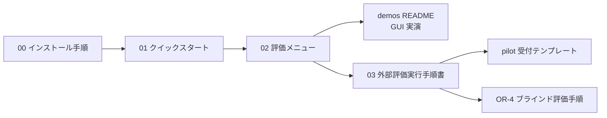
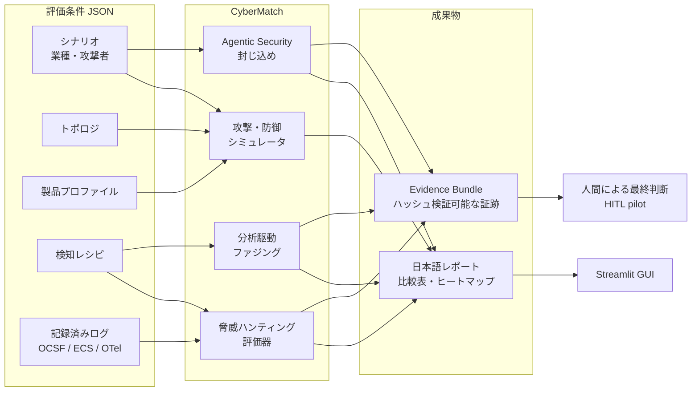
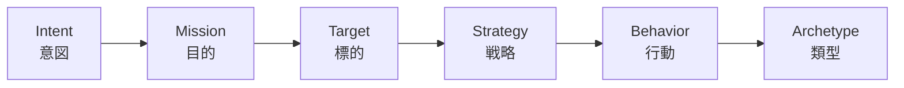

# CyberMatch Framework

**CyberMatch v2.0.0** ・ [English README](README.md) ・ [ドキュメント案内](docs/README.md)

CyberMatch は、**攻撃者の意思決定プロセスを再現**し、防御戦略やセキュリティ製品を比較評価するためのサイバー意思決定シミュレータです。
「検知が発火したか」だけでなく、防御によって攻撃者が**何を信じ、何を選び、何を諦めたか**が変わったかを測ります。

## 手順として読むドキュメント

目的に合わせて、上から順に読んでください。

| 手順 | こんなとき | 読むドキュメント |
|---:|---|---|
| 0 | 環境を導入して動作確認する(前提・用途別のインストール・1.x からの更新) | [docs/00 インストール手順](docs/00_installation.md) |
| 1 | 初めて使う。環境構築 → 評価実行 → 結果確認まで(約15分) | [docs/01 クイックスタート](docs/01_quickstart.md) |
| 2 | どの評価を選ぶか決める。各レポートの読み方を知る | [docs/02 評価メニュー](docs/02_evaluation_menu.md) |
| 3 | GUI でデモを実演する | [scenarios/demos/README.md](scenarios/demos/README.md) |
| 4 | 自組織のログで評価する・HITL pilot を行う・LLM の説明を比較する | [docs/03 外部評価実行手順書](docs/03_external_evaluation_guide.md) |
| 5 | pilot の受付・承認・Evidence Bundle hash を記録する | [pilots/phase3/PILOT_INTAKE_TEMPLATE.md](pilots/phase3/PILOT_INTAKE_TEMPLATE.md) |
| 6 | LLM 説明候補を人手でブラインド評価する(OR-4) | [docs/procedures/OR-4 Blind Human Review 手順書](docs/procedures/or4_blind_human_review_20260915.md) |
| - | AI エージェントの安全性評価の仕組みを知る | [docs/04 Agentic Security](docs/04_agentic_security.md) |
| - | 仕組み・連携・1.x からの移行 | [docs/05 アーキテクチャ](docs/05_architecture.md) / [docs/06 公開API方針](docs/06_public_api.md) / [docs/07 依存関係方針](docs/07_dependency_policy.md) |
| - | 用語を調べる | [docs/08 用語集](docs/08_glossary.md) |



## 3ステップで試す

```powershell
# 1. 環境構築(Python 3.12 以上)
python -m venv .venv
.\.venv\Scripts\Activate.ps1          # Linux / macOS: source .venv/bin/activate
python -m pip install -r requirements-dev.lock
python -m pip install --no-deps -e .

# 2. 評価を実行(環境確認 + ログのリプレイ評価 + 製品比較デモ、約1分半)
python scripts/evaluate.py quickstart
#    正式な評価は全レーン・5 seed(95%信頼区間付き)で: python scripts/evaluate.py all(約7分)

# 3. 表示された EVALUATION_SUMMARY.md を開く
```

インストールの詳細(用途別の方式・動作確認・1.x からの更新)は [docs/00 インストール手順](docs/00_installation.md)、評価の流れは [docs/01 クイックスタート](docs/01_quickstart.md) を参照してください。

## CyberMatch で答えられる問い

| 問い | 評価レーン |
|---|---|
| 攻撃者の目的(mission)によって、有効な防御製品は変わるか? | `product` / `standard` |
| Deception(欺瞞)は、攻撃者の信念・確信度・経路選択を変えたか? | `product`(Deception デモ) |
| 検知レシピは、攻撃を早く・少ない誤検知で捉えられるか? | `hunting` / `replay` |
| 検知結果を防御に反映する閉ループは、攻撃の成功を下げるか? | `hunting` / `resilience` |
| 自律 AI エージェントの境界逸脱を封じ込められるか? | `agentic` / `resilience` |
| 検知ロジックは、入力の揺らぎに対して頑健か? | `fuzzing` |

`python scripts/evaluate.py --list` で全レーンを表示できます。各レーンの詳細と結果の読み方は [docs/02 評価メニュー](docs/02_evaluation_menu.md) にあります。

## 全体像



## 攻撃者の意思決定モデル



| 概念 | 意味 |
|---|---|
| Mission | 攻撃者の目的。金銭獲得 (`profit`)、目標達成 (`achievement`)、継続的な潜伏 (`persistence`)、重要資産の探索 (`critical_hunter`) |
| Belief / Trust | 攻撃者が真だと考えていること / ノード・認証情報・経路を頼り続けるか |
| Deception | デコイ、偽の資産・経路、誤誘導シグナル |
| Coalition | 複数攻撃者の連携(調整コスト・情報損失を伴う) |
| Counter-Deception | 攻撃者の認識そのものを操作する防御 |

用語の一覧は [docs/08 用語集](docs/08_glossary.md) を参照してください。

## 主な機能

| 領域 | 内容 |
|---|---|
| 製品評価 | IDS / IPS / Honeypot / Deception / XDR などの製品プロファイルを、攻撃者の目的別に比較。「最強の製品」を決めるのではなく、**どの防御がどの目的の攻撃者の意思決定をどう変えるか**を理解する |
| シナリオ・ベンチマーク | 業種別シナリオ(金融・病院・クラウド・OT・中小企業)、トポロジ、標準ベンチマーク(500パターン) |
| 脅威ハンティング | 監査可能な検知レシピ、外部テレメトリ(CSV/JSONL)の取り込み、任意の ML 検知器、閉ループ評価 |
| Agentic Security | 自律エージェントの境界逸脱、脅威情報の汚染、共通原因故障、報酬ハックの評価([docs/04](docs/04_agentic_security.md)) |
| ファジング | 攻撃者の目的・意思決定経路に基づく意味的ファジング。決定的な再生と外部SUTアダプタ付き |
| 外部妥当性 | OCSF / ECS / OpenTelemetry 形式の記録ログを同じ評価器で再生し、合成評価との差を測定 |
| HITL pilot | 人間の事前承認 → 評価 → 説明(既定はオフラインのテンプレート、任意でローカル/外部 LLM) → 人間の最終判断 |

実製品・外部API・LLM への接続は必須ではありません。既定の評価はすべてオフラインで完結します。

## GUI ダッシュボード

```powershell
streamlit run apps/streamlit_app.py      # 評価・結果閲覧(サイドバーで日本語を選択)
streamlit run apps/pilot_web.py          # HITL pilot(人間の承認と最終判断を記録)
```

デモの実演手順は [scenarios/demos/README.md](scenarios/demos/README.md)、pilot の運用は [docs/03 外部評価実行手順書](docs/03_external_evaluation_guide.md) を参照してください。

## リポジトリ構成

```text
cybermatch-framework/
├── README.md / README_JP.md   概要(英語 / 日本語)
├── docs/                      ドキュメント(番号順に読む)
├── scripts/                   CLI(evaluate.py = 評価メニューの入口)
├── apps/                      Streamlit GUI、HITL pilot UI
├── cybermatch_core/           安定した公開 API(外部連携はここを使う)
├── cybermatch/                実装本体(ローダー・意思決定モデル・評価ランナーを含む)
├── scenarios/ benchmarks/ topologies/ profiles/ recipes/
│   mappings/ replays/ fuzzing/ protocols/ configs/   評価条件(JSON)
├── pilots/ models/            pilot 受付テンプレート、ローカル LLM 配置場所
├── tests/                     pytest
└── output/                    生成物(Git 管理外)
```

直下の設定ファイルは `pyproject.toml`(pytest の設定を含む)と lock ファイルだけです。各ファイルの役割は [docs/05 アーキテクチャ](docs/05_architecture.md#リポジトリ直下のファイル) を参照してください。

> **v2.0.0 の変更:** 実装パッケージ名を `src.cybermatch` から `cybermatch` に変更し、直下にあった Python モジュール(`scenario_loader.py`、`run_scenarios.py` など)も `cybermatch/` 配下へ移動しました。`from cybermatch import CyberDefenseSimulator` などの旧名は引き続き使えます。それ以外の旧名で import しているコードは [docs/06 公開API方針 3章](docs/06_public_api.md#3-1x-からの移行200-の破壊的変更) の対応表に従って書き換えてください。

## ライセンス

本プロジェクトは **PolyForm Noncommercial License 1.0.0** で提供されます。

研究・教育・評価などの**非商用目的**で利用できます。商用利用には、リポジトリ所有者の別途許諾が必要です。
詳細は [LICENSE](LICENSE) を参照してください。
