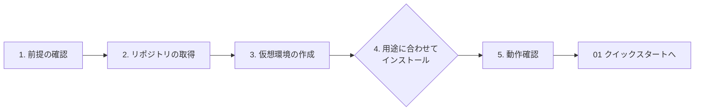

# 00. インストール手順

CyberMatch Framework を手元の PC に導入し、正しく動くことを確認するまでの手順です。
導入後の最初の評価は [01 クイックスタート](01_quickstart.md) に進んでください。



## 1. 前提の確認

| 項目 | 必須/任意 | 要件 | 確認コマンド |
|---|---|---|---|
| Python | 必須 | 3.12 以上(64-bit 推奨) | `python --version` |
| Git | 必須 | リポジトリとサブモジュールの取得 | `git --version` |
| OS | 必須 | Windows 11 / Linux / macOS(CI は Windows と Ubuntu で検証) | - |
| ディスク | 必須 | 依存パッケージと評価出力で 1〜2 GB 程度 | - |
| ネットワーク | 条件付き | 初回の `pip install`、ローカル LLM のダウンロード、外部 LLM 利用時のみ | - |
| ブラウザ | 任意 | GUI(Streamlit)を使う場合 | - |
| ライセンス | 必須 | PolyForm Noncommercial 1.0.0。**非商用目的のみ**。[LICENSE](../LICENSE) を確認 | - |

## 2. リポジトリの取得

```powershell
git clone https://github.com/buildko89/cybermatch-framework.git
cd cybermatch-framework
```

評価対象のバージョンを固定する場合は、タグまたはコミットを指定します。

```powershell
git checkout <タグまたはコミット>
git rev-parse HEAD        # 評価記録に残す
```

### ProfileCore サブモジュール(任意)

`external/profilecore` は、特徴量を ProfileCore へ連携する機能(Phase9.3)でだけ使います。無くても他の評価はすべて動き、連携部分だけ「未接続」として記録されます。

```powershell
git submodule update --init external/profilecore
```

## 3. 仮想環境の作成

システムの Python を汚さないよう、リポジトリ内に仮想環境を作ります。

**Windows (PowerShell)**

```powershell
python -m venv .venv
.\.venv\Scripts\Activate.ps1
```

> `Activate.ps1` の実行がブロックされる場合は、そのウィンドウだけ許可します: `Set-ExecutionPolicy -Scope Process RemoteSigned`

**Linux / macOS**

```bash
python3 -m venv .venv
source .venv/bin/activate
```

以降のコマンドは、仮想環境を有効にした状態(プロンプトに `(.venv)` が付いた状態)で実行します。

## 4. 用途に合わせてインストール

```mermaid
flowchart TD
    Q{何をしたい?}
    Q -->|評価・GUI・テストを一通り<br/>(推奨)| A["lock で完全再現<br/>requirements-dev.lock + -e ."]
    Q -->|シミュレーション本体だけ<br/>組み込みたい| B["core のみ<br/>pip install -e ."]
    Q -->|GUI と ML ハンティングを<br/>使いたい| C["pip install -e .[hunting,ui]"]
    Q -->|ローカル LLM で<br/>説明を比較したい| D["上記 + pip install -e .[local-llm]"]
```

| 方式 | コマンド | 含まれるもの | 用途 |
|---|---|---|---|
| **推奨: lock で完全再現** | `python -m pip install -r requirements-dev.lock`<br>`python -m pip install --no-deps -e .` | 本体 + scikit-learn + Streamlit + pytest / build / pip-tools(バージョン固定) | 評価者・開発者。本書と各ガイドはこの環境を前提にしています |
| core のみ | `python -m pip install -e .` | NumPy, Matplotlib, CVXPY, jsonschema | 他システムへの組み込み |
| GUI + ML ハンティング | `python -m pip install -e ".[hunting,ui]"` | core + scikit-learn + Streamlit | 評価と GUI だけ使う |
| 開発 | `python -m pip install -e ".[hunting,ui,dev]"` | 上記 + テスト・ビルドツール | lock を使わずに開発 |
| ローカル LLM を追加 | `python -m pip install -e ".[local-llm]"` | llama-cpp-python | OR-4 shadow 比較(任意) |

- `-e`(editable)でインストールすると、リポジトリのコードを編集した内容がそのまま反映されます。評価・開発では `-e` を使ってください。
- lock ファイルの運用ルールは [07 依存関係方針](07_dependency_policy.md) を参照してください。

## 5. 動作確認

次の4つがすべて成功すれば、インストールは完了です。

| # | 確認内容 | コマンド | 期待結果 |
|---:|---|---|---|
| 1 | パッケージを読み込める | `python -c "import cybermatch_core, cybermatch; print(cybermatch_core.__version__)"` | `2.0.0` のようなバージョンが表示される |
| 2 | テストが通る | `python scripts/run_tests.py --smoke` | 最後に `passed` と表示され、`failed` が無い(約20秒) |
| 3 | 同梱データが正しい | `python scripts/validate_assets.py --root .` | `"total": 57` のような JSON が表示される |
| 4 | 評価メニューが表示される | `python scripts/evaluate.py --list` | 8つのレーンとプリセットが表示される |

GUI を使う場合は、次のコマンドで起動し、ブラウザで `http://localhost:8501` が開けることを確認します(終了は `Ctrl+C`)。

```powershell
streamlit run apps/streamlit_app.py
```

確認できたら [01 クイックスタート](01_quickstart.md) の「2. 評価を実行する」へ進んでください。

## 6. 追加の設定(必要な場合のみ)

| やりたいこと | 手順 |
|---|---|
| ローカル LLM(Qwen2.5)を使う | `python scripts/setup_qwen25.py --download --smoke-test`。詳細は [models/local_llm/README.md](../models/local_llm/README.md) |
| 外部 LLM(Orca Router)を使う | `.env.example` を `.env` にコピーして API キーを設定(`.env` は Git 管理外)。手順は [03 外部評価実行手順書 8〜9章](03_external_evaluation_guide.md#8-経路d-説明候補をor-4-shadow評価する) |
| 外部の検知製品をコマンドで接続する | 既定では無効。条件は [fuzzing/allowlists/README.md](../fuzzing/allowlists/README.md) |

## 7. 1.x からの更新

2.0.0 では実装パッケージ名が `src.cybermatch` から `cybermatch` に変わりました。コードを更新したら、**必ず再インストール**してください。

```powershell
git pull
python -m pip install -r requirements-dev.lock
python -m pip install --no-deps -e .
```

| 注意点 | 対応 |
|---|---|
| 古いビルド成果物が残っている | `build/` を削除してから再インストール・ビルドする(古いモジュールが wheel に混入するのを防ぐ) |
| 旧名で import している自作コードがある | [06 公開API方針 3章](06_public_api.md#3-1x-からの移行200-の破壊的変更) の対応表に従って書き換える |
| 研究用スクリプトで `config.json` を使っていた | 2.0 から暗黙に読み込まないため、`--config config.json` を明示する |

## 8. アンインストール

```powershell
python -m pip uninstall cybermatch-framework
deactivate
```

仮想環境ごと削除する場合は、`deactivate` の後に `.venv/` フォルダーを削除します。評価結果は `output/` にあるため、必要なら先に退避してください。

## 9. うまくいかないとき

| 症状 | 主な原因 | 対応 |
|---|---|---|
| `python` が見つからない / 3.11 以下が起動する | PATH の Python が古い | Windows は `py -3.12 -m venv .venv` で作成する |
| `ModuleNotFoundError: No module named 'cybermatch_core'` | 仮想環境が無効、またはインストール前 | 仮想環境を有効にして手順4を実行 |
| `ModuleNotFoundError: No module named 'src'` / `'scenario_loader'` | 1.x の import が残っている | 手順7の対応表で書き換える |
| `pip install` が CVXPY などのビルドで失敗 | Python 3.12 以外、または 32-bit | 64-bit の Python 3.12 で仮想環境を作り直す |
| `run_tests.py --smoke` が `timeout` で失敗 | 初回実行でキャッシュ作成に時間がかかった | もう一度実行する。続く場合は `--fast` で個別の失敗を確認 |
| GUI が開かない | ポート 8501 が使用中 | `streamlit run apps/streamlit_app.py --server.port 8502` |
| フォルダーが削除できない(アクセス拒否) | 別のアカウントやサンドボックスが作成したファイル | 管理者の PowerShell で `takeown /f <フォルダー> /r /d y` → `icacls <フォルダー> /grant "$env:USERNAME:F" /t` → 削除 |
