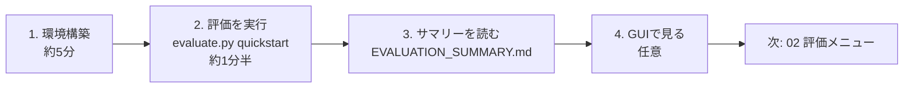

# 01. クイックスタート(約15分)

この文書のゴールは、**環境を作り、1コマンドで代表的な評価を実行し、結果レポートを読むところまで**です。
外部通信・LLM・APIキーは一切使いません。



## 0. 前提

| 項目 | 要件 |
|---|---|
| Python | 3.12 以上(64-bit 推奨) |
| OS | Windows 11 / Linux / macOS(CI は Ubuntu と Windows で検証) |
| ディスク | 依存パッケージと出力用に数百MB |
| ネットワーク | 初回の `pip install` 時のみ |
| ライセンス | PolyForm Noncommercial 1.0.0。**非商用目的のみ**。[LICENSE](../LICENSE) を確認 |

## 1. 環境構築

> 前提条件の確認、用途別のインストール方式(GUI のみ・core のみ等)、1.x からの更新、トラブル対応は [00 インストール手順](00_installation.md) にまとめています。ここでは推奨手順だけを示します。

リポジトリのルートで実行します。

**Windows (PowerShell)**

```powershell
python -m venv .venv
.\.venv\Scripts\Activate.ps1
python -m pip install -r requirements-dev.lock
python -m pip install --no-deps -e .
```

**Linux / macOS**

```bash
python3 -m venv .venv
source .venv/bin/activate
python -m pip install -r requirements-dev.lock
python -m pip install --no-deps -e .
```

`requirements-dev.lock` には、シミュレーション本体・脅威ハンティング用ML・GUI・テストツールがすべて含まれます。
用途別の最小構成は [07 依存関係方針](07_dependency_policy.md) を参照してください。

## 2. 評価を実行する

まず評価メニューを表示します。

```powershell
python scripts/evaluate.py --list
```

続けて、初回向けプリセット `quickstart` を実行します。

```powershell
python scripts/evaluate.py quickstart
```

`quickstart` は次の3レーンを順に実行します(合計 約1分半)。

| レーン | 何を確かめるか | 所要 |
|---|---|---:|
| `check` | インストールが正しいか(smokeテスト約360件)、同梱JSON資産がスキーマに適合するか | 約20秒 |
| `replay` | 匿名化済みOCSFログに対し、検知レシピが正解ラベルをどこまで再現するか。Evidence Bundle のハッシュ検証まで実施 | 数秒 |
| `product` | 攻撃者の目的(mission)が変わると、有効な防御製品プロファイルがどう変わるか(デモ3種) | 約40秒 |

`quickstart` は速さを優先して seed を1つだけ使います。結論が偶然でないか(seed を変えても変わらないか)まで確かめる正式な評価は、全レーンを5つの seed で実行する `python scripts/evaluate.py all`(約7分)を使ってください。

## 3. 結果を読む

実行が終わると、最後に次のように表示されます。

```text
summary: output/evaluations/20260925-173053/EVALUATION_SUMMARY.md
```

出力は実行ごとに独立したフォルダーへ保存され、過去の結果を上書きしません。

```text
output/evaluations/<run-id>/
├── EVALUATION_SUMMARY.md      ← 最初に開く(各レーンの結果・所要時間・読むべきファイル)
├── evaluation_summary.json    ← 同内容の機械可読版
├── logs/                      ← 各コマンドのログ
├── replay/
│   ├── PHASE3_EXTERNAL_VALIDITY_REPORT.md
│   └── evidence_bundle.json
└── product/
    ├── demo_vendor_comparison/
    │   ├── PHASE63_MISSION_PRODUCT_REPORT.md
    │   ├── SEED_ROBUSTNESS_REPORT.md   ← seed を2つ以上使ったときに出力
    │   └── evidence_bundle.json
    ├── demo_deception_value/...
    └── demo_ot_factory_defense/...
```

すべてのレーンの出力フォルダーには `evidence_bundle.json`(入力・出力ファイルのハッシュを記録した証跡)が作られ、`evaluate.py` が改ざん・欠落がないことを自動で検証します。

`EVALUATION_SUMMARY.md` の表の「まず読むファイル」列を上から順に開いてください。
製品比較レポートは日本語で、**結論 → 比較表 → 読み方 → 注意事項** の順に構成されています。

> **解釈の注意:** 結果は同梱の合成シナリオ・記録データ・固定seedに対する**比較評価**です。
> 実製品の認証や、本番環境での有効性を示すものではありません。「この条件では」「このmissionでは」と範囲を付けて表現してください。

## 4. GUIで見る(任意)

```powershell
streamlit run apps/streamlit_app.py
```

ブラウザで `http://localhost:8501` を開き、サイドバーで **日本語** を選びます。

| 画面 | できること |
|---|---|
| シナリオ | 評価条件(JSON)の確認・読み込み |
| 製品 | 比較対象の防御製品プロファイルの確認 |
| 実行 | デモシナリオの一括適用と評価実行 |
| 結果 | 結論・比較表・ヒートマップ・レポートのダウンロード |
| Threat Hunting | 18ケースのハンティングベンチマーク、レシピ調整、証跡タイムライン |
| Agentic Security | 自律エージェントの境界逸脱タイムラインと封じ込めアクションの再生 |

デモの実演手順は [scenarios/demos/README.md](../scenarios/demos/README.md) にまとめています。

## 5. うまくいかないとき

| 症状 | 対応 |
|---|---|
| `ModuleNotFoundError` | 仮想環境を有効化してから手順1の2つの `pip install` を再実行 |
| `run directory already exists` | `--run-id` を省略する(時刻で自動採番)か、別のIDを指定 |
| レーンが `NG` になった | `EVALUATION_SUMMARY.md` の「失敗したレーン」と `logs/<lane>-<n>.log` を確認 |
| 文字化けする(Git Bash など) | PowerShell で実行するか、`PYTHONIOENCODING=utf-8` を設定 |
| コマンドの中身を確認したい | `python scripts/evaluate.py all --dry-run` で実行予定のコマンドだけを表示 |

## 次に読む

- 各レーンの詳しい読み方・個別コマンド → [02 評価メニュー](02_evaluation_menu.md)
- 自組織のデータで評価したい → [03 外部評価実行手順書](03_external_evaluation_guide.md)
