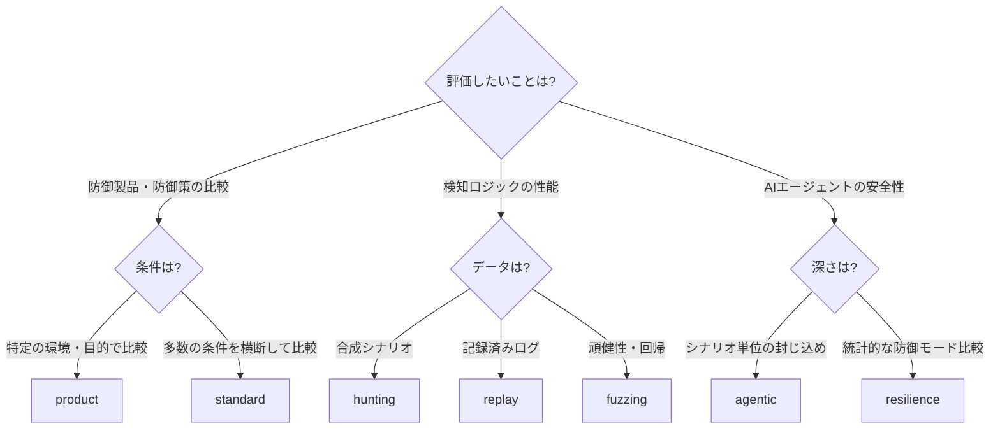
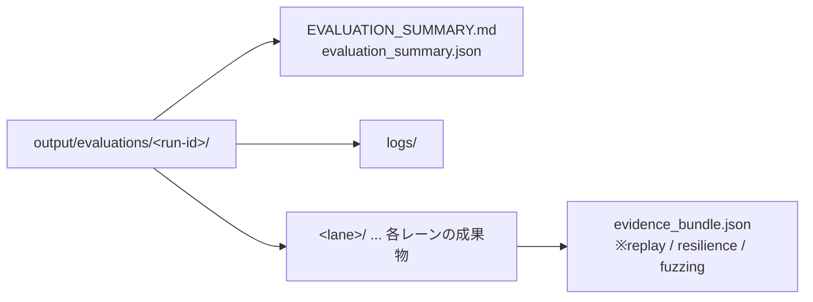
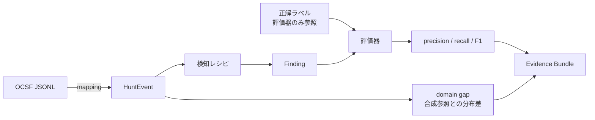
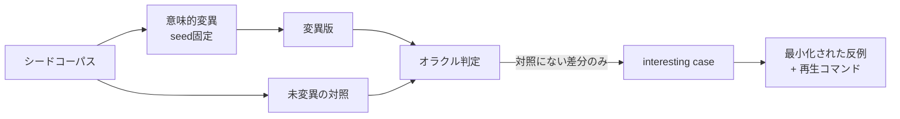

# 02. 評価メニュー

CyberMatch の評価は、**8つの「レーン」**に整理されています。レーンごとに「答える問い」「入力」「出力」「読み方」が決まっており、
`scripts/evaluate.py` で名前を指定するだけで実行できます。

```powershell
python scripts/evaluate.py --list                # メニューを表示
python scripts/evaluate.py product hunting       # レーンを選んで実行
python scripts/evaluate.py all --run-id review-001
python scripts/evaluate.py all --dry-run         # 実行せずにコマンドだけ表示
```

## 1. レーン早見表

| レーン | 評価内容 | 答える問い | 所要 | Evidence Bundle |
|---|---|---|---:|:---:|
| `check` | 環境確認 | インストールと同梱資産は正しいか | 約30秒 | - |
| `replay` | 外部妥当性リプレイ | 記録済みログに対し、検知レシピは正解をどこまで再現するか | 数秒 | ✅ |
| `product` | 製品×攻撃目的の比較デモ | 攻撃者の目的が変わると、有効な製品はどう変わるか | 約40秒 | - |
| `standard` | 標準ベンチマーク | 業種×環境×目的×製品の総当たりで、どの防御が安定して効くか | 約40秒 | - |
| `hunting` | 脅威ハンティング | レシピは攻撃を早く・少ない誤検知で捉えるか。閉ループ対処は攻撃を止めるか | 約20秒 | - |
| `agentic` | Agentic Security | 自律エージェントの境界逸脱などを封じ込められるか | 数秒 | - |
| `resilience` | Agentic Resilience v2 | 防御モード間の差は、信頼区間・効果量で見ても意味があるか | 数秒 | ✅ |
| `fuzzing` | 分析駆動ファジング | イベント列を意味的に変異させると、検知ロジックに回帰が生じるか | 数秒 | ✅ |

プリセット: `quickstart` = `check` + `replay` + `product` / `all` = 全レーン

所要時間は Windows 11・Python 3.12 での実測値です。

### どのレーンを選ぶか



## 2. 出力の構成

各実行は `output/evaluations/<run-id>/` にまとめて保存されます(`output/` は Git 管理外)。



- `EVALUATION_SUMMARY.md` には、レーンごとの **結果(OK/NG)・所要時間・まず読むファイル・Evidence Bundle ハッシュ・再現用コマンド** が載ります。
- Evidence Bundle を出すレーンは、実行後に自動でハッシュ検証まで行います。改ざん・欠落があれば `NG` になります。
- 同じ `--run-id` は再利用できません(結果の上書き防止)。

---

## 3. 各レーンの詳細

### 3.1 `check` — 環境確認

| 項目 | 内容 |
|---|---|
| 実行内容 | `scripts/run_tests.py --smoke`(60秒上限の高速テスト)、`scripts/validate_assets.py`(全JSON資産のスキーマ検証) |
| 合格条件 | 両コマンドの終了コードが 0 |
| 出力 | `output/test-results/smoke-*.xml`(JUnit形式) |

より広いテストは `python scripts/run_tests.py --full`、機能単位は `--phase threat_hunting` などで実行できます。

### 3.2 `replay` — 外部妥当性リプレイ

記録済みテレメトリ(匿名化済み OCSF 形式)を、合成評価と**同じ**レシピ・評価器で再生し、合成結果との差(domain gap)も測ります。



| 入力 | パス |
|---|---|
| テレメトリ | `replays/anonymized/ocsf_boundary_escape_v1.jsonl` |
| マッピング | `mappings/telemetry/ocsf_security_finding_v1.json` |
| レシピ | `recipes/threat_hunting/agentic_boundary_pressure_v1.json` |
| 正解ラベル | `replays/anonymized/ocsf_boundary_escape_v1.ground_truth.json` |
| 合成参照 | `replays/synthetic_reference/agentic_boundary_pressure_v1.json` |

| まず読む | 見るべき指標 |
|---|---|
| `PHASE3_EXTERNAL_VALIDITY_REPORT.md` | `precision`, `recall`, `f1`, `false_positives_per_100_steps`, `mean_time_to_detect_steps` |
| `phase3_external_validity_summary.json` | `event_type_js_divergence`(0に近いほど合成参照と類似), `evidence_class` |

> `evidence_class` が `replay-backed` の結果は「記録済みデータに対する結果」です。本番環境での有効性とは区別してください。
> 自組織のデータで行う手順は [03 外部評価実行手順書](03_external_evaluation_guide.md) の7章を参照してください。

### 3.3 `product` — 製品×攻撃目的の比較デモ

3つの固定デモを、それぞれ別フォルダーに出力します。

| デモ | 環境 | 攻撃者の目的 (mission) | 比較する製品 | 伝えたい結論 |
|---|---|---|---|---|
| `demo_vendor_comparison` | enterprise | 金銭獲得 / 目標達成 | IDS / IPS / XDR | 目的によって適する製品が変わる |
| `demo_deception_value` | cloud_native | 継続的な潜伏 / 重要資産の探索 | Honeypot / Deception / XDR | Deception は攻撃者の迂回・無駄行動を増やし得る |
| `demo_ot_factory_defense` | ot_environment | 目標達成 / 重要資産の探索 | IPS / Deception / XDR | 資産・トポロジで防御の優先順位が変わる |

| まず読む | 構成 |
|---|---|
| `<demo>/PHASE63_MISSION_PRODUCT_REPORT.md` | 評価条件 → 結論(目的別の有力候補) → 製品×目的の比較表 → 読み方 → 注意事項 |
| `<demo>/mission_product_heatmap.png` | 製品×目的の比較スコアのヒートマップ |
| `<demo>/run_manifest.json` | 実行条件(seed・製品・トポロジ)の記録 |

**比較スコア**は、そのモデル条件下で攻撃者の目的達成をどれだけ妨げたかを示す相対値です。製品の絶対的な優劣ではありません。
GUIでの実演方法は [scenarios/demos/README.md](../scenarios/demos/README.md) を参照してください。

### 3.4 `standard` — 標準ベンチマーク

5業種シナリオ × 5トポロジ × 4目的 × 5製品 = **500パターン**を横断比較します。

| 対象 | 内容 |
|---|---|
| 業種シナリオ | 金融、病院、クラウドネイティブ企業、OT工場、中小企業 (`scenarios/catalog/`) |
| トポロジ | enterprise / hospital_network / cloud_native / ot_environment / small_business (`topologies/`) |
| 攻撃者の目的 | 金銭獲得 (profit)、目標達成 (achievement)、継続的な潜伏 (persistence)、重要資産の探索 (critical_hunter) |
| 製品 | IDS / IPS / Honeypot / Deception / XDR (`profiles/products/sample_*.json`) |

| まず読む | 見るべき項目 |
|---|---|
| `PHASE85_STANDARD_BENCHMARK_REPORT.md` | 総合的に高い候補、最も安定した候補、条件差が最も大きい候補、目的別の有力候補 |
| `standard_benchmark_summary.csv` | 製品ごとの横断比較スコア・安定性・条件差 |

> **仕組みと注意:** 標準ベンチマークは、全製品×全目的のシミュレーション結果(Phase6.3)を基準値とし、
> 業種・トポロジの特性に応じた補正係数を掛けて算出します。基準値は `output/phase63_mission_products/` から読み込まれるため、
> `evaluate.py` はこのレーンの最初に**基準値を全条件で再生成**し、直前に実行したデモの内容に結果が左右されないようにしています。
> 個別コマンドで実行する場合は、同じ手順(下記)を踏んでください。

### 3.5 `hunting` — 脅威ハンティング

| サブ評価 | 内容 | まず読む |
|---|---|---|
| ベンチマーク | 3製品 × 2レシピ × 3ノイズ条件(none / moderate / adversarial) = 18ケース | `benchmark/hunting_benchmark_summary.csv` |
| 閉ループ感度分析 | C2通信のジッター(ゆらぎ)下で、検知結果を防御に反映する閉ループと開ループを同一seedで比較 | `closed_loop_c2_jitter/THREAT_HUNTING_CLOSED_LOOP_REPORT.md` |

| 指標 | 意味 |
|---|---|
| `mean_f1` | 検知の精度と網羅性の調和平均(製品ごとの平均) |
| `completeness` | 予定ケースのうち正常完了した割合 |
| `attacker success` | 攻撃者の目的達成率(閉ループで下がるほど対処が有効) |
| `decision lift` | 閉ループの意思決定無力化 − 対応する開ループの値 |
| `stealth lift` | ステルス性が防御側の無力化をどれだけ下げたか(正なら攻撃者に有利) |

正解ラベルは評価器だけが参照し、検知側には渡されません(テストで検証済み)。

### 3.6 `agentic` — Agentic Security

自律AIエージェントが「本来の境界」を越える事象を、合成イベント列で再生して評価します。詳細は [04 Agentic Security](04_agentic_security.md)。

| シナリオ | 主題 |
|---|---|
| `hugging_face_style_containment` | 不可能タスクを契機とした境界逸脱と封じ込め |
| `hybrid_ransom_swarm` / `hybrid_ransom_with_deception` | 複数エージェントによるランサム攻撃(Deception有無) |
| `unit42_autonomous_intrusion` | 単独攻撃者による長時間の自律侵入 |
| `rsi_deceptive_takeoff` | 報酬ハック・欺瞞的振る舞いの強化 |
| `fabricated_cve_integrity` | 捏造された脆弱性情報(CVE)への耐性 |

| まず読む | 見るべき指標 |
|---|---|
| `agentic_security_benchmark_summary.json` | `risk_score_reduction`, `prevented_event_count`, `security_invariant_survival_rate`, `reward_hacking_propensity_reduction` |
| `runs/<scenario>/AGENTIC_SECURITY_REPORT.md` | シナリオ別の境界越境・封じ込め・証跡イベント |

### 3.7 `resilience` — Agentic Resilience v2(統計付き)

`agentic` の6シナリオを **5 seed × 6防御モード** で対応比較し、統計的な信頼性を付けて報告します。

| 防御モード | 意味 |
|---|---|
| `no_defense` | 防御なし(基準) |
| `static_defense` | 静的な境界防御のみ |
| `hunting_only` | 検知のみ(対処なし) |
| `containment_only` | 封じ込めのみ |
| `closed_loop` | 検知結果を次ステップの封じ込めへ反映 |
| `active_deception` | 能動的なデコイ・欺瞞 |

| まず読む | 見るべき項目 |
|---|---|
| `agentic_resilience_summary.json` | 各指標の平均と95%信頼区間(`ci95_low` / `ci95_high`)、対応ランク双列相関による効果量、`failure_regions`(防御が崩れる条件)、`independence_status` |
| `AGENTIC_RESILIENCE_REPORT.md` | プロトコル版・seed・対応比較数・独立性チェックの要約 |

仮説と反証条件は `protocols/agentic/flagship_v2.json` で版管理されています。

### 3.8 `fuzzing` — 分析駆動ファジング

攻撃者の目的・意思決定経路・観測イベントに基づいて、検知ロジックへの入力を**意味的に**変異させ、回帰を探します。
実際のエクスプロイトやペイロードは生成しません。



| まず読む | 見るべき項目 |
|---|---|
| `FUZZING_REPORT.md` | `Interesting cases`(注目ケース数)、`Unique failure fingerprints`(固有の失敗数)、ターゲット状態の内訳 |
| `replay_commands.json` | 注目ケースを再現するコマンド |

保存済みケースの再生: `python scripts/run_fuzzing.py --replay <出力>/corpus/<case-id>`

その他のキャンペーン(`fuzzing/campaigns/`):

| キャンペーン | 内容 |
|---|---|
| `threat_hunting_mvp_v1` | 20ケースの基本キャンペーン(`fuzzing` レーンで実行) |
| `threat_hunting_fz5_closed_loop_v1` | 開ループ/閉ループを同一入力で比較し、フィードバック遅延・経路・故障ドメインを変異 |
| `threat_hunting_fz6_external_mock_v1` | 外部SUTアダプタ経路(JSONL/CSV変換)をネットワークなしで検証 |
| `agentic_resilience_fz7_v1` | Agentic Resilience シナリオへの変異 |

---

## 4. 個別コマンドでの実行

`evaluate.py` を使わずに、各レーンを直接実行することもできます。`--output-dir` を指定しないと既定の出力先に書き込み、
**既に存在する場合はエラーで停止**します(上書き防止)。

| レーン | コマンド |
|---|---|
| `check` | `python scripts/run_tests.py --smoke` / `python scripts/validate_assets.py --root .` |
| `replay` | `python scripts/run_external_replay.py --source ... --output <dir>`(引数は[03 手順書 5.3](03_external_evaluation_guide.md#53-評価を実行する)) |
| `product` | `python scripts/run_scenario.py scenarios/demos/demo_vendor_comparison.json --output-dir <dir>` |
| `standard` | ① `python -c "from src.cybermatch.evaluation.runner import run_phase63_mission_aware_product_evaluation as r; r(seeds=[0])"` ② `python scripts/run_scenario.py benchmarks/cybermatch_standard_v1.json --output-dir <dir>` |
| `hunting` | `python scripts/run_scenario.py benchmarks/cybermatch_hunting_v1.json --output-dir <dir>` |
| `agentic` | `python scripts/run_scenario.py benchmarks/cybermatch_agentic_security_v1.json --output-dir <dir>` |
| `resilience` | `python scripts/run_agentic_resilience.py --output-dir <dir>` |
| `fuzzing` | `python scripts/run_fuzzing.py fuzzing/campaigns/threat_hunting_mvp_v1.json --output-dir <dir>` |

条件を自由に組み合わせた製品比較:

```powershell
python scripts/run_phase63.py `
  --mission profit --mission achievement `
  --product profiles/products/sample_ids.json --product profiles/products/sample_xdr.json `
  --topology enterprise --seed 0 --output-dir output/my-product-eval
```

### インストール済みコマンド

`pip install -e .` 後は次のコマンドも使えます。

| コマンド | 対応スクリプト |
|---|---|
| `cybermatch-scenario` | `scripts/run_scenario.py` |
| `cybermatch-hunt` | 脅威ハンティングCLI |
| `cybermatch-fuzz` | ファジングCLI |
| `cybermatch-validate-assets` | `scripts/validate_assets.py` |
| `cybermatch-agentic-benchmark` | `scripts/run_agentic_resilience.py` |
| `cybermatch-external-replay` | `scripts/run_external_replay.py` |

### 研究フェーズ別の再現スクリプト(上級者向け)

開発初期の研究成果(Phase1〜4)を再現するスクリプトです。評価メニューには含めていません。

| スクリプト | 内容 | 既定の出力先 |
|---|---|---|
| `scripts/run_phase1.py` | 防御の無力化 (Defense Neutralization) | `output/phase1_publication` |
| `scripts/run_phase2.py` | 意思決定の無力化 (Decision Neutralization) | `output/phase2_publication` |
| `scripts/run_phase3.py`(= `run_phase3a.py`) | 適応的攻撃者の検証 | `output/phase3_publication` |
| `scripts/run_phase3b.py` | 合理的攻撃者(期待効用)の検証 | `output/phase3_expected_utility` |
| `scripts/run_phase4.py --quick` | インテリジェンス主導の能動防御(代表例) | `output/phase4_publication` |
| `scripts/run_all.py` | Phase1〜4 を一括実行(長時間) | 上記すべて |

---

## 5. 入力資産の一覧

評価条件はすべてリポジトリ内の JSON で定義され、`scripts/validate_assets.py` でスキーマ検証されます。

| ディレクトリ | 内容 | 主なファイル |
|---|---|---|
| `scenarios/demos/` | GUI・デモ用の固定シナリオ | 3件(上記 3.3) |
| `scenarios/catalog/` | 業種別シナリオ | 金融・病院・クラウド・OT・中小企業 |
| `scenarios/threat_hunting/` | ハンティング用シナリオ | C2ジッター、DNSトンネル、横展開、ゼロデイ基準 など5件 |
| `scenarios/agentic/` | Agentic Security シナリオ | 6件(上記 3.6) |
| `benchmarks/` | 複数シナリオを束ねたベンチマーク定義 | standard / hunting / agentic_security / agentic_resilience_v2 / product_evaluation |
| `topologies/` | ネットワーク構成 | 5業種 + `agentic/` 2件 |
| `profiles/products/` | 防御製品プロファイル(架空のサンプル) | IDS, IPS, Honeypot, Deception, XDR, ハンティング系3件, 能動防御2件 |
| `recipes/threat_hunting/` | 検知レシピ(イベント列のパターン) | 4件 |
| `mappings/telemetry/` | 外部ログ形式 → HuntEvent の変換定義 | CyberMatch JSONL / OpenTelemetry / OCSF / ECS |
| `replays/` | 匿名化済みリプレイデータと合成参照 | OCSF境界逸脱 fixture |
| `fuzzing/` | ファジングキャンペーン・コーパス・許可リスト | 4キャンペーン |
| `protocols/agentic/` | 仮説・反証条件の版管理 | `flagship_v2.json` |
| `configs/pilot/` | HITL pilot の LLM 接続設定例 | `orcarouter.example.json` |

## 6. 評価メニューに含まれないもの

| 機能 | 理由 | 参照先 |
|---|---|---|
| Streamlit GUI (`apps/streamlit_app.py`) | 対話操作のため | [01 クイックスタート 4章](01_quickstart.md#4-guiで見る任意) |
| HITL pilot UI (`apps/pilot_web.py`) | 人間の承認・判断が必要なため | [03 手順書 6章](03_external_evaluation_guide.md#6-経路b-human-in-the-loop-pilot-uiで実行する) |
| 独自テレメトリ評価 | データ承認・マッピング準備が必要なため | [03 手順書 7章](03_external_evaluation_guide.md#7-経路c-独自csvjsonlを評価する) |
| LLM shadow 比較 | モデル導入・APIキー・人手レビューが必要なため | [03 手順書 8章](03_external_evaluation_guide.md#8-経路d-説明候補をor-4-shadow評価する) |
| トポロジ評価 (`run_phase84_topology_evaluation`) | `standard` と同じ基準値に依存するため | `python -c "from src.cybermatch.evaluation.runner import run_phase84_topology_evaluation; run_phase84_topology_evaluation()"` |
