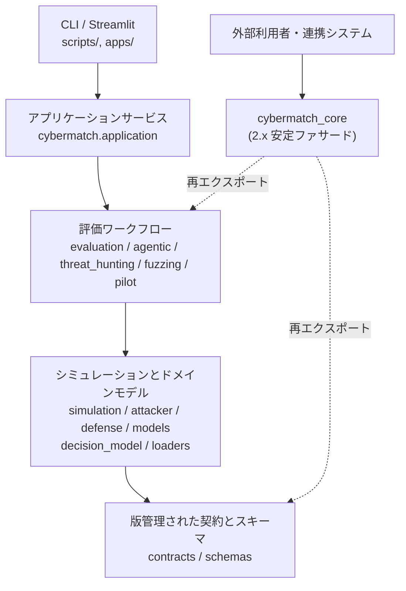
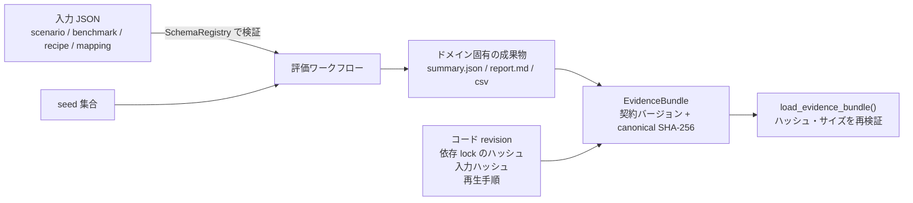
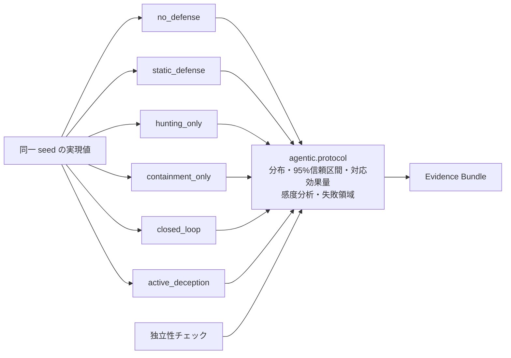

# 05. アーキテクチャ

## 1. 基本方針

CyberMatch は、グラフやシミュレーション履歴だけでなく、**監査可能な証跡 (auditable evidence)** を主な成果物とする評価ワークベンチです。
依存の向きは上位から下位への一方向です。



- `cybermatch_core` パッケージが **2.x 系の安定ファサード**です。実装はすべて `cybermatch` 配下にあります。
- 2.0.0 で実装パッケージ名を `src.cybermatch` から `cybermatch` に変更し、リポジトリ直下の Python モジュールも廃止しました。直下はパッケージ・設定ファイル・ドキュメントだけです。旧名からの移行表は [06 公開API方針 3章](06_public_api.md#3-1x-からの移行200-の破壊的変更) を参照してください。

## 2. ディレクトリと責務

```text
cybermatch-framework/
├── cybermatch_core/        安定ファサード(外部連携はここだけを使う)
├── cybermatch/
│   ├── contracts/          canonical JSON・SHA-256・EvaluationRun・Evidence Bundle・スキーマレジストリ
│   ├── schemas/            版管理された JSON Schema(資産・pilot・mapping 等)
│   ├── simulation/         攻撃・防御シミュレータ本体と純粋な確率演算
│   ├── attacker/ defense/  攻撃者モデル、防御戦略(ILP/MPC)
│   ├── models/ config/     製品プロファイル、シミュレーション設定
│   ├── decision_model/     攻撃者の意思決定モデル(意図推定・行動プロファイル・特徴空間・類型・分類体系・戦略検証・意思決定グラフ)
│   ├── loaders/            シナリオ・ベンチマーク・トポロジ JSON のローダー
│   ├── evaluation/         Phase 別評価ランナー(runner.py)、Phase8.x ベンチマーク(benchmark_suites.py)、
│   │                       seed 頑健性(seed_robustness.py)、統計・成果物 I/O ヘルパー
│   ├── threat_hunting/     防御側ハンティング(レシピ・評価器・外部テレメトリ・閉ループ)
│   ├── agentic/            Agentic Security(封じ込め・学習・完全性ゲート・統計プロトコル)
│   ├── fuzzing/            分析駆動ファジング(変異・オラクル・ターゲット・外部SUT)
│   ├── pilot/              HITL pilot(承認・ResultView・LLM説明・shadow比較)
│   ├── application/        GUI から使うプロセス制御・結果探索
│   ├── visualization/      グラフ描画
│   └── external_sut.py     外部SUT契約とリプレイ評価
├── apps/                   Streamlit GUI(streamlit_app.py + 画面文言 streamlit_text.py)、HITL pilot UI(pilot_web.py)
├── scripts/                CLI エントリポイント(evaluate.py が評価メニューの入口)
├── scenarios/ benchmarks/ topologies/ profiles/ recipes/
│   mappings/ replays/ fuzzing/ protocols/ configs/   … 評価条件(JSON 資産)
├── tests/                  pytest(マーカーで機能別に実行可能)
└── output/                 生成物(Git 管理外)
```

### リポジトリ直下のファイル

2.0 以降、直下には Python モジュールを置かず、ツールが直下にあることを前提とする設定ファイルだけを置きます。

| ファイル | 役割 | 直下に置く理由 |
|---|---|---|
| `pyproject.toml` | パッケージ定義・依存範囲・CLI エントリポイント・pytest 設定(`[tool.pytest.ini_options]`) | Python パッケージングの規格上、直下が必須 |
| `requirements.lock` | 実行時依存の固定版 | Evidence Bundle が依存 lock のハッシュを記録する際にこの位置を参照 |
| `requirements-dev.lock` | 開発・テスト用依存の固定版 | CI のインストールとキャッシュキーがこの位置を参照 |
| `requirements.txt` | `-r requirements.lock` だけを含む互換入口 | 旧来の `pip install -r requirements.txt` 手順との互換 |
| `.env.example` | pilot 用環境変数のひな形(実際の `.env` は Git 管理外) | pilot のローダーが直下の `.env` を読む |
| `.gitignore` / `.gitmodules` | Git の設定 | Git の規約 |
| `LICENSE` / `README.md` / `README_JP.md` | ライセンス・概要 | GitHub が直下を表示 |

`__pycache__/`、`build/`、`dist/`、`*.egg-info/`、`.venv*/`、`output/` はローカルで生成されるもので、Git 管理外です。不要になったら削除して構いません。
ただし `build/` に古いビルドが残っていると wheel に混入することがあるため、**ビルド前には `build/` を削除**してください。

## 3. Phase 1 で設けた境界(構造分離の第一段階)

| モジュール | 役割 |
|---|---|
| `cybermatch.contracts` | canonical JSON、ハッシュ、実行マニフェスト、指標、Evidence Bundle、スキーマレジストリ |
| `cybermatch.evaluation.statistics` / `artifact_io` | 巨大な評価ランナーから切り出した、純粋関数/副作用を限定したヘルパー |
| `cybermatch.simulation.probability` | シミュレータから最初に切り出した純粋な状態演算 |
| `cybermatch.application.process_control` / `artifacts` | Streamlit 層がプロセスのライフサイクル管理と結果探索を委譲する先 |
| `cybermatch.evaluation.benchmark_suites` | 2.0 で `runner.py` から切り出した Phase8.x(シナリオカタログ・ベンチマーク・トポロジ・標準ベンチマーク)。`runner` からも遅延再エクスポート |
| `cybermatch.evaluation.seed_robustness` | seed ごとのスコアの分布・信頼区間・1位の割合 |
| `scripts/validate_assets.py` | 登録済みの全 JSON 資産を検証する CI・運用者向けの入口 |

以降の分割は、これらテスト済みの継ぎ目 (seam) の内側で進めます。
`runner.py`(2.0 時点で約2.0万行)や `simulator.py`(約5千行)の全面書き換えは、振る舞いの変更と構造の変更が混ざるため行いません。
2.0 では、依存関係を AST で確認したうえで Phase8.x(約950行)を `benchmark_suites.py` へ、GUI の画面文言(約650行)を `apps/streamlit_text.py` へ切り出しました。次の候補は、Phase ごとにまとまった評価ランナー群(Phase2〜Phase9)です。

## 4. 版管理されたデータの流れ

すべての評価は最終的に `EvaluationRun` と `EvidenceBundle` に集約されることを目指しています。



- 入力は `SchemaRegistry` で検査されます。
- 出力は契約バージョンと canonical SHA-256 ハッシュを持ちます。
- ドメイン固有の成果物は残してよいですが、マニフェストは**ハッシュを変えずに**共通の証跡レコードを参照できる必要があります。

### Evidence Bundle の検証

```powershell
python -c "from cybermatch_core.contracts import load_evidence_bundle; print(load_evidence_bundle('output/evaluations/<run-id>/replay').bundle_hash)"
```

2.0 からは、全8レーンのうち出力を持つ7レーンすべてが Evidence Bundle を出力し、`scripts/evaluate.py` が実行後に自動で検証します。

| 出力元 | Bundle の作り方 |
|---|---|
| `replay` / `resilience` / `fuzzing` | 各ランナーが固有の指標とともに出力 |
| `product` / `standard` / `hunting` / `agentic`(`scripts/run_scenario.py` 経由) | 実行後に出力フォルダー内の全ファイルをハッシュ化(`write_directory_evidence_bundle`)。入力には、シナリオ/ベンチマーク JSON と、そこから参照される製品・トポロジ・レシピ等の JSON をすべて含む。複数 seed の場合は `seed=-1` とし、seed 一覧を指標に記録 |

## 5. Phase 2: フラッグシップ・プロトコル



| 要素 | 内容 |
|---|---|
| `agentic.mode_runner` | 潜在/実際のイベントを検知器のテレメトリと分離し、同一 seed の実現値を6つの防御モードで評価 |
| `agentic.protocol` | 分布、95%信頼区間、対応ランク双列相関による効果量、標準の感度軸、再現された失敗領域を報告 |
| 独立性チェック | オラクル用フィールド、未来の証拠、ラベルを含むID、観測されていないイベントを引用する Finding を実行時に拒否 |

Agentic ベンチマークの成果物とファジングの反例は、共通の Evidence Bundle を使います。
Bundle には、コード revision、依存 lock のハッシュ、入力ハッシュ、seed 集合、再生手順、各成果物のハッシュが記録されます。

## 6. 現在の制約

| 制約 | 状況 |
|---|---|
| 共通 Evidence Bundle | `run_scenario.py` 経由の実行は出力フォルダー単位で Bundle 化される。GUI から直接ランナーを呼んだ場合は Bundle を作らない |
| 標準ベンチマークの基準値 | CLI(`run_scenario.py`)は毎回出力先の中に基準値を生成し、`baseline_provenance.json` に記録する。ライブラリ関数を引数なしで呼んだ場合と GUI は、従来どおり共有フォルダー `output/phase63_mission_products/` を読む(その旨も provenance に記録される) |
| OS 検証 | push ごとに Ubuntu / Windows で smoke と slow 以外の全テスト、毎晩 Ubuntu で全テストと全評価レーンを実行 |
