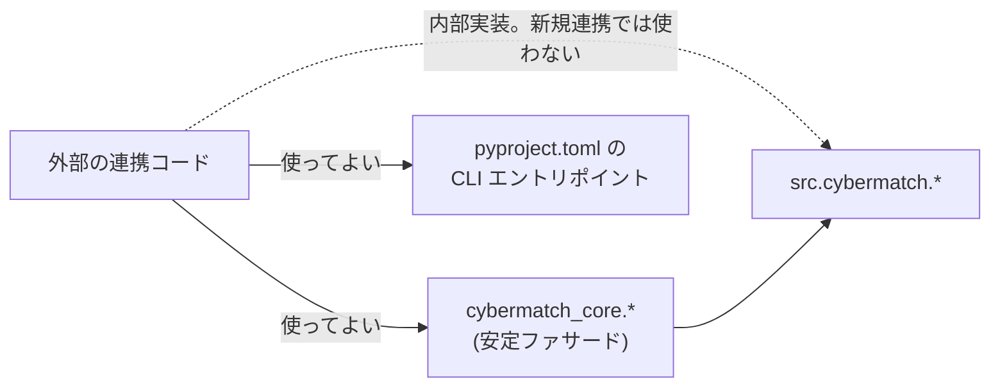
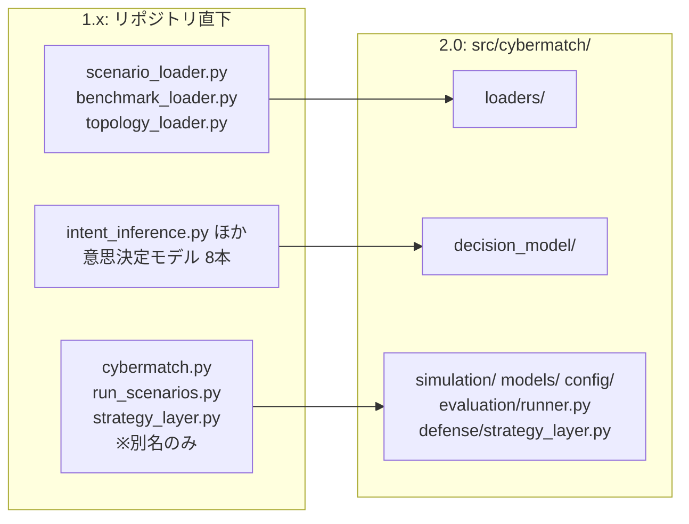

# 06. 公開API方針

## 1. 2.x 系でサポートする API

`cybermatch_core` が安定した Python インポート名前空間です。次のファサードモジュールが、サポート対象の連携境界です。

| モジュール | 用途 |
|---|---|
| `cybermatch_core.contracts` | EvaluationRun、Evidence Bundle、スキーマレジストリ、canonical ハッシュ |
| `cybermatch_core.agentic_security` | Agentic Security 評価 |
| `cybermatch_core.threat_hunting` | 脅威ハンティング |
| `cybermatch_core.external_sut` | 外部SUT(評価対象システム)契約とリプレイ評価 |
| `cybermatch_core.benchmarks` / `metrics` / `products` / `scenarios` / `topologies` | ベンチマーク・指標・製品・シナリオ・トポロジの読み込みと操作 |

`pyproject.toml` で宣言された CLI エントリポイント(`cybermatch-scenario` など)も公開 API です。

### 独立して版管理される契約

| 契約 | バージョン定数 / 管理方法 |
|---|---|
| 証跡(Evidence)の正規契約 | `RUN_CONTRACT_VERSION` |
| リポジトリ内の JSON 資産 | スキーマレジストリ |
| 外部SUT境界 | `EXTERNAL_SUT_CONTRACT_VERSION` |

外部SUTへのリクエストには、**防御側から観測可能なイベントと検知器のメタデータだけ**が含まれます。評価器の正解ラベル (Ground Truth) は決してリクエストに含まれません。
実装側は正規化された Finding を返す必要があり、その証拠IDはリクエスト内のイベントを参照していなければなりません。

## 2. 互換性と非推奨

| 対象 | 2.x での扱い |
|---|---|
| `cybermatch_core.*` | 安定 API |
| `src.cybermatch.*` | 実装パス。ファサードから再エクスポートされていないものは内部扱いで、**新しい外部連携はこれらに依存しないこと** |
| 公開シンボルの削除 | 少なくとも1つのマイナーリリースの間は非推奨 (deprecated) として残し、削除は次のメジャーバージョン(3.0)より前には行わない |

> 1.x では、リポジトリ直下の互換モジュールを 2.0 まで維持すると定めていました。2.0.0 でその予定どおり廃止しています(次章)。

`cybermatch` という名前は、2.0 で直下の `cybermatch.py` を廃止したことで空きました。
`src.cybermatch` を `cybermatch` パッケージへ改名する移行は、今後のメジャーバージョンで扱います(2.x の間は `src.cybermatch` のまま)。

## 3. 1.x からの移行(2.0.0 の破壊的変更)

2.0.0 で、リポジトリ直下にあった14個の Python モジュールを `src/cybermatch/` 配下へ移動し、直下からは削除しました。
旧名で import すると `ModuleNotFoundError` になるため、次の表に従って書き換えてください。

### ローダー・意思決定モデル(実装本体を移動)

| 1.x の import | 2.0 の import |
|---|---|
| `scenario_loader` | `src.cybermatch.loaders.scenario_loader`(推奨: `cybermatch_core.scenarios`) |
| `benchmark_loader` | `src.cybermatch.loaders.benchmark_loader`(推奨: `cybermatch_core.benchmarks`) |
| `topology_loader` | `src.cybermatch.loaders.topology_loader`(推奨: `cybermatch_core.topologies`) |
| `intent_inference` | `src.cybermatch.decision_model.intent_inference` |
| `behavior_profile` | `src.cybermatch.decision_model.behavior_profile` |
| `feature_space` | `src.cybermatch.decision_model.feature_space` |
| `feature_export` | `src.cybermatch.decision_model.feature_export` |
| `archetype_analysis` | `src.cybermatch.decision_model.archetype_analysis` |
| `mission_taxonomy` | `src.cybermatch.decision_model.mission_taxonomy` |
| `strategy_validation` | `src.cybermatch.decision_model.strategy_validation` |
| `decision_graph` | `src.cybermatch.decision_model.decision_graph` |

### 別名モジュール(廃止し、実体を直接 import)

| 1.x の import | 2.0 の import |
|---|---|
| `run_scenarios` | `src.cybermatch.evaluation.runner` |
| `strategy_layer` | `src.cybermatch.defense.strategy_layer` |
| `from cybermatch import CyberDefenseSimulator` | `from src.cybermatch.simulation.simulator import CyberDefenseSimulator` |
| `from cybermatch import SimulationConfig` | `from src.cybermatch.config.simulation_config import SimulationConfig` |
| `from cybermatch import ProductProfile, HuntingCapabilities, load_product_profile` | `from src.cybermatch.models.product import ...`(推奨: `cybermatch_core.products`) |
| `from cybermatch import Visualizer` | `from src.cybermatch.visualization.visualizer import Visualizer` |
| `from cybermatch import AttackerModel` | `from src.cybermatch.attacker.attacker_model import AttackerModel` |
| `from cybermatch import OptimizationEngine` | `from src.cybermatch.defense.ilp_mpc_strategy import OptimizationEngine` |

### 変わらないもの

- `cybermatch_core.*` の API、CLI(`scripts/*.py` と `cybermatch-*` コマンド)の引数、出力ファイル名、証跡・スキーマのバージョン。
- `python -c "from run_scenarios import ..."` のように旧名を使っていたワンライナーは、`from src.cybermatch.evaluation.runner import ...` に置き換えてください。

## 4. 安定性の境界

| 変更対象 | 必要な手続き |
|---|---|
| 公開ファサード、CLI 引数、証跡/スキーマのバージョン、文書化された出力ファイル名 | 互換性レビュー |
| データ契約 | 新しいバージョン番号と移行ノート |
| `src.cybermatch` 配下でファサードから再エクスポートされていない関数 | 内部実装扱い。マイナーバージョン間で変更され得る |
