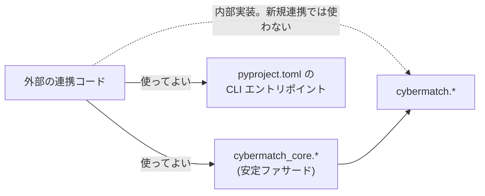
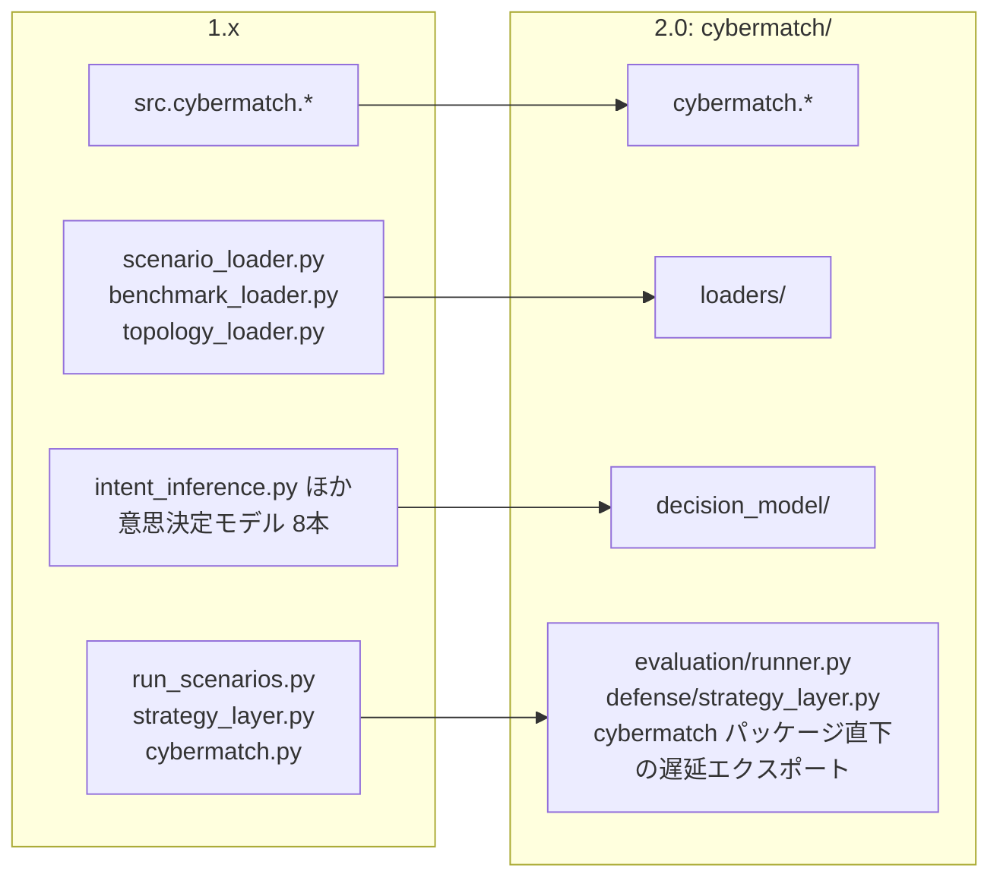

# 06. 公開API方針

## 1. 2.x 系でサポートする API

`cybermatch_core` が安定した Python インポート名前空間です。次のファサードモジュールが、サポート対象の連携境界です。

| モジュール | 用途 |
|---|---|
| `cybermatch_core.contracts` | EvaluationRun、Evidence Bundle、スキーマレジストリ、canonical ハッシュ |
| `cybermatch_core.scoped_response` | 対象限定対処の型・模擬適用台帳・node限定legacy変換・合成デモ |
| `cybermatch_core.threat_hunting.T0ObservationAdapter` | 到着済みのT0合成観測envelopeだけを`HuntEvent`へ変換する境界adapter |
| `cybermatch_core.threat_hunting.HmacIdentityPseudonymizer` | 平文identityをversion付きHMAC referenceへ変換するT1仮名化器 |
| `cybermatch_core.active_defense` | T2の文脈ハンティング、T3の閉ループ評価、T4aのtoken化replay、T4bのattacker結果adapter・shadow Pilot。詳細は[11章](11_cti_asm_context_hunting_guide.md)、[12章](12_active_defense_closed_loop_evaluation_guide.md)、[13章](13_tokenized_replay_and_optional_integration_guide.md) |
| `cybermatch_core.agent_skills.NativeSkillLoader` | 自作SOPを実行せず、front matterとhash付きsnapshotとして読むS1 loader |
| `cybermatch_core.agentic_security` | Agentic Security 評価 |
| `cybermatch_core.threat_hunting` | 脅威ハンティング |
| `cybermatch_core.external_sut` | 外部SUT(評価対象システム)契約とリプレイ評価 |
| `cybermatch_core.benchmarks` / `metrics` / `products` / `scenarios` / `topologies` | ベンチマーク・指標・製品・シナリオ・トポロジの読み込みと操作 |

`pyproject.toml` で宣言された CLI エントリポイント(`cybermatch-scenario` など)も公開 API です。

### 独立して版管理される契約

| 契約 | バージョン定数 / 管理方法 |
|---|---|
| 証跡(Evidence)の正規契約 | `RUN_CONTRACT_VERSION` |
| 対象限定対処・receipt | `RESPONSE_CONTRACT_VERSION`（1.0）。既存feedbackと独立。詳細は[共通基盤](09_scoped_response_guide.md) |
| CTI/ASM観測・相関・仮説・閉ループ評価 | `ACTIVE_DEFENSE_CONTRACT_VERSION`（1.0）とスキーマレジストリ（`active_defense_*`） |
| リポジトリ内の JSON 資産 | スキーマレジストリ |
| 外部SUT境界 | `EXTERNAL_SUT_CONTRACT_VERSION` |

外部SUTへのリクエストには、**防御側から観測可能なイベントと検知器のメタデータだけ**が含まれます。評価器の正解ラベル (Ground Truth) は決してリクエストに含まれません。
実装側は正規化された Finding を返す必要があり、その証拠IDはリクエスト内のイベントを参照していなければなりません。

## 2. 互換性と非推奨

| 対象 | 2.x での扱い |
|---|---|
| `cybermatch_core.*` | 安定 API |
| `cybermatch.*` | 実装パス。ファサードから再エクスポートされていないものは内部扱いで、**新しい外部連携はこれらに依存しないこと** |
| 公開シンボルの削除 | 少なくとも1つのマイナーリリースの間は非推奨 (deprecated) として残し、削除は次のメジャーバージョン(3.0)より前には行わない |

> 1.x では、リポジトリ直下の互換モジュールを 2.0 まで維持すると定めていました。2.0.0 でその予定どおり廃止しています(次章)。

## 3. 1.x からの移行(2.0.0 の破壊的変更)

2.0.0 では、次の2つを同時に行いました。

1. **実装パッケージ名の変更**: `src.cybermatch` → `cybermatch`(ディレクトリも `src/cybermatch/` → `cybermatch/`)。`src` という汎用的な名前でのインストールをやめ、他ライブラリとの名前衝突を防ぎます。
2. **直下モジュールの廃止**: リポジトリ直下にあった14個の Python モジュールを `cybermatch/` 配下へ移動しました。

旧名で import すると `ModuleNotFoundError` になるため、次の表に従って書き換えてください。

### 実装パッケージ

| 1.x の import | 2.0 の import |
|---|---|
| `src.cybermatch.<サブパッケージ>` | `cybermatch.<サブパッケージ>`(例: `src.cybermatch.agentic` → `cybermatch.agentic`) |

### ローダー・意思決定モデル(実装本体を移動)

| 1.x の import | 2.0 の import |
|---|---|
| `scenario_loader` | `cybermatch.loaders.scenario_loader`(推奨: `cybermatch_core.scenarios`) |
| `benchmark_loader` | `cybermatch.loaders.benchmark_loader`(推奨: `cybermatch_core.benchmarks`) |
| `topology_loader` | `cybermatch.loaders.topology_loader`(推奨: `cybermatch_core.topologies`) |
| `intent_inference` | `cybermatch.decision_model.intent_inference` |
| `behavior_profile` | `cybermatch.decision_model.behavior_profile` |
| `feature_space` | `cybermatch.decision_model.feature_space` |
| `feature_export` | `cybermatch.decision_model.feature_export` |
| `archetype_analysis` | `cybermatch.decision_model.archetype_analysis` |
| `mission_taxonomy` | `cybermatch.decision_model.mission_taxonomy` |
| `strategy_validation` | `cybermatch.decision_model.strategy_validation` |
| `decision_graph` | `cybermatch.decision_model.decision_graph` |

### 別名モジュール

| 1.x の import | 2.0 での扱い |
|---|---|
| `run_scenarios` | 廃止。`cybermatch.evaluation.runner` を使う |
| `strategy_layer` | 廃止。`cybermatch.defense.strategy_layer` を使う |
| `from cybermatch import CyberDefenseSimulator` など | **そのまま動作**。`cybermatch` パッケージが `CyberDefenseSimulator`、`SimulationConfig`、`ProductProfile`、`HuntingCapabilities`、`load_product_profile`、`Visualizer`、`AttackerModel`、`OptimizationEngine` を遅延読み込みで再エクスポートします |

### 内部関数の移動(内部 API のため参考)

| 1.x | 2.0 |
|---|---|
| `runner._phase82_*` 〜 `runner._phase85_*`、`run_phase82`〜`run_phase85` | `cybermatch.evaluation.benchmark_suites` に移動。`cybermatch.evaluation.runner` からも引き続き参照可能(遅延再エクスポート)。ただし `monkeypatch` などで差し替える場合は `benchmark_suites` 側を対象にすること |

### 変わらないもの

- `cybermatch_core.*` の API、CLI(`scripts/*.py` と `cybermatch-*` コマンド)の引数、出力ファイル名、証跡・スキーマのバージョン。
- `python -c "from run_scenarios import ..."` のように旧名を使っていたワンライナーは、`from cybermatch.evaluation.runner import ...` に置き換えてください。

### 2.0.0 で追加された機能(互換性に影響しない)

| 機能 | 内容 |
|---|---|
| `scripts/run_scenario.py --output-dir / --seeds / --baseline / --no-evidence` | 出力先・seed・Phase8 の基準値を指定可能。出力フォルダーに `evidence_bundle.json` を自動生成 |
| Phase8.x の `baseline_summary_path` 引数 | `run_phase82`〜`run_phase85` が基準値の入力元を明示的に受け取り、`baseline_provenance.json` に記録 |
| `cybermatch.evaluation.seed_robustness` | seed ごとのスコアの95%信頼区間と「1位の割合」を出力 |
| `cybermatch_core.contracts.write_directory_evidence_bundle` / `collect_input_payloads` | 既存の出力フォルダーを Evidence Bundle 化するヘルパー |

## 4. 安定性の境界

| 変更対象 | 必要な手続き |
|---|---|
| 公開ファサード、CLI 引数、証跡/スキーマのバージョン、文書化された出力ファイル名 | 互換性レビュー |
| データ契約 | 新しいバージョン番号と移行ノート |
| `cybermatch` 配下でファサードから再エクスポートされていない関数 | 内部実装扱い。マイナーバージョン間で変更され得る |
