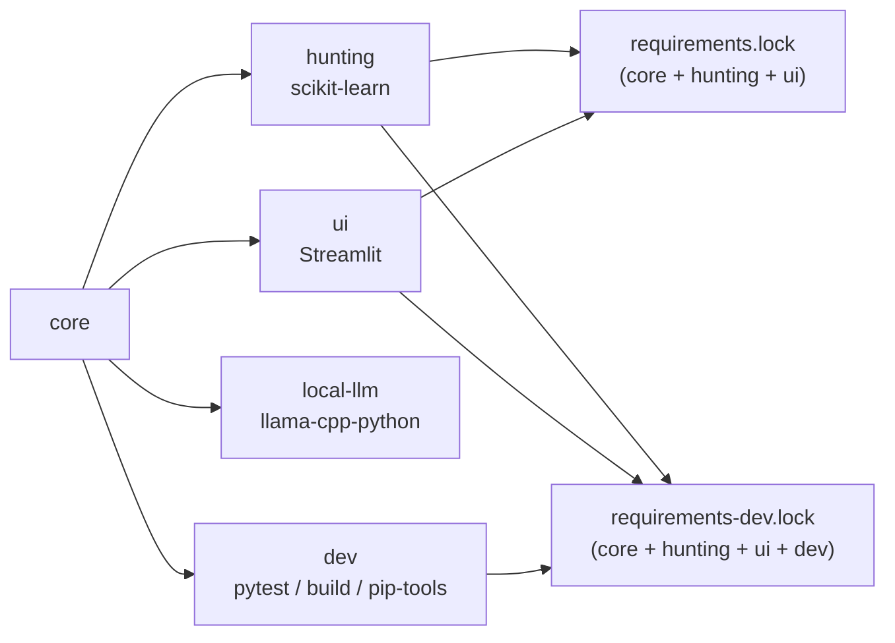

# 07. 依存関係方針

サポートする Python バージョン、実行時依存の範囲、オプション機能の**唯一の正 (source of truth)** は `pyproject.toml` です。

## 1. 依存グループ

| グループ (extra) | パッケージ | 用途 |
|---|---|---|
| core(既定) | NumPy, Matplotlib, CVXPY, jsonschema | シミュレーション、最適化、指標計算、スキーマ検証 |
| `hunting` | scikit-learn | K-Means / Isolation Forest によるハンティング用プラグイン(任意) |
| `ui` | Streamlit | ローカルのダッシュボード GUI |
| `local-llm` | llama-cpp-python | ローカル Qwen2.5 による説明生成(OR-4 shadow 比較用、任意) |
| `dev` | pytest, build, pip-tools | テスト、パッケージ検証、lock 生成 |
| `all` | scikit-learn, Streamlit | `hunting` + `ui` のまとめ指定 |



- **ProfileCore** は任意のサブモジュール連携(`external/profilecore`)であり、Python パッケージ依存ではありません。マシン固有の editable パスとして記述してはいけません。
- **外部SUT** はデータアダプタ経由で接続します。同様に、無条件の core 依存にしてはいけません。

## 2. インストール方法

| 目的 | コマンド |
|---|---|
| core のみ | `python -m pip install -e .` |
| ローカルアプリ一式(GUI・ハンティング込み) | `python -m pip install -e ".[hunting,ui]"` |
| 開発環境 | `python -m pip install -e ".[hunting,ui,dev]"` |
| ローカル LLM を追加 | `python -m pip install -e ".[local-llm]"` |
| **開発環境を完全に再現(推奨)** | 下記 |

lock ファイルでまったく同じ環境を再現するには、プロジェクト本体より**先に** lock をインストールします。

```powershell
python -m pip install -r requirements-dev.lock
python -m pip install --no-deps -e .
```

実行時依存だけを固定バージョンで入れたい場合は `python -m pip install -r requirements.txt` も使えます。

## 3. lock ファイルの保守

2つのコミット済み lock は、どちらも `pyproject.toml` から直接生成します。これにより、依存範囲の正は1か所に保たれます。

| ファイル | 含む extra |
|---|---|
| `requirements.lock` | `hunting`, `ui` |
| `requirements-dev.lock` | `hunting`, `ui`, `dev` |

```powershell
python -m piptools compile --resolver=backtracking --strip-extras --extra hunting --extra ui --output-file=requirements.lock pyproject.toml
python -m piptools compile --resolver=backtracking --strip-extras --extra hunting --extra ui --extra dev --output-file=requirements-dev.lock pyproject.toml
```

### レビュー時のルール

- 依存を変更したら、`pyproject.toml` と生成された lock の**両方の差分**をレビューする。
- コミットする依存ファイルに、ローカルの絶対パスを決して含めない。
