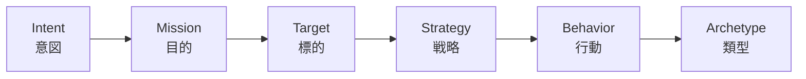

# 08. 用語集

CyberMatch のドキュメント・レポート・コードに出てくる用語をまとめています。

## 1. 攻撃者の意思決定モデル

CyberMatch は攻撃者の意思決定を次の階層で表します(分析専用のモデルで、実行時の振る舞いは変えません)。

| 用語 | 意味 | 例 |
|---|---|---|
| Intent(意図) | 攻撃者の上位の動機 | 金銭目的、スパイ活動、破壊、長期潜伏 |
| Mission(目的) | 攻撃者が達成しようとする具体的な目的 | `profit`(金銭獲得)、`achievement`(目標達成)、`persistence`(継続的な潜伏)、`critical_hunter`(重要資産の探索) |
| Target(標的) | 攻撃者が狙う資産・関係性の種類 | ID基盤、クラウドのコントロールプレーン、バックアップ、信頼関係 |
| Strategy(戦略) | 目的達成のための標的別の作戦アプローチ | - |
| Behavior / Archetype | 観測される行動と、その類型化 | - |

## 2. 攻防の概念

| 用語 | 意味 |
|---|---|
| Belief(信念) | 攻撃者・防御者が資産・経路・状態・目的について「真だと考えていること」 |
| State(状態) | 方策選択や結果分析に使う、推定されたキャンペーンの文脈 |
| Trust(信頼) | 攻撃者がノード・認証情報・経路・仲間を引き続き頼りにするかどうか |
| Deception(欺瞞) | デコイ、偽の資産・経路、意図の偽装、誤誘導シグナル |
| Coalition(連携) | 引き継ぎ・調整コスト・情報損失・信頼低下を伴う複数攻撃者の協調 |
| Counter-Deception | 受動的なフィルタリングではなく、攻撃者の認識そのものを操作する防御 |
| Awareness / Hunting(攻撃者側) | 欺瞞を認識し、積極的に見破ろうとする攻撃者の能力 |
| Defense / Decision Neutralization | 防御の無力化 / 攻撃者の意思決定の無力化(研究初期の評価軸) |
| Topology(トポロジ) | 評価対象のネットワーク構成(業種別プリセットあり) |
| Product Profile | 防御製品の能力を表す JSON(`profiles/products/`)。実在製品ではなく**架空のサンプル** |

## 3. 脅威ハンティング

| 用語 | 意味 |
|---|---|
| HuntEvent | 防御側から観測可能な正規化イベント。外部ログは mapping によりこの形式へ変換される |
| Recipe(レシピ) | 検知ロジック。イベント種別の並び(シーケンス)などで攻撃を捉える JSON 定義 |
| Finding | レシピが出す検知結果。根拠となったイベントIDを必ず持つ |
| Ground Truth(正解ラベル) | 評価器だけが参照する「本当に攻撃だった区間」。検知側・LLM には渡さない |
| Oracle(オラクル) | 正解を知っている判定者。「オラクル非漏えい」= 正解情報が検知側へ流れないこと |
| Open-loop / Closed-loop | 検知しても対処しない / 検知結果を次ステップの防御行動へ反映する |
| Noise profile | 評価時に加える雑音の強さ(`none` / `moderate` / `adversarial`) |
| Mapping | 外部ログ(OCSF・ECS・OpenTelemetry・独自CSV等)のフィールドを HuntEvent へ対応付ける定義 |
| Domain gap | 記録データと合成参照データのイベント分布の差(JS ダイバージェンスなど) |

## 4. 証跡と評価の信頼性

| 用語 | 意味 |
|---|---|
| Evidence Bundle | 評価の入力・コード revision・依存 lock・seed・成果物それぞれの SHA-256 をまとめた証跡ファイル(`evidence_bundle.json`)。読み込み時に改ざん・欠落を検出する |
| Bundle hash | Evidence Bundle 全体のハッシュ。評価記録へ転記して結果を一意に特定する |
| EvaluationRun | 評価1回分を表す共通の契約オブジェクト |
| Manifest | 実行条件(入力・seed・バージョン)の記録ファイル |
| Seed | 乱数の種。同じ seed なら同じ結果が再現される |
| 95% CI(信頼区間) | 複数 seed の結果から推定した平均値の不確かさの幅 |
| Effect size(効果量) | 2条件の差の大きさ。CyberMatch では対応ランク双列相関([-1, 1])を使用 |
| Failure region | 感度分析で防御が崩れることが再現された条件の範囲 |

### Evidence class(根拠の種類)

| クラス | 意味 | 言ってよいこと | 言ってはいけないこと |
|---|---|---|---|
| `synthetic-only` | 合成シナリオのみ | 合成条件下での再現結果 | 実環境での有効性 |
| `replay-backed` | 記録済みデータのリプレイ | 記録済みデータに対する結果 | 本番環境での有効性、製品認証 |
| `external-sut-backed` | 実際の外部システムを明示アダプタ経由で評価 | 記録条件下での外部SUTの結果 | 未観測の環境・全構成への一般化 |

## 5. 外部評価・pilot・LLM

| 用語 | 意味 |
|---|---|
| SUT (System Under Test) | 評価対象のシステム(検知製品・検知ロジック等) |
| External SUT Adapter | 外部SUTとイベント/Finding をやり取りする契約。標準 CLI は内蔵の参照実装を使用 |
| HITL (Human-in-the-Loop) | 人間が実行前に承認し、結果を見て最終判断を記録する運用 |
| Pilot | 外部利用者と行う試行評価。`apps/pilot_web.py` の UI で実施 |
| ResultView | LLM に渡すために、ハッシュ検証済みの結果から機微情報を除いたビュー |
| Authoritative / Advisory | 正式な結果(指標・Evidence Bundle) / 参考情報(LLM による説明) |
| Shadow evaluation | 利用者に見せずに、複数の説明候補(テンプレート・ローカルLLM・外部LLM)を同一条件で比較すること |
| Blind review | 候補の正体(モデル名等)を伏せた状態で人間が採点すること |
| OR-0〜OR-6 / LOCAL-1 | LLM 説明機能の段階的な導入ステージ名。OR-4 = shadow 評価、LOCAL-1 = ローカル Qwen 導入。外部公開には OR-5・OR-6 の完了が必要 |
| Orca Router | 外部 LLM ルーター。明示設定時のみ使用し、無料モデル限定・解決済みモデルの許可リストで制御 |
| Fallback | LLM 応答がスキーマ・根拠検証に失敗した際に、決定的なテンプレート説明へ切り替えること |

## 6. ファジング

| 用語 | 意味 |
|---|---|
| Campaign | ファジング実行の定義(入力・変異・オラクル・出力先) |
| Corpus | 変異の元になるシード入力の集合 |
| Mutator | 入力を意味的に変える操作。例: `shift_step`(時刻ずらし)、`drop_event`(イベント欠落)、`duplicate_semantic_event`(重複)、`insert_benign_noise`(無害イベント挿入)、`boundary_numeric_attribute`(境界値) |
| Control(対照) | 変異させていない入力。既存の見逃し・誤検知を「新しい回帰」と誤報告しないために比較する |
| Interesting case | 対照と比べて注目すべき差分が出たケース |
| Failure fingerprint | 失敗の種類を識別する指紋。重複した失敗をまとめるのに使う |
| Metamorphic oracle | 「開ループと閉ループで入力ハッシュ・イベント数が一致するはず」のような関係性で判定するオラクル |

## 7. フェーズ番号の対応

コード・出力ファイル名に残るフェーズ番号と、機能の対応です。

| 番号 | 機能 | 評価メニューのレーン |
|---|---|---|
| Phase1〜2 | 防御の無力化 / 意思決定の無力化 | -(`scripts/run_phase1.py` 等) |
| Phase3-A / 3-B | 適応的 / 合理的攻撃者の検証 | - |
| Phase4 | インテリジェンス主導の能動防御 | - |
| Phase5 | 連携・カウンター欺瞞・認知・ハンティング | - |
| Phase6.1〜6.3 | 製品インターフェース / 製品プロファイル / mission 別製品評価 | `product` |
| Phase8.1〜8.5 | シナリオ読込 / カタログ / ベンチマーク / トポロジ / 標準ベンチマーク | `standard` |
| Phase9.0〜9.9 | 意図推定から意思決定グラフまでの攻撃者モデル | -(テストマーカー `phase90`〜`phase99`) |
| Phase3 (外部妥当性) | 外部テレメトリのリプレイ評価 | `replay` |
