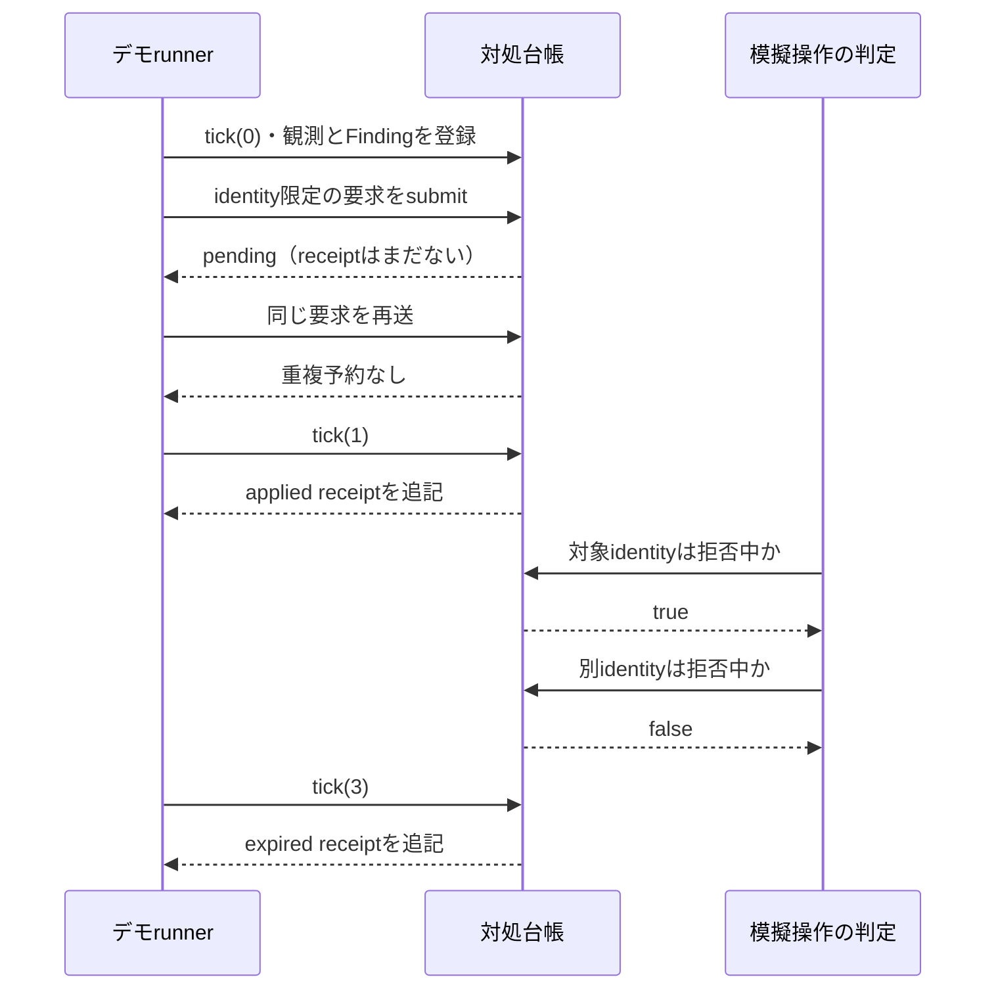
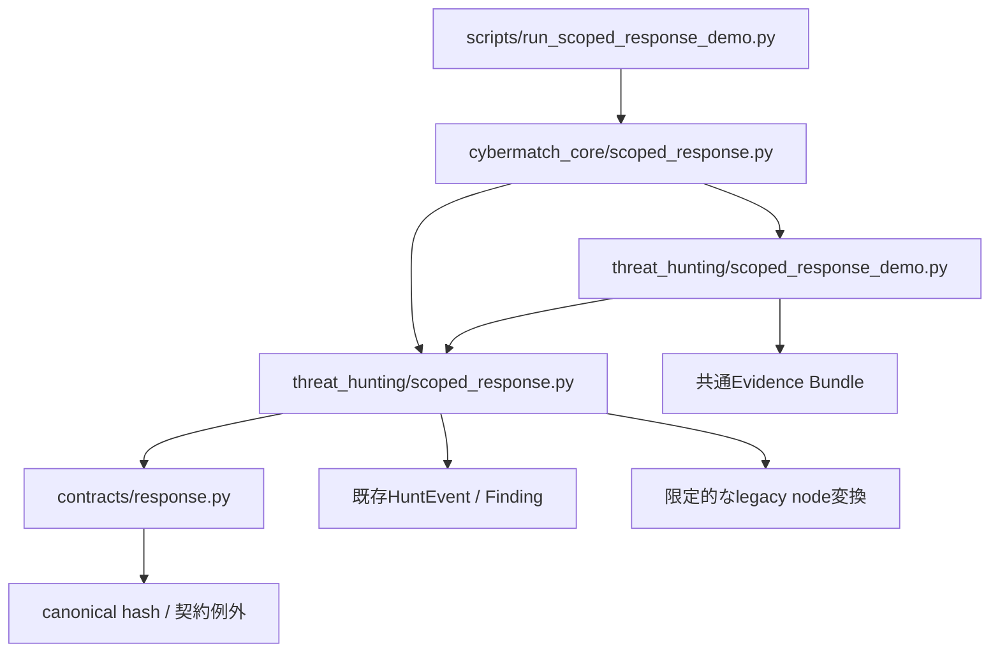
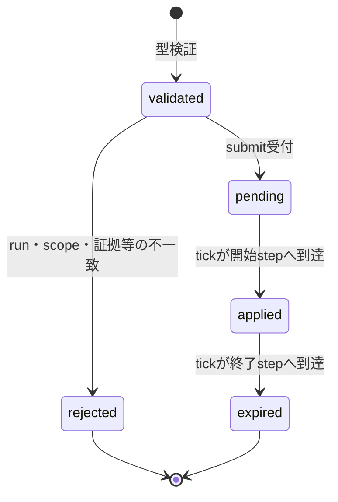

# 09. 対象限定対処の共通基盤（C0）

## 1. この文書で分かること

CTI・ASM統合ハンティングとAgent Skills評価の両方が使う、対象限定の模擬対処を説明します。今回実装したのは、要求の型、観測証拠の確認、次stepへの予約、適用・拒否・期限切れの追記履歴、既存node隔離への限定変換です。

本機能はシミュレーション内の対処台帳です。実際のアカウントを失効させたり、OS・ネットワークを操作したりする機能はありません。CTI相関、Skills loader、sessionモデル、LLM連携は別工程です。実装全体の進捗は[工程・テスト設計](10_cti_skills_implementation_plan.md)を参照してください。

| 対象 | C0で提供する内容 | 今後の工程 |
|---|---|---|
| identity | 指定identityに対する期間限定の拒否状態 | T3で新規認証・既存sessionに接続 |
| node | 指定nodeの隔離状態 | T3/T4で通信操作へ接続 |
| workload | 指定workloadの停止状態 | Skills模擬操作runnerへ接続 |
| receipt | applied / rejected / expiredの不変record | 各runnerの評価指標と接続 |
| 観測 | run・tenant・到着step・証拠IDの検査 | T1でCTI/ASMとenvelopeを追加 |

## 2. 最初に実行するデモ

リポジトリのルートで実行します。既存の開発環境の依存だけで動作し、追加パッケージ・API key・ネットワークは必要ありません。

```powershell
python scripts/run_scoped_response_demo.py --output output/scoped_response/example_01
```

出力先は新しいdirectoryを指定してください。既存directoryには上書きせず終了コード2で停止します。再実行するときは別の出力先を使います。

インストール更新後は公開entry point `cybermatch-scoped-response-demo --output ...`も利用できます。リポジトリ配置のfixtureを使うデモなので、ソースcheckoutのある環境で実行してください。

### 2.1 期待する結果



| step | 対象identity | 無関係なidentity | receipt累計 | 意味 |
|---|---|---|---|---|
| 0 | 許可 | 許可 | 0 | 要求は予約されたが未適用 |
| 1 | 拒否 | 許可 | 1 | 効果開始・applied |
| 2 | 拒否 | 許可 | 1 | 同じ対処の継続 |
| 3 | 許可 | 許可 | 2 | 半開区間の終端・expired |
| 4 | 許可 | 許可 | 2 | 対処の効果なし |

このデモのFindingは固定fixtureです。上の結果は契約・時間・対象範囲の検証であり、検知精度や実サービスの封じ込め性能を表しません。

### 2.2 出力ファイル

| ファイル | 内容 | 確認方法 |
|---|---|---|
| `scoped_response_result.json` | 要求、receipt、5stepの状態、limitations | 再実行時にresult hashを比較 |
| `scoped_response_report.md` | 日本語説明、状態遷移図、step表 | Markdown viewerで閲覧 |
| `evidence_bundle.json` | code revision、入力hash、成果物hash、主要指標 | 共通Bundle loaderで再読込 |

```powershell
python -c "from cybermatch_core.contracts import load_evidence_bundle; print(load_evidence_bundle('output/scoped_response/example_01').bundle_hash)"
```

result hashには出力directoryや処理時間を含めません。同じ入力・コードから同じ結果を再生できます。Bundle hashは環境のframework version、revision、dependency lock、再現timestampにも依存するため、比較時にこれらも揃えます。

## 3. 配置と依存方向



| 配置先 | 責務 | 配置理由 |
|---|---|---|
| `cybermatch/contracts/response.py` | 版管理された要求・結果の型 | CTIとSkillsの共通契約として再利用 |
| `cybermatch/threat_hunting/scoped_response.py` | 観測に基づく予約と効果台帳 | Finding/HuntEventに依存するワークフロー層 |
| `cybermatch/threat_hunting/scoped_response_demo.py` | 固定シナリオと成果物生成 | CLIからドメイン処理を分離 |
| `cybermatch_core/scoped_response.py` | 外部利用用ファサード | 内部moduleへの直接依存を避ける |
| `scripts/run_scoped_response_demo.py` | 引数処理・終了コード・出力先 | script名から実行用途が分かる |
| `configs/scoped_response/actions/` | 要求fixture | 人が確認できる固定入力 |
| `configs/scoped_response/receipts/` | 適用結果fixture | schemaとcanonical形式の検証 |
| `cybermatch/schemas/scoped-response-*.schema.json` | JSON構造検証 | 既存registryへ登録 |
| `tests/test_scoped_response_*.py` | 型、状態、境界、CLI、再現性 | 用途ごとにテストを分離 |

巨大な`simulator.py`や`evaluation/runner.py`へ条件分岐を追加していません。旧feedbackの形式・既存動作も変更しません。

## 4. 要求のデータ契約

`ScopedResponseAction`はimmutableで、キーワード引数だけを受け取ります。versionは`RESPONSE_CONTRACT_VERSION = "1.0"`です。

| field | 型・制約 | 用途 |
|---|---|---|
| `schema_version` | `"1.0"` | 未対応versionを拒否 |
| `action_id` | `response_`と64桁小文字hex | 内容から決定するID |
| `run_id / tenant_id` | 空でなく前後空白なし | 実験・組織の分離 |
| `finding_ids` | 空でない文字列tuple | 要求の観測根拠 |
| `action_type` | 下表の3種 | 対処内容 |
| `scope_kind` | identity / node / workload | 対象種別 |
| `subject_refs` | 空でない文字列tuple | 対象の明示 |
| `requested_step` | 非負整数 | 要求発行step |
| `effective_step` | requested_stepより大きい整数 | 効果開始 |
| `expires_step` | effective_stepより大きい整数 | 効果終了（このstepは含まない） |
| `policy_hash` | 64桁小文字hex | policy allowlistとの照合 |
| `reason_code` | 小文字で始まる最大64文字のコード | 生の秘密情報を自由記述しない定型理由 |

| action_type | 許可scope | 不許可例 |
|---|---|---|
| `revoke_identity` | identity | node全体の失効として扱う |
| `quarantine_zone` | node | identity指定をnodeへ暗黙変換 |
| `pause_workload` | workload | run全体を無条件停止 |

数値fieldは`True`/`False`、float、負数を拒否します。対象の空配列は全対象を意味せずエラーになります。

`create()`はFinding/subjectの重複を除去して昇順にし、呼出元のlistをコピーします。wire入力の`from_dict()`は未知field、欠落field、非canonicalな配列、内容と一致しないIDを拒否します。`SchemaRegistry.validate()`も構造だけでなく型契約を通すため、JSON Schemaで表現できない相対時刻と内容IDを検査します。

IDはaction_id自身を除く全契約fieldから作ります。reason_codeも意味的payloadに含めます。run、tenant、policy、時刻、対象、根拠のいずれかが変われば別IDになります。別IDであっても同じ対象への新しい観測根拠がなければ延長は認めません。

## 5. 観測証拠の登録

controllerはrun/tenantごとに1個作り、既知のsubject集合とpolicy hash allowlistを与えます。subject集合は初期inventoryのコピーです。攻撃の正解ラベルをinventoryとして渡すものではありません。

登録するHuntEventには、既存fieldに加えて次の観測属性を設定します。

| attributes | 意味 | 制約 |
|---|---|---|
| `run_id` | 観測の所属run | controllerと一致 |
| `tenant_id` | 所属tenant | controllerと一致 |
| `available_step` | 到着して利用可能になったstep | event.step以上・現在step以下 |
| `identity_ref` | 観測されたidentity | 任意。存在する場合だけidentity対処の根拠 |
| `node_ref` | 観測されたnode | 任意。node scopeの根拠 |
| `workload_ref` | 観測されたworkload | 任意。workload scopeの根拠 |

後続のT1ではObservationEnvelopeからこの境界へ明示的に変換します。event.stepだけを到着時刻として流用しません。

`register_finding()`は以下を検査します。

1. 全evidence IDが渡された観測集合に存在し、重複していない。
2. Findingと観測のstream/期間が一致し、未来・未到着の観測でない。
3. 観測のrunとtenantがcontrollerに一致する。
4. `ground_truth`等の既知の評価器専用fieldが混入していない。
5. 同一event IDとFinding IDの内容が以前の登録から変わっていない。

この検査は入力境界の整合性を保証するものです。悪意ある同一processの呼出元に対するOS隔離、任意の文章に隠されたoracleの完全検出、ログ発行元の真正性を保証しません。観測生成・信頼されたadapterの責務を別途維持します。

## 6. 予約・適用・期限切れ



`tick(0)`で開始し、1stepずつ進めます。tickはそのstepの模擬操作より前、Finding登録とsubmitは観測取得後に行います。逆戻り、step飛ばし、遅れて到着した過去stepの新規要求は例外になります。

| API | 戻り値 | 副作用 |
|---|---|---|
| `tick(step)` | 今回追記したreceiptのtuple | 開始／終了に該当する要求を遷移 |
| `register_finding(finding, events)` | None | 検証済み観測との対応を保持 |
| `submit(action)` | pendingならNone、拒否や既処理ならreceipt | 同一IDの再送で効果・履歴を重複させない |
| `is_blocked(scope, subject)` | bool | 現在stepの状態参照のみ |
| `actions / receipts` | immutable recordのtuple | 内部listを外部へ渡さない |

適用期間は`[effective_step, expires_step)`です。複数actionの期間が重なっている場合は和集合で拒否し、一つのactionがexpiredになっても他が有効なら拒否を継続します。

### 6.1 新しい証拠による延長

延長判定はFinding IDだけでは行いません。`(action_type, subject_ref)`ごとに使った観測event IDを記録します。

```text
同じ観測event + 別Finding ID     → no_new_evidence
別identityの新しい観測event     → 対象identityの延長根拠にはならない
対象identityの新しい観測event   → その他の検証を満たせば予約可能
```

複数対象を一つのactionに含める場合は全対象に条件を要求し、一部だけを黙って適用しません。対象を分けて扱う場合は別actionに分けます。

## 7. receiptと異常時の動作

| status | 効果時刻 | affected_subject_refs | 作成条件 |
|---|---|---|---|
| applied | 要求と同じ開始・終了 | 要求と同じ全対象 | 開始stepで台帳に適用 |
| rejected | 両方null | 空 | 有効な要求を受付境界で拒否 |
| expired | 以前の適用区間を保持 | 以前の適用対象 | 期限に到達 |

`ResponseReceipt.validate_for(action)`でaction/run/対象/期間の対応を確認できます。receipt単体の構文検証では、対応するactionの存在までは検証できません。実運用コードでは相互参照も確認します。

| reason_code／例外 | 原因 | 次の確認 |
|---|---|---|
| `run_mismatch` | 別runの要求 | run別controllerの利用 |
| `tenant_mismatch` | 別tenantの要求 | tenant別の観測・要求生成 |
| `unapproved_policy` | policy hash不一致 | 固定policyとallowlist |
| `unknown_subject` | inventoryに対象なし | 対応表を観測根拠から整備 |
| `unobserved_finding` | Finding未登録 | 先に観測を登録 |
| `unsupported_subject` | 証拠が対象を支持しない | scope誤り・対象取り違え |
| `no_new_evidence` | 同じ対象の観測根拠を使い回した | 新規観測なしで期間を延ばさない |
| `ResponseValidationError` | malformed契約・時刻逆転等 | 入力作成を修正。receipt成功に変換しない |

拒否済みの同一要求を再送しても再審査しません。状況が変わった場合は新しい観測と現在stepを使い、新たな要求を作ります。

## 8. 旧feedbackとの互換性

旧`ThreatHuntingFeedback`のsignature、JSON、ID生成は変更していません。新機能は旧controllerへ自動接続されません。

`to_legacy_node_feedback()`は、次の全条件がある場合だけ変換します。

- actionがnode scopeの`quarantine_zone`。
- 明示したrun/tenantが一致。
- 全subjectに対応する非負整数node IDがあり、alias衝突がない。
- Findingがちょうど1件。複数Findingの証跡を捨てて変換しない。

identity/workloadの変換、対象欠落時の空node配列への変換、全nodeへの拡張は拒否します。legacyではtenant/runがwireに残らないため、呼出側もrun専用のsinkへ送る責務があります。

## 9. 検証と今後の接続

```powershell
python -m pytest -q tests/test_scoped_response_contracts.py tests/test_scoped_response_demo.py
python scripts/validate_assets.py
```

| 観点 | テスト内容 |
|---|---|
| 型 | 必須field、未知version、bool/負数/NaN、空対象、scope不一致 |
| 再現性 | canonical JSON、IDの入力順非依存、デモ再生hash一致 |
| 因果性 | 同step適用禁止、未到着観測、逆行・step飛ばし拒否 |
| 範囲 | tenant/run分離、無関係なidentityが影響を受けない |
| 冪等性 | 同ID再送、同証拠の別Finding、別対象の新規証拠 |
| 証跡 | applied/rejected/expiredの整合、Bundle再読込 |
| 互換性 | node限定変換、旧feedback・agenticテストの回帰 |
| CLI | 日本語help/report、既存出力の上書き拒否 |

この段階のC0はsession切断を実装していません。T3の世界状態は、台帳の拒否開始を受けて該当sessionを無効化し、期限切れで古いsessionを復活させない処理を追加します。その挙動は専用テストで確認します。

関連文書: [C0の設計判断](procedures/scoped_response_contract_decisions.md)、[T0/S0の工程・テスト設計](10_cti_skills_implementation_plan.md)。
