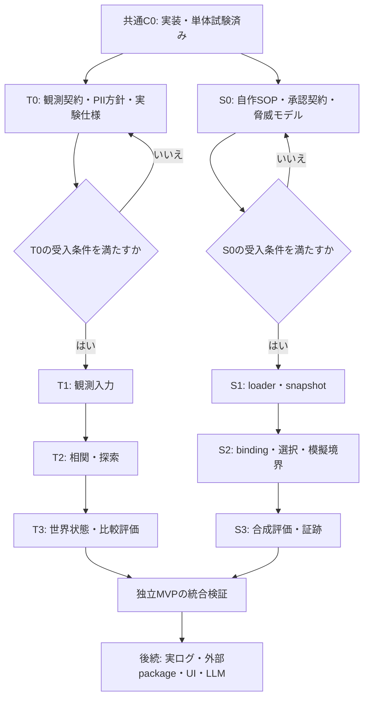
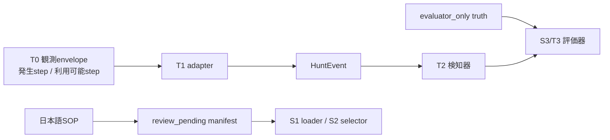
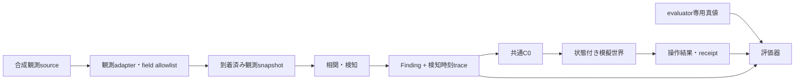
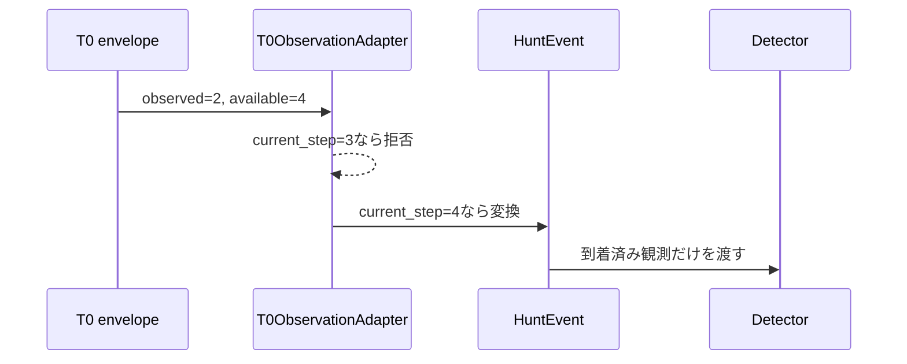
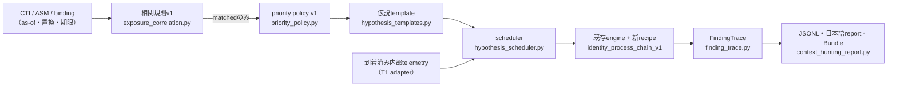
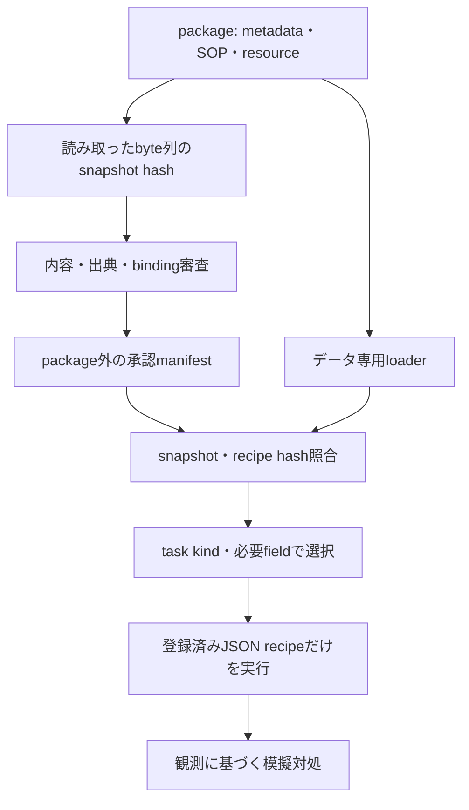

# 10. CTI・Agent Skills拡張の実装工程とテスト設計

## 1. 今回の実装範囲

更新日: 2026-09-27。対象はCTI・ASM統合ハンティング計画v2.0とAgent Skills検証評価計画v2.0です。本書はリポジトリに残す実装状況・設計入力・検証記録であり、未実装機能の利用手順ではありません。

CTI・ASM側はT0〜T4bを実装し、全既存pytest suite **847件**の完走を確認しました。利用方法は[11章](11_cti_asm_context_hunting_guide.md)、[12章](12_active_defense_closed_loop_evaluation_guide.md)、[13章](13_tokenized_replay_and_optional_integration_guide.md)を参照してください。Agent Skills側の候補manifestは`review_pending`で、外部packageは未取得です。

| 工程 | 現在の状態 | この変更で提供したもの | 未実施のもの |
|---|---|---|---|
| 共通C0 | 完了 | action/receipt、台帳、schema、fixture、CLI、説明文書、T3統合受入 | なし |
| T0 | 完了 | 到着時刻付き観測envelope、evaluator専用truth、評価仕様、PII保護方針 | なし |
| S0 | native範囲完了 | native5件の日本語SOP、候補binding、評価仕様、固定snapshot、実装レビュー記録 | 外部packageの出典・license審査はS4b |
| T1 | 完了 | 到着済み変換、固定順snapshot、HMAC、保存禁止形式の拒否、CTI/ASM/binding契約・置換 | 実データの鍵管理・運用canaryは信頼境界内の運用工程 |
| T2 | 完了 | 相関規則v1、priority policy v1、仮説template、scheduler、新recipe、FindingTrace、CLI・日本語レポート・Bundle | なし |
| T3 | 完了 | session世界、ログ欠損transform、4mode比較、対象限定対処、truth評価、CLI・日本語report・Bundle | なし |
| T4a | 完了 | token化済みJSONL/CSV replay、source manifest、data quality、検知適合性report・Bundle | 実データ取得・token化は別運用工程 |
| T4b | 完了（任意接続baseline） | attacker結果adapter、allowlist型shadow Pilot、独立UI renderer | 実LLM・本番UI・外部simulatorごとの個別検証 |
| S1 | native範囲完了 | SOP 1fileのUTF-8・front matter・snapshot・manifest照合 | resource、外部package、sandboxはS4b |
| S2 | native範囲完了 | 承認済みbinding、recipe hash照合、決定論的selector、summary recipe・限定検査 | 自然言語検索はS4c |
| S3 | native合成baseline実装 | 模擬tool境界、独立label評価、再現hash、日本語report、Evidence Bundle、CLI | Linux CIの実行記録と大規模holdoutは継続検証 |
| S4b | 完了 | 代表8件の固定source/license/hash審査、採用・除外理由、No-Egress worker、GitHub-hosted Ubuntu実拒否probe | 外部bindingは意味的同値性の別レビューまで0件を維持 |

「設計が承認された」「型が通った」「模擬台帳が適用状態になった」「実環境で防御できた」は、それぞれ異なる証拠です。今回確認したのはC0の契約・状態遷移と既存機能との回帰です。

## 2. 依存関係と進め方



図の分岐は依存関係上の独立性を示します。T側はSkills未完成でも自前のtemplate registryで動作でき、S側はCTI未完成でも合成観測で評価できます。両側で対処契約を再定義しません。

### 2.1 工程を閉じるために残す記録

| 記録 | 内容 | 完了としない例 |
|---|---|---|
| 契約記録 | version、必須field、未知field処理、hash対象 | dataclass例だけがある |
| 設計判断 | 選択肢、採用理由、互換性、残る制約 | 「安全」「決定論的」という宣言だけ |
| 試験結果 | コマンド、結果、対象revision、除外範囲 | 旧テスト成功を新機能の証明に流用 |
| レビュー記録 | 確認対象のhash/revision、指摘、解消状況 | 自動でapprovedを付ける |
| 利用者向け説明 | 日本語の図表、実行例、結果の読み方 | 未実装CLIを実行手順に掲載 |

## 3. ファイル配置と命名の方針

ルートへ作業用Pythonを追加せず、引数処理は`scripts/`、再利用する処理は`cybermatch/`、公開入口は`cybermatch_core/`に置きます。用途名をファイル名に含め、`temp.py`や`new_test.py`のような役割が不明な名前を避けます。

| 用途 | 配置 | 命名例・現状 |
|---|---|---|
| 共通型 | `cybermatch/contracts/` | `response.py`（実装済み） |
| 対処ワークフロー | `cybermatch/threat_hunting/` | `scoped_response.py`（実装済み） |
| 固定デモの処理 | 同上 | `scoped_response_demo.py`（実装済み） |
| 公開API | `cybermatch_core/` | `scoped_response.py`（実装済み） |
| CLI | `scripts/` | `run_scoped_response_demo.py`（実装済み） |
| 型の固定入力 | `configs/scoped_response/` | `actions/identity_revocation_example.json`等（実装済み） |
| schema | `cybermatch/schemas/` | `scoped-response-action.schema.json`等（実装済み） |
| 自作Skill評価入力 | `configs/agent_skills/packages/`を予定 | `cm-credential-path/SKILL.md`等（未作成） |
| 信頼された承認設定 | package外の専用設定rootをT0/S0で確定 | packageの自己申告approvalを受け入れない |
| 自動試験 | `tests/` | `test_scoped_response_contracts.py`等（実装済み） |
| 正式ガイド | `docs/`の番号付き章 | 本書、09章（実装済み） |
| 設計・審査手順 | `docs/procedures/` | `scoped_response_contract_decisions.md`（実装済み） |
| T2文脈ハンティング | `cybermatch/threat_hunting/active_defense/` | `exposure_correlation.py`、`hypothesis_scheduler.py`等（実装済み。一覧は11章§9） |
| T2 CLI | `scripts/` | `run_cti_asm_hypothesis_hunt.py`（実装済み） |
| T2設定・fixture | `configs/active_defense/{runs,policies,templates,fixtures}/` | `t2_synthetic_context_hunting_v1.json`等（実装済み） |
| 実行成果物 | `output/<用途>/<run名>/` | `output/scoped_response/c0_first_implementation/`、`output/active_defense/t2_first_implementation/` |

既存のGit管理方針に従い、非公開計画が含まれる`docs/`全体の除外設定は解除しません。番号付きガイドと既存の`procedures/`に正式文書を置きます。評価用Skillは開発エージェントが自動探索する`.agents/skills`へ配置しません。

## 4. T0: 観測・時刻・PII・評価の設計入力

### 4.0 固定したT0/S0資産

以下の資産は、後続実装が恣意的な入力形式へ戻らないための固定点です。いずれも合成入力または候補定義であり、実データ・実行許可・人手承認を含みません。

| 資産 | 配置先 | 現在の意味 | 次工程で追加する検証 |
|---|---|---|---|
| 観測envelope schema | `cybermatch/schemas/cti-observation-envelope.schema.json` | 発生時刻と利用可能時刻を分離 | T1 adapterがHuntEventへ写像するときのfield allowlist |
| 遅延到着の合成観測 | `configs/threat_hunting/observations/t0_synthetic_cti_observation.json` | step 2発生、step 4から利用可 | as-of、期限切れ、tenant分離のcase追加 |
| evaluator専用truth | `configs/threat_hunting/evaluator_only/t0_synthetic_truth.json` | detectorアクセス禁止の別artifact | 読取権限・引数・結果不変性の自動試験 |
| Skill候補manifest schema | `cybermatch/schemas/skill-candidate-manifest.schema.json` | packageとbindingの候補形を固定 | snapshot hash、recipe hash、失効の相互検証 |
| native候補manifest | `configs/agent_skills/manifests/native_skills_candidate_v1.json` | `review_pending`で実行不可 | アナリストによるbinding単位の承認記録 |
| Skills評価仕様 | `configs/agent_skills/evaluation_specs/synthetic_skills_evaluation_v1.json` | 合成のみ・truth非渡し・禁止事項を固定 | S3 evaluatorとresource limitの実装 |
| native SOP 5件 | `configs/agent_skills/packages/cm-*/SKILL.md` | 日本語の読み取り専用手順 | S1 loaderとsnapshot、S2 selector |



truthからadapter、検知器、selectorへ矢印がないことが設計上の要点です。コードでその非到達性を検証するのはT1/S3の受入条件です。

### 4.1 観測と真値の経路



真値から相関器・検知器への矢印は設けません。とはいえ、図だけでは非漏洩を保証できません。実装時には引数、読み取り対象、出力経路、テストで境界を検証します。C0の禁止field検査も、同一process内の悪意ある任意コードに対する隔離ではありません。

### 4.2 三つの時刻

| 時刻 | 意味 | 必須条件・注意 |
|---|---|---|
| observed_step | 観測された出来事の発生step | 既存HuntEventでは`step` |
| available_step | 検知器が利用可能になったstep | `observed_step <= available_step` |
| detected_step | 到着済み入力からFindingを生成したstep | 根拠となる全観測のavailable_step以上 |
| effective_step | 対処が適用を開始するstep | `requested_step + 1`以上 |
| expires_step | 対処の効力がなくなるstep | 効果は`[effective_step, expires_step)` |

例: step 2の観測がstep 5に到着し、そのstepで検知された場合、対処開始は最速step 6です。step 2に検知・対処した結果へ書き換えません。C0は到着時刻と現在stepを検査しますが、T1/T2で必要となる専用envelopeとFindingTraceはまだありません。

### 4.3 PIIとcredentialの扱い

| データ | 合成MVP | 実ログreplayで確定すべき条件 |
|---|---|---|
| identity | 架空の識別子のみ | version付きHMAC-SHA-256 token、鍵と成果物を分離 |
| credential値 | 入力・保存とも不要 | password/token/secret自体の保存を禁止 |
| credential分類 | 必要な分類値だけ | 分類fieldをallowlistで検証 |
| 原文・自由記述 | 自作の合成文のみ | 全文を証跡へ転送しない。PII canaryで検査 |
| error/log/Bundle | 合成IDと定型理由 | エラー経路も含めて秘密情報の非混入を試験 |

HMACは仮名化です。匿名性、再識別不能性、全PIIの自動除去を意味しません。C0はHMAC変換器を実装していないため、実ログをそのまま投入してはいけません。

### 4.4 評価指標の確定項目

| 指標・条件 | T0で確定する事項 |
|---|---|
| lead_time_steps | 起点・終点、侵入未発生caseの扱い、負値の意味 |
| 検知率・誤検知率 | 評価単位、未知labelの除外、分子・分母 |
| 阻止率 | request数ではなく、世界の操作結果で判定 |
| 誤対処 | 正当なidentity/workload等への不利益を別計上 |
| 4mode比較 | 共通seed、潜在drawの対応、条件以外を固定 |
| 再現性 | 同じ入力・policy・codeでresult hash一致 |
| 計測時間 | 実時間は性能測定用の別artifact。step指標と混同しない |

### 4.5 T0の受入チェックリスト

- [ ] 観測envelope・CTI/ASM・binding・FindingTraceの契約を確定する。
- [ ] as-of参照、期限切れ、未知値、tenant分離のfixtureを設計する。
- [ ] 観測固定・真値だけ変更しても検知結果が変わらない試験を設計する。
- [ ] PII方針とsecret canaryの検査対象を確定する。
- [ ] 4modeの比較仕様、指標の分母、未発生・未評価の扱いを確定する。
- [ ] 契約・評価fixtureのレビュー記録を残す。

## 4.6 T1最小adapterの実装範囲

`cybermatch/threat_hunting/t0_observation_adapter.py`に、`T0ObservationAdapter`を追加しました。これは外部CTI connectorではなく、T0の固定JSON envelopeを安全に既存`HuntEvent`へ渡す最小の境界です。安定公開APIは`cybermatch_core.threat_hunting`から利用できます。

| 入力条件 | adapterの動作 | 意図 |
|---|---|---|
| `available_step > current_step` | 拒否 | 到着前のイベントを検知器へ渡さない |
| `available_step < observed_step` | 拒否 | 発生前にログが利用可能になる時系列破綻を防ぐ |
| run／tenantの不一致 | 拒否 | 他run・他tenantの観測混入を防ぐ |
| schema外のfield | 拒否 | 平文email、password等を勝手に受け入れない |
| evaluator truth | APIに引数なし | 真値をadapter・検知器の入力にしない |
| 到着済みの合成観測 | `HuntEvent`へ変換 | `step`は発生時刻、attributeは`available_step`を維持 |
| 複数観測snapshot | `adapt_snapshot()`で固定順に返す | 一件でも未到着・重複なら全体を返さない |



`HmacIdentityPseudonymizer`を指定したadapterは、identityだけを`key_version:HMAC-SHA-256 digest`形式へ変換してから`HuntEvent`を作ります。鍵と平文identityは出力・snapshot・Evidence Bundleへ渡しません。指定しない場合は、従来どおり合成の`identity_ref`だけを使います。

HMACは仮名化であり匿名化ではありません。現実の運用には、鍵を成果物・設定file・ログから分離する保管手順、rotation時のkey version管理、error経路を含むsecret/PII canary、実connectorの入力field allowlistが必要です。これらはまだ実装していません。

変換後の`HuntEvent`には`assert_hygienic_payload()`を適用します。平文email、password／token等のfield、PEM private key、AWS access key形式を検出した場合は値をエラー文へ再掲せず拒否します。これは限定的なcanary検査であり、全PII・全secretの完全な発見や削除を保証するものではありません。

`adapt_snapshot()`はeventの発生step、event IDの順に並べます。これにより入力fileの列挙順で検知結果が変わることを防ぎます。ただし、CTI/ASMの実コネクタ、永続的なwatermark、欠損データの再取得はこの最小実装の対象外です。

T2の最小接続点である`AsOfThreatHuntingRunner`はこのsnapshotを既存の`ThreatHuntingEngine`へ渡します（T2本体は§4.7と11章）。入力は検証済みrecipeと観測envelopeだけで、evaluator truthを引数に持ちません。未到着の観測が含まれるとengineを実行せず失敗します。結果は`to_dict()`で、実際に渡した観測、Finding、traceを固定順のwire形式へ変換できます。`AsOfFindingTrace`は実行step、recipe ID/hash、利用event ID、生成Finding IDだけを保持し、truth・平文identity・観測本文は保持しません。これは時刻境界と最小追跡性の接続点です。CTI/ASM相関・仮説探索・永続artifactは§4.7の`ContextHuntingRunner`で追加しました。

合成入力は次のCLIで確認できます。出力先を書き換えず、event IDと時刻だけをJSONで表示します。

```powershell
python scripts/validate_t1_observation_snapshot.py `
  --input configs/threat_hunting/observations/t0_synthetic_cti_observation.json `
  --run-id t0-synthetic-run --tenant-id tenant-example `
  --scenario-id t1-cli-check --current-step 4
```

同じ入力で`--current-step 3`を指定すると、未到着として終了コード2になります。

## 4.7 T2: CTI/ASM相関・仮説探索の実装範囲

T2の成果物とExit Criteriaの対応を示します。利用方法・契約・図表の詳細は[11. CTI・ASM文脈ハンティング（T2）ガイド](11_cti_asm_context_hunting_guide.md)にあります。



| Exit Criteria（計画§12） | 実装 | 主な試験 |
|---|---|---|
| 手計算score | 整数bp・floor・固定分母、missing成分の記録 | `test_active_defense_priority_and_correlation.py` |
| 安定sort | ID/step順の固定、入力順序の入替えで結果一致 | 同上、`test_active_defense_context_hunting_runner.py` |
| budget/待機 | 予算3・最大待機5・新規観測なしは再実行しない・待機中失効の記録 | `test_active_defense_hypothesis_scheduler.py` |
| 必要field不足 | `not_evaluable:missing_fields`。キー不在と`null`を区別 | scheduler・runner試験 |
| CTIのみでは対処なし | 内部ログがなければFinding 0件。CTI envelopeを内部ログとして受け付けない | runner試験 |
| 同snapshot結果一致 | 決定論的result hash、別出力先で一致、Bundle再読込 | runner・CLI試験 |

T2で既存資産へ加えた互換性のある変更は次の3点です。(1) 観測envelope schemaへ内部telemetry種別と任意field（`auth_result`等）を追加、(2) T1 adapterは任意fieldをenvelopeにある場合だけ写す、(3) recipe許可fieldへ`attributes.identity_ref`を追加。既存CLI・公開facadeのsignature・旧feedbackのwire形式は変更していません。

## 5. S0: 自作SOP・承認・脅威モデルの設計入力

### 5.1 最初の5件と対応先

以下はv2計画から引き継いだ作成候補です。既存recipeが存在することと、SOPからの対応が承認されたことは別です。今回、SOPやApprovedSkillManifestを作成・承認してはいません。

| 自作Skill ID | task kind | 対応候補recipe | 作業 |
|---|---|---|---|
| cm-credential-path | credential_path | credential_to_critical_path_v1 | SOP作成、入力field・手順対応の審査 |
| cm-critical-approach | critical_approach | critical_path_approach_v1 | 同上 |
| cm-agentic-credential | agentic_credential | agentic_credential_chain_v1 | 同上。派生signalの限界を記載 |
| cm-agentic-boundary | agentic_boundary | agentic_boundary_pressure_v1 | 同上。実OS境界の試験と区別 |
| cm-summary-review | summary_review | summary_suppression_v1 | 新規recipe、負例、abstain、holdout設計 |

本文は日本語で、目的、必要観測、手順ID、recipeが扱わない部分、解釈上の制限を記載します。外部Skillの件数・licenseをnative作成の前提にしません。

### 5.2 承認と実行の分離



SOP本文、`allowed-tools`、package自身の「承認済み」という文言は権限を付与しません。自動生成を使う場合も審査待ちの提案に留め、実行時に自然言語をコードへ変換しません。

### 5.3 脅威と必要な検証

| 脅威 | 主な対策・テスト | 実装工程 |
|---|---|---|
| `..`、絶対path、junction、symlinkによる範囲外読込 | root内の固定snapshot、Windows固有pathも拒否 | S1 |
| 大容量・大量file・YAML展開 | byte数・file数・構文深さの上限、alias/tag/重複key拒否 | S1 |
| hash確認後の内容差替え | 同じ読取byte列の検証・解析、固定snapshot | S1 |
| packageの自己承認 | 信頼rootを分離、review_record参照、失効確認 | S1/S2 |
| scriptや本文からの権限昇格 | データ専用、任意import/shellを実装しない | S1/S2 |
| field不足時の誤実行 | 明示的not_evaluable。値を捏造しない | S2 |
| recipe重複による検知数水増し | recipe/scope/観測snapshotの組で実行重複を除く | S2/S3 |
| label・gold Skill IDの漏洩 | evaluatorのみ保持、label変更による不変性試験 | S3 |
| 明示的隠蔽signalの過大評価 | 引用・否定・要約不足・holdoutを含む評価 | S3 |
| 外部packageの通信・host書込 | 専用workerで実際の拒否をprobeする | S4b。今回未実施 |

静的検査は補助的なrisk signalです。No-Egress SandboxもC0には含まれません。hashは改変検知であり無害性の証明ではなく、外部packageの採用前にはlicense・出典・権限・worker実証の審査が必要です。

### 5.4 S0の受入チェックリスト

- [x] native5件の日本語SOPと手順IDを作成する。
- [x] metadata/snapshot/manifest/binding/selection/traceの契約を確定する。
- [x] 必要fieldとrecipeが参照するfieldの整合を審査する。
- [x] native v1は単純front matter parserを使い、YAML依存をcoreへ追加しない方針を確定する。
- [x] loaderの上限・path・差替え・失効の試験仕様を確定する。
- [x] 外部packageなしで進めるnative scopeと、後続S4bを分離して記録する。
- [x] 各bindingのsnapshot/recipe hashをpackage外manifestへ記録する。

### 5.5 S1 native snapshot loaderの実装範囲

`cybermatch/agent_skills/native_loader.py`は、`configs/agent_skills/packages/`直下の自作packageを読み取るだけのloaderです。公開入口は`cybermatch_core.agent_skills`です。package内の文面はデータであり、命令・コード・権限として解釈しません。

| 検査 | v1の扱い |
|---|---|
| package ID | `cm-`で始まる限定形式だけを受理。`..`やseparatorを拒否 |
| path | root外、symlink、存在しないdirectoryを拒否 |
| package内容 | `SKILL.md`だけを許可。script・resourceを無視せず拒否 |
| file | UTF-8、64 KiB以下、symlinkでない通常fileだけを受理 |
| front matter | `name`と`description`だけ。package名との不一致や複雑なYAMLを拒否 |
| snapshot | 読み取った同一byte列のSHA-256、size、metadataをcanonical hashへ含める |
| 実行 | subprocess、dynamic import、network、LLMを呼ばない |

S1 v1は意図的に狭いprofileです。resourceや外部packageを扱うには、別途snapshot全体のfile一覧・上限・license/SBOM・No-Egress workerを設計し、S4bの受入条件で実証します。

## 6. 共通C0の検証対応表

| 要件 | 実装・試験箇所 | 確認内容 |
|---|---|---|
| 厳格な型とcanonical形式 | response.py、契約テスト | bool/浮動小数step、未知field/version、hash不一致、空対象を拒否 |
| 対象限定 | 台帳・契約テスト | run/tenant、identity/node/workload、観測根拠を検査 |
| 因果順序 | 台帳・契約テスト | 次step適用、遅延到着、半開区間、clock巻戻し・飛越し拒否 |
| 冪等性 | 台帳・契約テスト | 同一actionの再submitでreceiptを増やさない |
| 無根拠な延長の拒否 | 台帳・契約テスト | 別Finding名・別対象の新規eventで元の対処を延長しない |
| 追記型の適用結果 | receipt・契約テスト | applied/rejected/expired、対象・期間のactionとの一致 |
| 旧形式との互換性 | legacy adapter・既存回帰 | 明示node隔離だけ変換、identity/workloadは拒否 |
| 固定入力のschema登録 | registry・資産試験 | JSON Schemaに加えて時刻相関・ID hashも検査 |
| 再現性と証跡 | デモテスト | 異なる出力先でもresult/bundle hash一致、Bundle再読込 |
| 成果物保全 | CLIテスト | 既存directoryを上書きしない |

テストコマンドと結果は次節にまとめます。C0のテストはT0/S0の受入チェックを代替しません。

## 7. 実行方法と検証記録

```powershell
python -m pytest -q tests/test_scoped_response_contracts.py tests/test_scoped_response_demo.py tests/test_schema_registry.py tests/test_packaging.py
python -m pytest -q -m "not slow"
python scripts/run_scoped_response_demo.py --output output/scoped_response/c0_first_implementation
```

出力directoryは新規名を指定します。デモは固定Findingに対する対象限定の効果確認であり、検知品質を測っていません。step 1/2だけ対象identityが拒否状態になり、step 3で期限切れ、無関係なidentityは全stepで許可されます。

| 検証 | 結果 | 留意事項 |
|---|---|---|
| C0・デモ・schema・packagingの重点試験 | 65 passed | Pythonでの型検査、CLI、再現性を含む |
| T0/S0資産・C0を合わせた重点試験 | 64 passed | schema、SOPと候補manifest、truth分離、C0状態遷移を含む |
| T0/S0/T1/S1/T2を合わせた重点試験 | 96 passed | 到着時刻、as-of snapshot、recipe接続、identity HMAC、hygiene、SOP hash照合を含む |
| 通常回帰試験（C0〜T2初版時点） | 667 passed、74 deselected、96.39秒 | デモを含む追加後の作業ツリーで実行。slowは実行していない |
| T2重点試験（`tests/test_active_defense_*.py`） | 56 passed、2.39秒 | 契約、priority手計算、相関、scheduler、runner、CLI・Bundle |
| 通常回帰試験（T2追加後の最終確認） | 758 passed、74 deselected、82.18秒 | T2追加後の作業ツリーで実行。slowは実行していない |
| 設定資産の検証（T2追加後） | 68件合格 | T2のrun spec・policy・template・fixture、新recipeを含む |
| T2 CLI（`t2_first_implementation`） | 成功 | result hashは下記。別出力先のsmoke runとも一致 |
| 外部ネットワーク遮断 | 未実施 | native C0には外部接続処理がないが、OS遮断の証明ではない |
| 実ログPII・session制御 | 未実施 | T1/T3/T4の対象 |
| 設定資産の検証 | 62件合格 | T0観測、S0 manifest・評価仕様を含む |
| デモ単独実行・Bundle再読込 | 成功 | result hashは下記。対象外identityの拒否は0件 |

T2のresult hash: `db24daafcc33682290cd898aa8a96829a8d2abf61810cf1f665b7e72367291dd`（`output/active_defense/t2_first_implementation/`）。

デモのresult hash: `944f332b3814fbfdbb83dda6895b51ae4866d9a6cda40f4b74606a382a3bc9f7`。生成物は`output/scoped_response/c0_first_implementation/`にあり、日本語report、決定論的JSON、Evidence Bundleを確認できます。`output/`はGit管理外です。

基準revisionは`4012a3328f941f18490871475446a966c7279ecf`、この記録はその作業ツリー上の未コミット変更に対するものです。既存Evidence Bundleのcode revisionはGit HEADであり、未コミット差分まで識別する保証はありません。正式な比較評価では変更を固定したrevisionと入力hashを記録してください。

## 8. 次の実装単位

1. GitHub Actions run `36561904646`の成功artifactとS4b実行記録を維持する。
2. S-B02の5 binding固定等価試験を維持し、実ログfield mappingを追加した場合は別fixtureで再検証する。
3. 外部packageは8件ともscript実行禁止を維持し、意味的同値性を別レビューできたものだけ新revisionのmanifestでbinding候補にする。
4. CTI・ASM側で実データを扱う場合は、取得・token化・鍵管理・retention承認を信頼境界内の別工程として実施する。

関連: [native Agent Skills評価ガイド](15_native_agent_skills_evaluation_guide.md)、[外部Agent Skills S4b審査ガイド](16_external_agent_skills_s4b_guide.md)、[T2文脈ハンティングガイド](11_cti_asm_context_hunting_guide.md)、[T3閉ループ評価ガイド](12_active_defense_closed_loop_evaluation_guide.md)、[T4a/T4bガイド](13_tokenized_replay_and_optional_integration_guide.md)、[C0利用ガイド](09_scoped_response_guide.md)、[公開API方針](06_public_api.md)。
