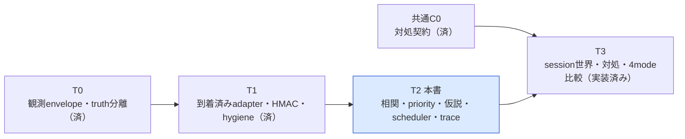
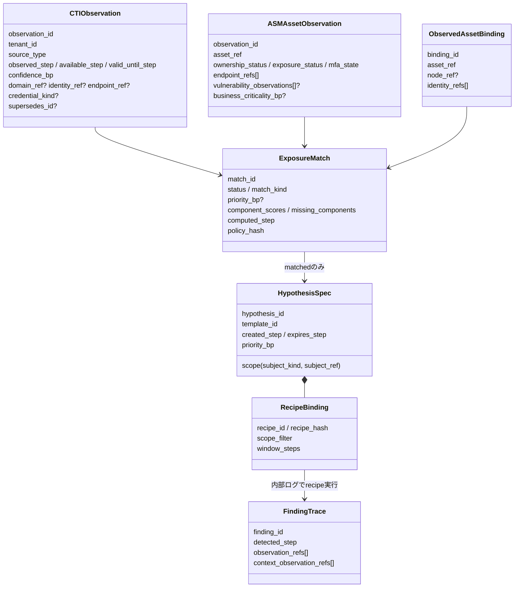
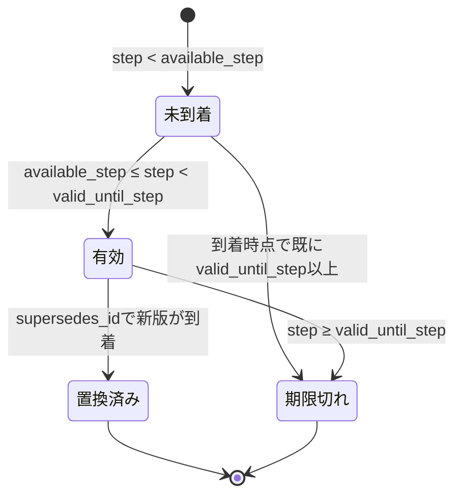
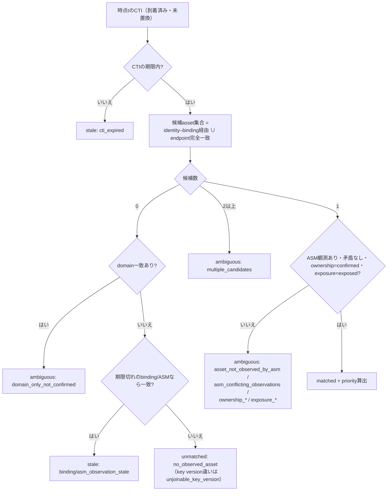
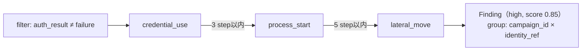
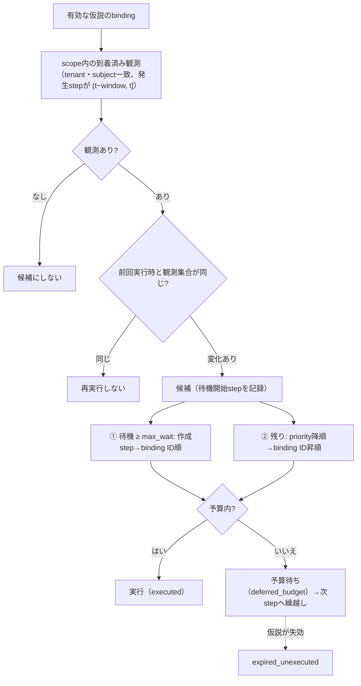
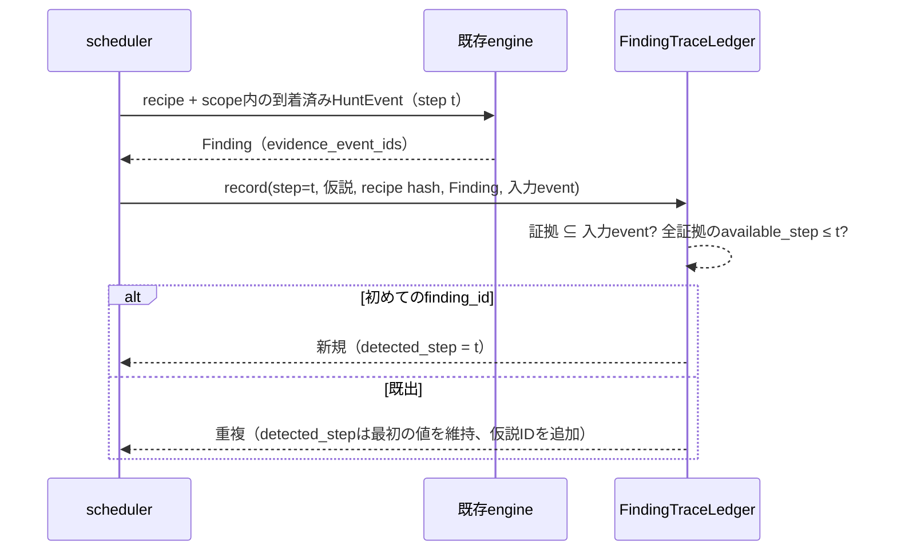

# 11. CTI・ASM文脈ハンティング（T2）ガイド

## 1. この文書で分かること

CTI・ASM統合ハンティング計画のT2工程で実装した「外部予兆（CTI）と公開資産（ASM）を突き合わせ、内部ログを調べる順番を決める」機能を説明します。実行方法、データ契約、相関規則、priority計算、仮説と調査予算、Finding traceの読み方、受入条件と検証結果を1か所にまとめています。

| 読者 | 主に読む節 |
|---|---|
| まず動かしたい人 | §2 実行方法、§3 出力の読み方 |
| 入力データを作る人 | §4 データ契約、§9 ファイル配置 |
| 相関・priorityをレビューする人 | §5 相関規則v1、§6 priority policy v1 |
| 調査予算・検知時刻を確認する人 | §7 仮説とscheduler、§8 Finding trace |
| 工程管理・受入判定をする人 | §10 受入条件と検証、§11 制約と次工程 |

本機能は**合成データによる決定論的な再生**です。実CTIの取得、実ASM scan、実アカウントの失効は行いません。CTIとのmatchは侵害の証拠ではなく、本runは対処要求（`ScopedResponseAction`）を生成しません。対処・ログ欠損・4mode比較はT3で扱います。全体の進捗は[工程・テスト設計](10_cti_skills_implementation_plan.md)を参照してください。

### 1.1 T2の位置づけ



| 工程 | T2で追加・変更したもの | T2で扱わないもの |
|---|---|---|
| T1の積み残し | CTI/ASM/bindingの観測契約、as-of選択、置換（supersedes） | 実CTI connector、鍵管理 |
| T2本体 | 相関規則v1、priority policy v1、仮説template、scheduler、新recipe、FindingTrace、CLI | 対処要求の生成、truth評価、ログ欠損transform |
| 既存資産 | envelopeへ内部telemetry種別と任意field、recipe許可fieldへ`attributes.identity_ref` | 既存CLI・旧feedback wire形式（変更なし） |

## 2. 実行方法

リポジトリのルートで実行します。追加パッケージ・API key・ネットワークは不要です。

```powershell
python scripts/run_cti_asm_hypothesis_hunt.py --output output/active_defense/t2_example_01
```

| 引数 | 必須 | 既定値 | 説明 |
|---|---|---|---|
| `--output` | はい | なし | 新規の出力directory。既存なら上書きせず終了コード2 |
| `--spec` | いいえ | `configs/active_defense/runs/t2_synthetic_context_hunting_v1.json` | repository相対のrun spec |

インストール後は`cybermatch-cti-asm-hypothesis-hunt --output ...`も使えます。標準出力には`result_hash`、`bundle_hash`、主要指標のJSONが出ます。

| 終了コード | 意味 |
|---|---|
| 0 | 成功。成果物とEvidence Bundleを保存 |
| 2 | 入力契約違反、保存禁止データ検出、出力先が既に存在、など。何も上書きしない |

### 2.1 同梱fixtureで期待する結果

同梱の合成fixture（`t2_identity_lateral_synthetic_v1.json`、horizon 16 step）では次の結果になります。

```mermaid
gantt
    title 合成fixtureの時系列（step）
    dateFormat X
    axisFormat %s
    section 外部予兆
    cti-001 観測(2)→到着(4)        :a1, 2, 4
    cti-002 観測(3)→到着(5)        :a2, 3, 5
    section 内部ログ（id-001）
    認証 step6                     :b1, 6, 7
    process step7                  :b2, 7, 8
    横展開 発生9→到着10            :crit, b3, 9, 10
    section 検知
    critical_path Finding (9)      :milestone, m1, 9, 9
    identity chain Finding (10)    :milestone, m2, 10, 10
```



| 観点 | 結果 | 意味 |
|---|---|---|
| 初回matched step | cti-001=4、cti-002=5、cti-008=12 | CTIが到着したstepで相関。未到着の予兆は使わない |
| 仮説 | 6件（identity 4件、node 2件） | matchedの予兆だけから作成 |
| step 6の予算 | 実行3、予算待ち3 | 1 step最大3 binding。priority 8500の仮説が先 |
| field欠損 | step 8で1件`not_evaluable:missing_fields` | `auth_result`が欠けたログを黙って捨てない |
| Finding | 2件（検知step 9と10） | 横展開ログはstep 9発生・step 10到着のため検知は10 |
| 未到着ログ | 1件（step 20到着予定） | horizon内に届かないログは使わない |

## 3. 出力の読み方

```text
output/active_defense/<run名>/
├─ cti_observations.jsonl        入力CTI（検証済みcanonical形式）
├─ asm_observations.jsonl        入力ASM
├─ asset_bindings.jsonl          入力binding
├─ matches.jsonl                 相関結果の履歴（内容が変わった時点ごと）
├─ hypotheses.jsonl              作成された仮説とrecipe binding
├─ scheduler_decisions.jsonl     stepごとの実行／予算待ち／未実行で失効
├─ binding_executions.jsonl      recipe実行の入力観測・評価状態・Finding
├─ finding_trace.jsonl           Finding ↔ 仮説 ↔ 内部観測 ↔ 外部予兆の対応
├─ findings.jsonl                既存形式のFinding
├─ metrics.json                  scalar指標とresult_hash
├─ context_hunting_result.json   上記すべてを含む決定論的payload
├─ report.md                     日本語レポート（図・表つき）
└─ evidence_bundle.json          入力hash・成果物hash・code revision
```

| 指標（metrics.json） | 定義 |
|---|---|
| `cti_record_count` | fixture内のCTI record総数（置換済みの旧版を含む） |
| `cti_current_at_horizon_count` | 最終stepで到着済みかつ置換されていないCTI数 |
| `cti_ever_matched_count` | 一度でもmatchedになったCTI数（lead time計算の参照候補） |
| `final_{matched,ambiguous,unmatched,stale}_count` | 最終stepの相関状態別件数 |
| `hypothesis_count` | 作成された仮説数 |
| `binding_execution_count` | recipe実行回数（not_evaluableを含む） |
| `not_evaluable_execution_count` | 必須field欠損で評価しなかった実行数 |
| `deferred_decision_count` | 予算超過で次stepへ繰り越した判断の延べ数 |
| `expired_unexecuted_count` | 待機中に仮説が失効し、未実行に終わったbinding数 |
| `pending_at_horizon_count` | horizon終了時点で待機中だったbinding数（右打切り） |
| `max_wait_steps_observed` | 観測された最大待機step数 |
| `finding_count` / `response_eligible_finding_count` | Finding数／内部観測の証拠を持ちT3対処判断の入力にできる数 |
| `internal_event_arrived_count` / `..._not_arrived_count` | horizon内に到着した／しなかった内部ログ数 |

`result_hash`はwall-clockを含まない決定論的payloadのhashです。出力先が異なっても同じ入力・同じcodeなら一致します。Evidence Bundleは`cybermatch_core.contracts.load_evidence_bundle()`で再読込・検証できます。

## 4. データ契約

### 4.1 全体像



### 4.2 共通の検証規則

すべての契約は`schema_version="1.0"`を持ち、**JSON Schemaとpython側の両方**で同じ制約を検査します。

| 規則 | 内容 | 防ぐ問題 |
|---|---|---|
| 未知field・field不足の拒否 | 任意項目も明示`null`で書く | 平文email・password等の紛れ込み、canonical形式の揺れ |
| bool・浮動小数の整数誤受理拒否 | `true`や`7000.0`をstep・bpにしない | 型の暗黙変換による別値化 |
| NaN/Infinity拒否 | JSON読込時に拒否 | hash・比較の不定 |
| 0〜10,000の整数bp | 信頼度・priority・重要度 | 浮動小数の丸め差 |
| 配列は重複なし昇順 | `endpoint_refs`、`identity_refs`等 | 入力順序でhashが変わる |
| 時刻の順序 | `observed ≤ available`、`valid_until > observed` | 発生前に利用可能な観測、即時失効 |
| IDへの評価label埋込み拒否 | `malicious`、`benign`、`true_label`、`ground_truth`、`oracle`等 | opaque IDからtruthを復元できる生成規則 |
| endpointは正規化済みのみ | 小文字`scheme://host:port`、先頭0なしport | 暗黙の正規化で別endpointが合流 |
| 保存禁止形式の検査 | email形式、PEM秘密鍵、AWS key形式、`password`等のfield名 | 実PII・credentialの成果物混入（完全な検出の保証ではない） |

### 4.3 観測の3つの時刻と置換

| field | 意味 | 使われ方 |
|---|---|---|
| `observed_step` | 出来事が観測された（発生した）step | recipeの系列判定、置換の前後関係 |
| `available_step` | 相関器・検知器が利用可能になるstep | as-of選択。これより前のstepでは存在しない扱い |
| `valid_until_step` | 観測が有効な最後のstepの次（半開区間） | 期限切れはstale。選択には使わないが件数化する |



更新は既存recordの上書きではなく、`supersedes_id`を持つ新recordの追加で表します。読込時に次を拒否します: 置換先が存在しない、tenantまたはsubject（CTIはidentity/endpoint/domain、ASMとbindingはasset）が異なる、古い観測で新しい観測を置換、同じ版を複数の新版が置換（分岐）、循環。

### 4.4 unknownの扱い

| 項目 | 値 | 意味・扱い |
|---|---|---|
| `ownership_status` | `confirmed` / `unconfirmed` / `unknown` | confirmed以外は確定matchにしない |
| `exposure_status` | `exposed` / `not_exposed` / `unknown` | exposed以外は確定matchにしない |
| `mfa_state` | `enabled` / `disabled` / `unknown` | unknownを「有効（安全）」とも「無効」とも解釈しない |
| `vulnerability_observations` | 配列 / `null` | `null`は未scan。空配列は「scanしたが無し」 |
| 脆弱性`status` | `confirmed_unpatched` / `inferred_from_product` / `patched` | 製品名からの推測は確認済みに数えない |
| `business_criticality_bp` | 0〜10000 / `null` | `null`はinventory上不明 |

### 4.5 内部telemetry（既存envelopeの拡張）

内部ログはT0/T1の観測envelope（`cti-observation-envelope.schema.json`）で表します。T2で次を追加しました（既存fixture・既存テストとの後方互換あり）。

| 追加 | 内容 |
|---|---|
| `source_kind` | `synthetic_internal_telemetry`、`replay_internal_telemetry` |
| `observation`の任意field | `auth_result`（`success`/`failure`/`null`）、`process_name`、`parent_process` |
| adapterの写し方 | 任意fieldは**envelopeにある場合だけ**attributesへ写す。キー不在（ログ欠損）と明示`null`（該当なし）を区別 |

T2のfixtureの`internal_telemetry`に置けるのは内部telemetry種別だけです。CTI/ASMのenvelopeを内部ログとしてengineへ流すと「CTIだけで検知・対処」が起き得るため、JSON Schemaとrunnerの両方で拒否します。

## 5. 相関規則v1

### 5.1 判定の流れ



| status | 仮説を作るか | 主な理由コード |
|---|---|---|
| `matched` | 作る | `identity_service_match`、`endpoint_exact_match`、（付記）`node_binding_ambiguous` |
| `ambiguous` | 作らない（`matches.jsonl`で調査候補として提示） | `domain_only_not_confirmed`、`multiple_candidates`、`ownership_unconfirmed`、`exposure_unknown`、`asm_conflicting_observations`、`asset_not_observed_by_asm` |
| `unmatched` | 作らない | `no_observed_asset`、`unjoinable_key_version` |
| `stale` | 作らない | `cti_expired`、`binding_observation_stale`、`asm_observation_stale` |

### 5.2 規則の要点

| 規則 | 実装上の扱い |
|---|---|
| tenant一致 | 相関器はtenant固定。別tenantの観測が1件でも来たら処理を停止（fail closed） |
| 時点tまでの観測だけ | `select_as_of()`で到着済み・未置換・期限内の版だけを選ぶ |
| 確定matchの根拠 | 観測済みidentity–service binding、または正規化endpoint完全一致のみ |
| domainだけの一致 | 調査候補の提示に留め、確定matchにしない |
| 共有IP/CDN | 同じendpointを持つassetが複数あれば`multiple_candidates` |
| ASMの版選択 | assetごとに最新`observed_step`。同時刻で内容が矛盾すれば一方を選ばず`ambiguous` |
| identity正規化 | opaque token完全一致（`opaque-exact-v1`）。lowercase等で別identityを合流させない |
| HMAC key version | `k1:…`と`k2:…`を暗黙に結合しない。不一致を理由コードで報告 |
| CTIは証拠ではない | matchedでも対処を発行しない。仮説（調査順）の入力に限る |

### 5.3 同梱fixtureの相関結果（step 6時点）

| CTI | 入力の特徴 | 結果 | 理由 |
|---|---|---|---|
| cti-001 | id-001の漏洩password。VPNのbindingに観測済み | matched / identity_service / 8500 | 確認済み・公開中のVPN assetに一意に決まる |
| cti-002 | id-003の漏洩password。mailのbindingに観測済み | matched / identity_service / 3600 | criticality不明（missing） |
| cti-003 | domain `tenant-a.example`だけ | ambiguous / domain_only | domainだけでは確定しない |
| cti-004 | `www`のendpoint。2つのassetが共有（CDN想定） | ambiguous / multiple_candidates | 一方を勝手に選ばない |
| cti-005 | inventoryにない`synthetic-id-999` | unmatched | 対応するassetなし |
| cti-006 | `legacy`のendpoint。ownership未確認 | ambiguous / ownership_unconfirmed | 組織の資産と確認できない |
| cti-007 | 到着（step 6）時点で失効済み | stale / cti_expired | 保存・件数化するが選択しない |
| cti-008 | cti-002の置換版（step 12到着、信頼度5000） | step 12以降 matched / 2000 | 同じsubjectの仮説は既にあるため重複作成しない |

## 6. priority policy v1

### 6.1 計算式

priorityは**調査順を決める人工的な重み付きscore**であり、侵害確率ではありません。matchedの候補だけに計算します。

```text
priority_bp = floor((4000*q + 2500*v + 2000*a + 1500*b) / 10000)
```

| 記号 | 成分名（JSON） | 値 | unknownの場合 |
|---|---|---|---|
| q | `cti_confidence` | CTIの`confidence_bp` | （必須項目） |
| v | `confirmed_vulnerability` | 確認済み未修正の脆弱性があれば10000、無ければ0 | 未scan（`null`）→0、missingへ記録 |
| a | `credential_leak_without_mfa` | password漏洩かつ観測上MFA無効なら10000、それ以外0 | 種別不明、またはpasswordでMFA不明→0、missingへ記録 |
| b | `business_criticality` | inventoryの`business_criticality_bp` | `null`→0、missingへ記録 |

成分名`credential_leak_without_mfa`は計画書の「password漏洩かつMFA無効」に対応します。成果物の保存禁止検査が`password`を含むfield名を拒否するため、この名前にしています。

### 6.2 手計算例（テストで完全一致を確認）

| ケース | q | v | a | b | 計算 | priority_bp | missing |
|---|---|---|---|---|---|---|---|
| cti-001 × VPN | 7000 | 10000 | 10000 | 8000 | (28,000,000+25,000,000+20,000,000+12,000,000)/10000 | **8500** | なし |
| cti-002 × mail | 9000 | 0（推測CVEのみ） | 0（MFA有効） | 0（不明） | 36,000,000/10000 | **3600** | business_criticality |
| cti-008 × mail | 5000 | 0 | 0 | 0（不明） | 20,000,000/10000 | **2000** | business_criticality |
| cti-001 × VPN（MFA・CVE・重要度が全て不明） | 7000 | 0 | 0 | 0 | 28,000,000/10000 | **2800** | 3成分 |
| q=3333、b=1 | 3333 | 0 | 0 | 1 | floor(13,333,500/10000) | **1333** | なし |

4行目で「不明成分を除いて重みを再正規化」すると7000になり、情報が少ないほどscoreが上がってしまいます。v1は分母を固定してこれを防ぎます。

### 6.3 policyの固定

`configs/active_defense/policies/priority_policy_v1.json`に重み・丸め（`floor`）・unknown値（`0`）・identity正規化versionを保存し、canonical JSONのSHA-256を`policy_hash`として全matchとprovenanceに記録します。v1は丸めとunknown値を変更できません（変更は別versionのpolicyとして扱う）。重みの合計は10000でなければ読み込みを拒否します。

## 7. 仮説とscheduler

### 7.1 仮説template

| template ID | subject | 条件となるmatch | recipe | 目的・限界 |
|---|---|---|---|---|
| `identity_lateral_v1` | identity | identity_service | **新規** `identity_process_chain_v1` | 認証成功→観測process→横展開を追う |
| `credential_progression_v1` | identity | identity_service | 既存 `credential_to_critical_path_v1` | 後段検知のbaseline・整合性比較用 |
| `critical_path_v1` | node | identity_service / endpoint_exact | 既存 `critical_path_approach_v1` | 派生critical-path signalを数える。派生signal依存の限界あり |

- 仮説のscopeは**観測subject**（仮名化identityまたはnode）だけです。攻撃者の真のactor IDやcampaign truthは補完しません。
- recipe bindingの`scope_filter`は`attributes.tenant_id`と`attributes.identity_ref`／`attributes.node_ref`の固定equalityだけです。自由な式・閾値・コードは受け付けません。
- 同じ`template × subject`の有効な仮説があれば新規作成しません（置換CTIによる重複実行の防止）。同stepに複数のmatchが同じsubjectへ対応した場合は1仮説にまとめ、最大priority・最短期限を使います。
- 仮説の失効stepは、根拠となったCTI・ASM・bindingの`valid_until_step`の最小値です。

### 7.2 新規recipe `identity_process_chain_v1`



| 項目 | 値 |
|---|---|
| required_fields | `campaign_id`、`event_id`、`event_type`、`step`、`attributes.identity_ref`、`attributes.auth_result` |
| group_by | `campaign_id`（観測streamのopaque scope）、`attributes.identity_ref` |
| 使う属性 | 観測された`event_type`と`auth_result`だけ。攻撃成功labelやprocess悪性labelは使わない |
| 最大span | 10 step |

`attributes.identity_ref`をrecipe許可field（`HUNT_EVENT_FIELDS`）へ追加しました。これは観測subjectとしての仮名化identityで、攻撃者actorのtruthではありません。

### 7.3 schedulerの選択規則

| 設定（`scheduler_policy_v1.json`） | 既定値 | 意味 |
|---|---|---|
| `max_bindings_per_step` | 3 | 1 stepで実行できるrecipe bindingの上限（調査予算） |
| `max_lookback_steps` | 20 | templateの`window_steps`の上限 |
| `max_wait_steps` | 5 | この待機step数に達した候補を優先して取り出す |



| 判断 | 記録 | 評価上の扱い |
|---|---|---|
| `executed` | `selection_reason`=`priority`または`max_wait_reached`、待機step数 | recipe実行（`binding_executions.jsonl`） |
| `deferred_budget` | 待機step数 | 次stepの候補。待機開始stepは維持 |
| `expired_unexecuted` | 待機step数 | 調査されずに終わった仮説として残す |
| horizon時点で待機中 | `pending_binding_ids_at_horizon` | 右打切りとして件数化 |

### 7.4 同梱fixtureでの予算の動き

| step | 実行 | 予算待ち | 説明 |
|---|---|---|---|
| 6 | 3 | 3 | id-001・node-vpn-gwの3件（8500）を先に実行。id-003系（3600）は待機 |
| 7 | 3 | 2 | id-001に新しいprocessログ → 2件再実行。残枠で待機1件を実行 |
| 8 | 3 | 1 | node-vpn-gwに派生signal到着。id-003のchainは`auth_result`欠損で`not_evaluable` |
| 9 | 2 | 0 | node-vpn-gwでFinding（critical_path）。待機3 stepの残り1件を実行 |
| 10 | 2 | 0 | 遅延到着した横展開ログでid-001のFinding（identity chain） |

### 7.5 field欠損の扱い

engineはrequired field不足をエラーにするため、schedulerが実行前に入力契約を検査します。scope内の観測に**キーごと欠けた**必須fieldがあれば、engineを呼ばず`not_evaluable:missing_fields`と欠損field名を記録します。明示`null`は「該当なし」として評価します。not_evaluableも予算を1件消費し、評価から黙って除外しません（T3のend-to-end recallでは見逃しとして扱う）。

## 8. Finding trace



| field | 意味 |
|---|---|
| `detected_step` | 初めてFindingを生成したstep。観測の発生stepではない |
| `finding_start_step` / `finding_end_step` | 証拠となった内部観測の発生stepの範囲 |
| `observation_refs` | engineへ実際に渡した内部観測のevent ID（Findingの証拠） |
| `context_observation_refs` | 仮説の根拠となったCTI・ASM・bindingの観測ID |
| `hypothesis_ids` | このFindingを生成した仮説（複数の仮説からの重複検知を記録） |
| `response_eligible` | 内部観測の証拠を持ち`evaluated`であればtrue。T3の対処判断へ渡せる条件 |

Findingの`evidence_event_ids`には内部観測だけを入れ、外部予兆との対応はtraceの`context_observation_refs`へ分けています。未入力のeventや未到着のeventを引用するFindingは例外で拒否します。

## 9. ファイル配置と命名

| 用途 | 配置 | ファイル |
|---|---|---|
| 値検査の共通関数 | `cybermatch/threat_hunting/active_defense/` | `contract_validation.py` |
| CTI/ASM/binding契約 | 同上 | `exposure_observations.py` |
| 時点選択・置換検証 | 同上 | `as_of_selection.py` |
| priority policy | 同上 | `priority_policy.py` |
| 相関規則v1 | 同上 | `exposure_correlation.py` |
| 仮説template・binding | 同上 | `hypothesis_templates.py` |
| scheduler | 同上 | `hypothesis_scheduler.py` |
| Finding trace | 同上 | `finding_trace.py` |
| run spec読込・step実行 | 同上 | `context_hunting_runner.py` |
| 成果物・日本語レポート | 同上 | `context_hunting_report.py` |
| 公開API | `cybermatch_core/` | `active_defense.py` |
| CLI | `scripts/` | `run_cti_asm_hypothesis_hunt.py` |
| 新規recipe | `recipes/threat_hunting/` | `identity_process_chain_v1.json` |
| JSON Schema | `cybermatch/schemas/` | `active-defense-{observation-fixture,priority-policy,scheduler-policy,hypothesis-templates,t2-run-spec}.schema.json` |
| run spec | `configs/active_defense/runs/` | `t2_synthetic_context_hunting_v1.json` |
| policy | `configs/active_defense/policies/` | `priority_policy_v1.json`、`scheduler_policy_v1.json` |
| template | `configs/active_defense/templates/` | `hypothesis_templates_v1.json` |
| 合成fixture | `configs/active_defense/fixtures/` | `t2_identity_lateral_synthetic_v1.json` |
| 自動試験 | `tests/` | `test_active_defense_*.py`（4ファイル） |

計画書§11のpackage名`active_defense`に合わせつつ、module名は`models.py`等の汎用名ではなく用途が分かる名前にしました。すべての`configs/active_defense/`資産はschema registryに登録され、`python scripts/validate_assets.py`で検査されます。

### 9.1 自作のrunを追加する手順

1. `configs/active_defense/fixtures/`に合成fixtureを追加します（`evidence_class`は`synthetic-only`のみ受理）。
2. `configs/active_defense/runs/t2_<用途>.json`にrun specを作り、fixture・policy・templateのpathを指定します。
3. `python scripts/validate_assets.py`でschema検査を通します。
4. `python scripts/run_cti_asm_hypothesis_hunt.py --spec configs/active_defense/runs/t2_<用途>.json --output output/active_defense/<run名>`を実行します。

## 10. 受入条件と検証

### 10.1 T2 Exit Criteriaとの対応

| 計画書のExit Criteria | 検証内容 | テスト |
|---|---|---|
| 手計算score | 8500 / 3600 / 2000 / 2800 / 1333の完全一致、成分・missingの記録、再正規化しない | `test_priority_matches_hand_calculation`、`test_priority_floors_and_records_unknown_components_without_renormalizing` |
| 安定sort | 入力配列を入れ替えても相関・仮説・判断・traceが完全一致 | `test_correlation_is_independent_of_input_order`、`test_same_snapshot_gives_same_result_regardless_of_input_order` |
| budget/待機 | 予算上限、priority→ID順、繰越し、最大待機の優先、待機中の失効 | `test_budget_orders_by_priority_then_binding_id_and_carries_over`、`test_max_wait_candidate_is_taken_before_higher_priority`、`test_candidate_expiring_while_waiting_is_recorded` |
| 必要field不足 | 例外にせず`not_evaluable:missing_fields`、キー不在と`null`の区別 | `test_missing_required_field_is_reported_not_raised`、`test_budget_and_missing_fields_are_explicit`、`test_adapter_keeps_missing_optional_field_distinct_from_null` |
| CTIのみでは対処なし | 内部ログなしでは仮説はできてもFinding・対処候補が0。CTI envelopeを内部ログとして流せない | `test_cti_only_run_produces_no_response_eligible_finding`、`test_invalid_inputs_fail_closed` |
| 同snapshot結果一致 | 再実行・別出力先でresult hash一致、Bundle再読込 | `test_same_snapshot_...`、`test_cli_writes_reproducible_evidence_and_refuses_overwrite` |

### 10.2 追加で確認した安全性・境界

| 観点 | 検証 |
|---|---|
| 到着前の非使用 | 未到着のCTI/ASM/bindingで相関しない。検知stepは全証拠の到着後 |
| tenant分離 | 別tenantのCTI・binding・内部ログを含む入力を拒否 |
| 曖昧なCTIから仮説を作らない | domainのみ・共有endpoint・未確認ownership・非公開・ASM矛盾 |
| key version | 異なるHMAC key versionのidentityを結合しない |
| 保存禁止データ | fixtureにemail形式のidentityがあれば拒否。出力前にも全payloadを検査 |
| truth非入力 | runnerの引数は`inputs`と`engine`のみ。evaluator専用artifactを参照しない |
| path | run specの`..`・絶対pathを拒否。出力先の上書き禁止 |

### 10.3 実行コマンド

```powershell
python -m pytest -q tests/test_active_defense_exposure_observations.py tests/test_active_defense_priority_and_correlation.py tests/test_active_defense_hypothesis_scheduler.py tests/test_active_defense_context_hunting_runner.py
python -m pytest -q -m "not slow"
python scripts/validate_assets.py
python scripts/run_cti_asm_hypothesis_hunt.py --output output/active_defense/t2_example_01
```

検証結果（件数・所要時間・result hash）は[工程・テスト設計 §7](10_cti_skills_implementation_plan.md)に記録しています。

## 11. 制約と次工程

| 制約 | 内容 |
|---|---|
| 合成データのみ | CLIは`synthetic-only`のfixtureだけを受け付けます。実ログreplayはT4a |
| priorityの意味 | 調査順の重みであり侵害確率ではありません。重みは未校正です |
| 仮説の重複排除 | 有効な同`template × subject`の仮説があれば、後から高priorityの予兆が来ても既存仮説のpriorityは更新しません（v1の単純化） |
| ambiguousの扱い | 仮説を作らず記録だけ。アナリストへの提示UIは未実装です |
| 対処 | 対処要求・receipt・session世界はT3です。`response_eligible`はT3への入力条件を示すだけです |
| 評価 | truthとの照合（exposure precision/recall、hypothesis hit rate、lead time）はT3の評価器で行います。`first_matched_step_by_cti`はlead timeの参照時刻として出力済みです |
| 分離境界 | 信頼されたPythonモジュール間のAPI分離です。同一process内の悪意あるコードに対するOS境界ではありません |

T3では、本書の`ContextHuntingRunner`のstep処理に「①当stepのaction適用」「②世界状態からの攻撃・良性操作」「③ログ欠損・遅延（LoggingHygieneTransform）」を前段として加え、`response_eligible`なFindingから共通C0の`ScopedResponseAction`を生成して4mode（B0〜B3）を比較します。

関連: [工程・テスト設計](10_cti_skills_implementation_plan.md)、[C0利用ガイド](09_scoped_response_guide.md)、[公開API方針](06_public_api.md)。
