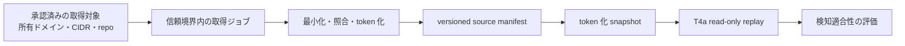

# 外部CTI・ASM取得の開始判定ガイド（将来F1〜F3）

## 1. 目的と現在地

本書は、統合計画 §1.1 の「将来」と §1.2 の F1〜F3 を、安全に実装へ移すための開始判定を定義する。T4a は、信頼境界の外側で作成済みの token 化 snapshot を read-only で評価できる。外部サービス、実組織データ、実ネットワークへの接続はまだ実装・実行しない。

この分離を保つことで、取得側の障害、規約変更、平文情報の混入が、CyberMatch の runner、CI、Evidence Bundle に影響しない。

## 2. 実装の優先順位

| 段階 | 実装対象 | 現時点の判定 | 次の成果物 |
|---|---|---|---|
| F1-A | 取得前ゲート、source profile、手動 token 化 snapshot | 着手可能 | 承認済みsource profile と dry-run 検証 |
| F1-B | Ransomware 掲載情報・HIBP 通知・自組織repoの secret scan の取り込み | 承認後 | 信頼境界内の source 別 importer |
| F2 | 所有権確認済み外部資産の発見・到達性点検 | F1 の運用記録後 | ASM observation/binding adapter |
| F3 | OpenCTI/MISP等からの STIX 変換 | F2 のデータ量・運用負荷を見て判断 | STIX one-way adapter |

F1 は取得元を増やすことより、入力最小化と再現可能な provenance を確立することを優先する。したがって、最初の実装単位は source ごとのネットワーク client ではなく、**承認済みの設定だけを受理する取得前ゲート**とする。

## 3. F1-A: 取得前ゲートの必須入力

取得ジョブを有効化する前に、source profile に次の値を記録し、レビューする。値が欠ける profile は dry-run 以外で使用しない。

| 項目 | 必須内容 | 理由 |
|---|---|---|
| `source_id` / `source_version` | 取得元と変換器の識別子 | provenance と再現性 |
| `approved_owner` | 承認責任者または承認記録への参照 | 権限の確認 |
| `allowed_targets` | 所有確認済み domain、CIDR、repository の完全一致一覧 | 部分一致・第三者対象を防ぐ |
| `collection_purpose` | DLS、漏洩通知、secret scan、ASMのいずれか | 目的外利用を防ぐ |
| `terms_reviewed_at` / `rate_limit` | 規約確認日、呼出上限、再配布条件 | 無償枠・規約の変更に対応 |
| `egress_allowlist` | 接続先の hostname と通信方式 | 任意の外向き通信を防ぐ |
| `credential_reference` | secret manager の参照名のみ | API key を設定・成果物へ保存しない |
| `retention_days` | raw、一時データ、token 化 snapshot の保持期間 | 最小保持 |
| `normalization_version` / `identity_key_version` | token 化規則と鍵版 | T4a manifest との整合 |
| `operator_review_required` | true 固定 | 最初の本番取込を人手確認する |

profile、取得ログ、Evidence Bundle のいずれにも、メールアドレス、credential 値、secret の digest、認証 header、取得元からの生本文を残さない。

## 4. source 別の最小化方針

| source 種別 | 許可する入力 | snapshot に渡せる値 | 禁止・既定無効 |
|---|---|---|---|
| DLS の公開インデックス | 承認済み domain の完全一致照合 | source ref、観測時刻、matched/ambiguous、token 化 domain ref | Tor/DLSへの直接接続、組織名の部分一致による matched |
| 漏洩通知 | ドメイン所有権を確認した通知 | HMAC identity ref、credential kind、利用可能時刻 | password、cookie、session、漏洩本文、通知メール原文 |
| 自組織repoの secret scan | ローカル clone または承認済みCI checkout | rule ID、鍵種別、repo/ref の token、検出時刻 | secret 値/digest、第三者repo、live verification |
| ASM | 所有確認済み endpoint/CIDR | token 化 asset ref、露出状態、根拠種別、確認時刻 | 未承認宛先のscan、侵害的template、推測を confirmed とすること |

## 5. F1-B の受入条件

source 別 importer は、以下をすべて満たすまで有効化しない。

1. source profile が §3 の必須項目を満たし、人手レビュー済みである。
2. 外向き通信先が `egress_allowlist` と完全一致し、target が `allowed_targets` と完全一致する。
3. raw 応答は信頼境界内の短期作業領域だけに存在し、正常時・異常時ともに snapshot とログへ流出しない。
4. 変換結果が T4a source manifest と snapshot schema の検証を通る。
5. `matched` は一意識別子の一致だけで決まり、部分一致は `ambiguous` または除外となる。
6. token 化前後の件数、除外理由、source version、取得時刻を監査可能な集計として記録する。
7. CI は importer を起動せず、合成 fixture と既存 T4a replay だけを実行する。

最初の運用は「一回の手動実行 → snapshot のレビュー → T4a replay」の順に限定する。定期実行、通知、外部送信は、この一回の結果と規約確認をレビューしてから別途承認する。

## 6. F2/F3 へ進む判断

F2 は、F1-B で token 化・保持期限・誤一致の監査が安定してから検討する。ASM scan は、対象の所有権、許容するポート・template、実行時間帯、停止手順を source profile より詳細な scan profile として承認する必要がある。

F3 は、複数 source の手作業統合が継続的な負荷になった場合だけ導入する。STIX から CyberMatch 契約への変換は一方向とし、外部feedの score や真偽をそのまま priority/truth として扱わない。原文 STIX は T4a の入力にも Evidence Bundle にも含めない。

## 7. 未決定事項と必要な承認

実取得へ移るには、次を利用者側で決定する必要がある。

- 対象にできる所有 domain、CIDR、repository の完全一覧と承認責任者
- 使用を許可する source、アカウント/API credential の管理場所、規約確認の担当
- raw 作業領域、token 化鍵、snapshot 保管先、保持・削除手順
- 実行頻度、障害時の停止・連絡先、通知先
- F2 で許可する検査範囲と緊急停止の手順

これらが決まるまでは、F1-A の dry-run、合成 fixture、T4a replay までを実施範囲とする。
