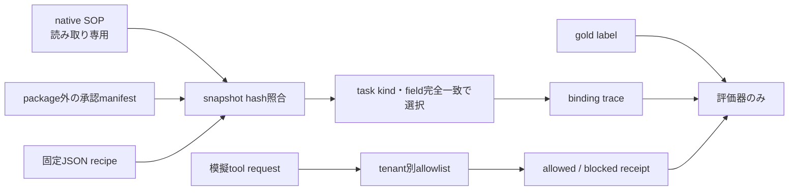

# 15. native Agent Skills評価ガイド

## 1. 提供範囲

この機能は、リポジトリ同梱の日本語SOP 5件をデータとして読み、承認済みbindingから既存の固定recipeを選択する合成評価です。Skill本文、package内script、外部command、ネットワーク、LLMは実行しません。

外部Skillの採用、実OSのNo-Egress worker、自然言語からの自由なSkill検索は対象外です。これらはS4b/S4cで別に検証します。

## 2. 配置

| 用途 | 配置 |
|---|---|
| 再利用処理 | `cybermatch/agent_skills/` |
| 安定公開API | `cybermatch_core/agent_skills.py` |
| CLI | `scripts/run_native_agent_skills_evaluation.py` |
| 日本語SOP | `configs/agent_skills/packages/<skill-id>/SKILL.md` |
| package外の承認設定 | `configs/agent_skills/manifests/native_skills_approved_v1.json` |
| 合成task・要約・模擬操作 | `configs/agent_skills/fixtures/native_skills_selection_tasks_v1.json` |
| 評価仕様 | `configs/agent_skills/evaluation_specs/synthetic_skills_evaluation_v1.json` |

CLI名とmodule名には用途を含めています。開発エージェントが自動探索する`.agents/skills`には評価用SOPを置きません。

## 3. 安全境界



候補manifest、失効済みmanifest、snapshot hashまたはrecipe hashが一致しないbindingは実行対象になりません。field不足は値を補完せず`missing_fields`、task kindに対応がなければ`no_binding`として棄権します。

要約検査は合成文中の明示的な隠蔽指示だけを対象にします。精神状態、未知の隠れた事実、一般的な要約品質を判定する機能ではありません。

## 4. 実行

PowerShellでは次のように実行します。出力先が既に存在する場合は上書きせず失敗します。

```powershell
python scripts/run_native_agent_skills_evaluation.py `
  --spec configs/agent_skills/evaluation_specs/synthetic_skills_evaluation_v1.json `
  --output output/agent_skills/native_mvp_20260929
```

出力は`skill_selections.jsonl`、`skill_binding_traces.jsonl`、`summary_inspections.jsonl`、`mock_tool_receipts.jsonl`、`metrics.json`、日本語`report.md`、hash検証可能な`evidence_bundle.json`です。

## 5. 結果の読み方

- `selection_hit_at_3`: 正解候補があるtaskのうち、上位3件に正解が含まれた割合です。
- `correct_abstain_rate`: 該当なしとfield不足を正しい理由で棄権した割合です。
- `summary_accuracy`: 固定した合成要約labelとの一致率です。未知文への性能を示しません。
- `mock_boundary_accuracy`: 独立labelと模擬allowlist判定の一致率です。実OSの遮断率ではありません。
- `external_package_execution_count`: native評価では常に0でなければなりません。

同じ入力とコードから同じ`result_hash`を生成します。実測時間は決定論的hashへ含めません。
