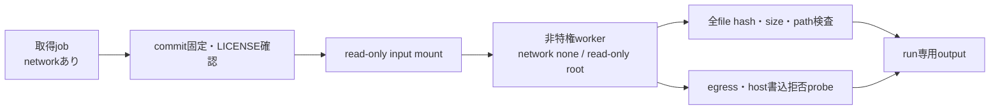

# 16. 外部Agent Skills S4b審査・No-Egress検証ガイド

## 1. 結論と対象範囲

S4bでは、コミュニティ管理の`mukul975/Anthropic-Cybersecurity-Skills`から代表8件を固定revisionで審査します。このリポジトリはAnthropic公式製品ではありません。取得処理と検証workerを分離し、worker内では外部Skillのscript、command、importを実行しません。

固定条件:

| 項目 | 値 |
|---|---|
| source | `https://github.com/mukul975/Anthropic-Cybersecurity-Skills` |
| revision | `54a798831d2266a3ca61ce68a7acb80b81160d57` |
| license | Apache-2.0 |
| LICENSE SHA-256 | `a941b58ef0ba43a31e24ae7ece1b743a585efed9e37792b9ca063e0798be1cbe` |
| package数 | 8 |
| execution mode | `recipe_only` |

## 2. 判定

5件はlicenseとsnapshotを確認した`reviewed_not_bound`、3件は`excluded`です。既存CyberMatch recipeとの意味的同値性を人手で確認できていないため、外部binding数は0です。静的risk signalがないことを自動承認条件にはしません。

除外理由には、credentialの外部検証、外部install command、未固定model依存、Tor／hidden service、外部network必須の手順が含まれます。詳細は`configs/agent_skills/external_review/s4b_external_candidates_v1.json`と生成される`report.md`を参照してください。

## 3. 処理境界



worker条件は`--network none`、read-only root、capability全削除、`no-new-privileges`、非特権UID、input read-only、output専用mountです。cloud credentialを渡しません。worker imageはnetwork遮断前に取得し、worker内ではpackage installしません。

## 4. ローカル審査

外部sourceを固定revisionへcheckoutした後、次を実行します。

```powershell
python scripts/review_external_agent_skills.py `
  --source-root tmp/anthropic-cybersecurity-skills-full `
  --output output/agent_skills/s4b_external_review
```

ローカル審査はhash・license・静的signalを確認しますが、Windows host上で直接実行しただけではread-only mountを証明しません。`sandbox_probe.json`の`passed=true`はLinux container workerで全拒否条件を実測した場合だけ記録されます。

## 5. Linux CI

`.github/workflows/ci.yml`の`agent-skills-linux-s4b` jobは次を実施します。

1. native Agent Skillsの試験と評価をUbuntuで実行する。
2. worker外で固定commitだけを取得する。
3. 8 packageのsnapshotとlicense hashを検査する。
4. networkなし・read-only・非特権containerで拒否probeを行う。
5. `linux_execution_record.json`、`sandbox_probe.json`、審査reportとEvidence Bundleをartifactへ保存する。

workflowが成功して初めてLinux CIと実OS境界の受入を完了扱いにします。workflow定義の追加だけを実行成功とは扱いません。

## 6. 制約

- hash一致は改変検知であり無害性の証明ではありません。
- Apache-2.0の確認は対象revisionと対象fileに限ります。将来revisionは再審査します。
- `reviewed_not_bound`は実行承認ではありません。
- 外部script実行、外部APIアクセス、credential検証、本番操作はS4bでも禁止します。
