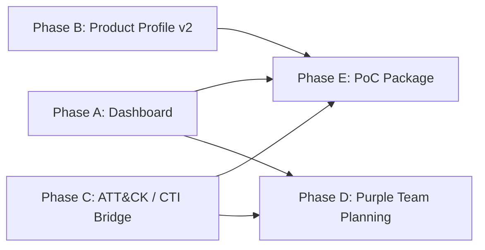

# CyberMatch Business Implementation Plan

作成日: 2026-07-09

## 1. 目的

CyberMatchを、研究用シミュレータから「セキュリティ製品・防御戦略の評価および提案支援ツール」へ段階的に実装拡張する。

初期の商用化ターゲットは、エンドユーザー企業の本番SOC運用ではなく、以下のような提案・評価を行う側に置く。

- セキュリティベンダー
- SIer
- MSSP
- セキュリティコンサルティング会社
- Purple Team / 演習設計チーム

初期ICP (Ideal Customer Profile) は、全セグメントを同時に狙わず、次の2つに絞る。

| 優先度 | ICP | 購買・利用動機 | 主な利用者 | MVPで刺すポイント |
| --- | --- | --- | --- | --- |
| Primary | セキュリティベンダー / SIerのプリセールス | 提案前に製品・防御策の有効性を説明したい | SE、プリセールス、ソリューションアーキテクト | 製品比較、提案レポート、5分デモ |
| Secondary | Purple Team / セキュリティコンサル | 演習やアセスメントの事前仮説を作りたい | 演習リーダー、コンサルタント | 攻撃者経路、デコイ効果、演習計画 |

MSSPや本番SOC運用者は将来候補とするが、MVPの主要ICPには置かない。理由は、継続運用・顧客別SLA・ログ連携・責任分界の設計が重く、初期プロダクトの検証速度を落とすためである。

最初の価値仮説は次の通り。

```text
CyberMatchは、製品や防御戦略が攻撃者のミッション達成率、信頼、経路選択、無駄行動、撤退にどう影響するかを、導入前に比較評価できる。
```

## 2. 市場上の位置づけ

CyberMatchは、Agentic AIランタイムの実行時ガードレール、MCP/skill scanner、prompt inspection、tool call blockingを主戦場にしない。

DefenseClawのようなツールは、AIエージェント実行環境に対して、実行前スキャン、実行時検査、policy enforcement、監査証跡を提供する。これは「AIエージェントを安全に動かす」ための実行時統制レイヤである。

CyberMatchはそこから距離を取り、次の領域に特化する。

```text
導入前・提案前・演習前に、防御策が攻撃者行動をどう変えるかを比較する意思決定シミュレーション。
```

## 3. 直接競合・隣接領域との差分

DefenseClaw系との差分に加え、CyberMatchはBAS、Threat Modeling、ATT&CK評価、サイバーレンジとも位置づけを分ける。

| 領域 | 代表例 | 主な価値 | CyberMatchとの差分 |
| --- | --- | --- | --- |
| BAS (Breach and Attack Simulation) | AttackIQ, SafeBreach, Cymulate | 実環境または検証環境で攻撃手順を再現し、制御の有効性を検証する | CyberMatchは実環境へ攻撃を流さず、導入前にモデルベースで製品・戦略を比較する |
| Threat Modeling | STRIDE, Microsoft Threat Modeling Tool | 設計段階で脅威を列挙し、対策を検討する | CyberMatchは静的な脅威列挙ではなく、攻撃者ミッションと意思決定アウトカムを時系列に評価する |
| MITRE ATT&CK Evaluations | MITRE ATT&CK Evaluations | ベンダー製品の検知・防御挙動を標準的なAPTエミュレーションで観測する | CyberMatchは製品認証をしない。自社仮説・提案条件に基づく比較シミュレーションを行う |
| サイバーレンジ / 演習基盤 | ZANSIN, Hack The Box for Business | 実践演習、スキルトレーニング、攻防体験 | CyberMatchは演習そのものではなく、演習前の仮説作成と演習後の校正に使う |

CyberMatchの商用上の短い説明は次の通り。

```text
BASが「実環境で試す」ための道具なら、CyberMatchは「試す前に、どの製品・戦略を試すべきかを絞る」ための道具である。
```

## 4. 差別化方針

| 観点 | Agentic AI Guardrail系 | CyberMatch |
| --- | --- | --- |
| 主対象 | AIエージェント実行環境 | セキュリティ製品・防御戦略 |
| タイミング | 実行時 | 導入前・提案前・演習前 |
| 主要機能 | scan / inspect / block / audit | simulate / compare / explain / report |
| 判断単位 | prompt, completion, tool call, skill, MCP | attacker mission, product profile, topology, defense strategy |
| 出力 | allow / alert / block / audit log | mission success, trust loss, path shift, waste, retreat, ROI-style report |
| 初期顧客 | AI agent運用者、DevSecOps | ベンダー、SIer、MSSP、コンサル、Purple Team |

## 5. MVPスコープ

MVPは既存のPhase6/Phase7資産に合わせて、Product Evaluationに限定する。

### 5.1 MVPが答える問い

```text
どの製品プロファイルが、どの攻撃者ミッションに対して、どの意思決定アウトカムを変えたか。
```

### 5.2 MVP対象製品クラス

- Baseline (比較基準であり、製品ではない)
- IDS
- IPS
- Honeypot
- Deception
- XDR

### 5.3 MVP対象ミッション

既存のmission-aware product evaluationに合わせる。

- profit
- achievement
- persistence
- critical-hunter

### 5.4 MVP対象トポロジ

既存のTopology Libraryを利用する。

- financial enterprise
- hospital enterprise
- OT factory
- cloud-native startup
- small business

### 5.5 MVP対象外

- 実製品APIとの接続
- ベンダー認証、製品認定
- 本番SOCでのリアルタイム推奨
- LLM runtime guardrail
- MCP/skill scanner
- prompt injection detector
- tool call blocker
- RL/LLM runtime依存

## 6. 実装フェーズ

Phase AからEは完全な直列ではない。Phase AはMVPデモの中核だが、Phase BとPhase Cは並行して進められる。



### Phase A: 営業デモとして使えるProduct Evaluation Dashboard

目的: 既存GUIを、技術検証画面から提案・評価デモ画面へ寄せる。

#### A-1. Run設定の実効化

現状の制約として、GUI上ではmission/product選択が見えていても、runner側は組み込み評価セットを実行している。これをMVP上の選択と実行内容が一致する状態にする。

成果物:

- GUI選択値をrunnerに渡す実行API
- selected scenario / topology / mission / productの実行ログ
- 選択値を含む再現可能なrun manifest

受け入れ条件:

- GUIで1ミッションだけ選んだ場合、出力CSV/JSONもそのミッションだけになる。
- GUIで製品を3つ選んだ場合、比較表もその3製品だけになる。
- 実行結果に入力条件が保存される。

#### A-2. 提案向け結果ページ

既存の結果表示を、営業・提案・評価会議で説明しやすい構造にする。

成果物:

- executive summary cards
- product x mission comparison
- best fit / weak fit explanation
- attacker outcome delta panel
- report download

主要メトリクス:

- mission success delta
- evaluation score
- trust / confidence delta
- deception waste
- path shift
- retreat contribution
- mission variance

受け入れ条件:

- 1画面で「この製品はどのミッションに強く、どこに弱いか」が説明できる。
- 数値だけでなく、解釈文が表示される。
- Markdown/CSV/JSONで結果をダウンロードできる。

#### A-3. デモ用シナリオパッケージ

営業・PoCで使う固定デモを整備する。

成果物:

- `demo_vendor_comparison.json`
- `demo_deception_value.json`
- `demo_xdr_vs_deception.json`
- `demo_ot_factory_defense.json`
- `demo_healthcare_critical_asset.json`

受け入れ条件:

- 各デモは5分以内で実行できる。
- デモごとに「説明すべき結論」がREADMEに書かれている。
- GUIからワンクリックで選択できる。

### Phase B: Product Profileを提案支援に使える粒度へ拡張

目的: サンプル製品プロファイルを、提案比較に耐える入力形式へ近づける。

#### B-1. Product Profile Schema v2

現在の軽量profileを拡張し、製品カテゴリだけでなく、効く攻撃段階、得意ミッション、コスト、制約を表現する。

追加候補フィールド:

- `covered_tactics`
- `covered_targets`
- `mission_affinity`
- `detection_strength`
- `prevention_strength`
- `deception_strength`
- `response_latency`
- `operational_cost`
- `deployment_friction`
- `confidence_effect`
- `trust_effect`

受け入れ条件:

- 既存v1 profileを壊さず読み込める。
- v2 profileのvalidateテストがある。
- GUIで主要属性を確認できる。

#### B-2. Product Comparison Report

製品評価結果から、提案書に流用できるレポートを生成する。

成果物:

- `PRODUCT_COMPARISON_REPORT.md`
- executive summary
- product fit matrix
- mission-specific recommendation
- assumptions and limitations
- non-certification disclaimer

受け入れ条件:

- レポート単体で評価条件、結果、注意事項が読める。
- 「製品認証ではない」ことが明示される。

### Phase C: ATT&CK / CTI Bridge

目的: CyberMatchを一般的なTTP文脈と接続し、説明可能性と導入しやすさを上げる。

#### C-1. ATT&CK Mapping Layer

CyberMatchのmission / target / strategy / behaviorを、ATT&CK tactics / techniquesに対応づける辞書を作る。

成果物:

- `docs/CYBERMATCH_ATTACK_MAPPING.md`
- `data/attack_mapping.json`
- mapping loader
- mapping validation tests

受け入れ条件:

- 既存ミッションから関連TTPを表示できる。
- TTPから候補ミッション・ターゲットを逆引きできる。
- GUIの結果画面で関連TTPを表示できる。

#### C-2. CTI-to-Scenario Draft

CTIレポートや脅威メモから、CyberMatch用シナリオ草案を作る半自動フローを作る。

初期実装はLLM必須にしない。まずはYAML/JSONテンプレートと手動レビュー前提にする。

受け入れ条件:

- 入力TTPリストからscenario draftを生成できる。
- 生成結果にはhuman review requiredが明示される。
- GUIには直接自動投入せず、レビュー済みscenarioのみ実行する。

### Phase D: Purple Team / ZANSIN連携の軽量化

目的: CyberMatchのシミュレーション結果を、演習前後の意思決定に使える形にする。

#### D-1. Exercise Pre-Planning Report

CyberMatchの出力から、Purple Team演習の事前仮説を生成する。

成果物:

- likely attacker path
- likely decoy interaction
- priority detection points
- expected defense effect
- evaluation checklist

受け入れ条件:

- ZANSIN等の実環境演習なしでもレポートが生成できる。
- 演習後に実測結果を手入力で比較できる。

#### D-2. Manual Calibration Import

演習後の結果をCSV/JSONで取り込み、CyberMatch側の評価パラメータを校正する。

受け入れ条件:

- attack success / failure
- time to compromise
- detection timing
- defender response timing
- 上記の値を取り込み、run manifestまたはcalibration historyに紐づけられる。

### Phase E: 有償PoCパッケージ化

目的: 実装成果を、外部説明・評価・契約前PoCに使える形にまとめる。

成果物:

- demo guide
- sample reports
- limitation statement
- pricing hypothesis memo
- customer interview script
- PoC checklist

想定PoCメニュー:

1. Product Fit Simulation
2. Deception Placement Value Simulation
3. Mission-aware XDR / Deception / Honeypot Comparison
4. OT / Healthcare / Finance Scenario Assessment
5. Purple Team Pre-Exercise Planning

## 7. 信頼性・Validation方針

有償PoCでは「この結果はどの程度信頼できるのか」という質問が必ず出る。CyberMatchは実環境での侵害可否を証明するものではなく、明示した仮定条件の下での比較シミュレーションである。この前提を保ちつつ、信頼性を説明するために次の仕組みを追加する。

### 7.1 Validation Strategy

- 既存の標準ベンチマークを継続的に実行し、結果の再現性を確認する。
- 公開されている代表的な攻撃ストーリーやATT&CKベースのTTP列を使い、シナリオ結果が直感・既知知見と矛盾しないかを確認する。
- ZANSINやPurple Team演習の結果が得られる場合、attack success、time to compromise、detection timingを使ってパラメータを校正する。

### 7.2 Confidence Level表示

レポートには、結果の確信度を数値またはラベルで表示する。

| Confidence | 条件 |
| --- | --- |
| High | 複数seedで分散が小さく、入力topology/product profileが十分具体的で、過去の校正データがある |
| Medium | 複数seedで結果は安定しているが、product profileまたはtopologyが抽象的 |
| Low | 単一seed、未校正profile、または仮定が多い |

### 7.3 Calibration History

Phase D-2で取り込む校正データは、レポートに履歴として表示する。

- calibration source
- date
- scenario
- observed outcome
- changed parameters
- reviewer

校正前の初期状態では、レポートに `uncalibrated model` と明示する。

## 8. 優先順位

| 優先度 | 項目 | 理由 |
| --- | --- | --- |
| P0 | GUI選択値とrunner実行内容の一致 | MVPの信頼性に直結する |
| P0 | Product comparison report | 商用デモで最も使いやすい成果物 |
| P1 | Demo scenario package | 顧客説明の再現性を作る |
| P1 | Product Profile Schema v2 | 製品比較の説得力を上げる |
| P2 | ATT&CK mapping | 市場の共通語に接続する |
| P2 | Purple Team pre-planning | 差別化を強化する |
| P3 | ZANSIN closed-loop | 強力だが初期MVPには重い |
| P3 | LLM/RL agent evaluation | 研究価値は高いが初期商用化からは遠い |

## 9. 30/60/90日ロードマップ

### 30日

- GUI選択値をrunnerに反映
- 3つのデモシナリオを追加
- Product comparison reportをMarkdownで生成
- 結果画面のexecutive summaryを改善

### 60日

- Product Profile Schema v2を追加
- mission-aware explanationを改善
- demo guideを作成
- 顧客ヒアリング用の資料を整備

### 90日

- ATT&CK mappingの初期版を追加
- Purple Team pre-planning reportを追加
- 有償PoCメニューを整理
- 2-3社にデモ可能な状態へ持っていく

## 10. リスクと前提条件

### 10.1 前提条件

- 開発者1名を主担当とし、必要に応じてレビュー担当1名がドキュメントとデモを確認する。
- 30日ロードマップは既存Phase6/7資産を活用する前提である。
- 実製品連携、外部API連携、本番SOCログ連携はMVPに含めない。
- デモ対象はPrimary ICPに寄せ、MSSPや本番SOCの要求は後続フェーズで扱う。

### 10.2 主なリスク

| リスク | 影響 | 対応 |
| --- | --- | --- |
| GUI選択値とrunnerの結合が想定より複雑 | 30日MVPが遅れる | 先にCLIベースのselection overrideを作り、GUIは薄く呼び出す |
| Product Profileの抽象度が高すぎる | 顧客が結果を信用しにくい | Schema v2でassumptionsとconfidenceを明示する |
| Topology Libraryが提案デモに不足 | 業種別デモの説得力が落ちる | Primary ICP向けの3デモに絞って補強する |
| シミュレーション結果の妥当性を問われる | 有償PoCに進みにくい | Validation Strategy、Confidence、Calibration Historyを出す |
| BASツールと混同される | ポジショニングがぼやける | 「実環境検証前の比較・絞り込み」と説明する |

## 11. 実装上の注意

### 11.1 誇張表現を避ける

CyberMatchは実製品の認証ツールではない。以下の表現は避ける。

- 「この製品が最強」
- 「この製品で侵害を防げる」
- 「実環境での効果を証明」
- 「ベンダー認証」

推奨表現:

- 「この仮定条件では」
- 「この攻撃者ミッションでは」
- 「この製品プロファイルでは」
- 「意思決定アウトカムにこういう差が出た」

### 11.2 ランタイムAI防御に寄せすぎない

以下は初期商用化スコープから外す。

- prompt injection blocking
- tool-call inspection
- MCP/skill admission control
- agent sandbox enforcement
- LLM gateway proxy

これらはDefenseClaw系の主戦場であり、CyberMatchの差別化軸ではない。

### 11.3 評価条件の透明性を重視する

結果画面とレポートには必ず以下を含める。

- scenario
- topology
- mission
- product profile
- assumptions
- random seed
- metrics definition
- limitations

## 12. 成功指標

### 技術指標

- GUIから選択した条件と出力結果が一致する。
- 標準デモが5分以内に完走する。
- Product comparison reportが自動生成される。
- 既存テストが維持される。

### ビジネス指標

- 非開発者がデモを理解できる。
- 1回のデモで「どの製品がどのミッションに効くか」を説明できる。
- SIer/ベンダー向け有償PoCの提案書に転用できる。
- DefenseClaw系ツールと比較して、ランタイム防御ではなく事前評価ツールだと説明できる。

### 定量KPI

| 指標 | 30日 | 60日 | 90日 |
| --- | --- | --- | --- |
| デモ実施回数 | 社内2回 | 外部含む3回 | 5回以上 |
| デモ完走率 (5分以内) | 80%以上 | 95%以上 | 100% |
| デモ後の興味表明率 | - | 50%以上 | 50%以上 |
| 有償PoC打診数 | - | - | 1件以上 |
| レポート自動生成後の手動修正率 | - | 30%以下 | 10%以下 |
| run manifest保存率 | 100% | 100% | 100% |

## 13. 次の実装着手順

| 順序 | 作業 | Estimate | 備考 |
| --- | --- | --- | --- |
| 1 | `apps/streamlit_app.py` のmission/product選択値の流れを確認する | 0.5d | 現状調査 |
| 2 | runnerにselection overrideを渡せる薄いAPIを追加する | 1.5d | 先にCLIで検証 |
| 3 | `scripts/run_scenario.py` とPhase6 runnerの入力仕様を揃える | 1.0d | 既存互換を維持 |
| 4 | `output/` にrun manifestを保存する | 0.5d | 再現性の中核 |
| 5 | Results画面をmanifest-awareにする | 1.0d | 表示条件の明確化 |
| 6 | Product comparison report generatorを追加する | 1.5d | Markdown出力 |
| 7 | デモシナリオを3本追加する | 1.0d | Primary ICP向け |
| 8 | テストとsmoke profileを更新する | 1.0d | 回帰確認 |
