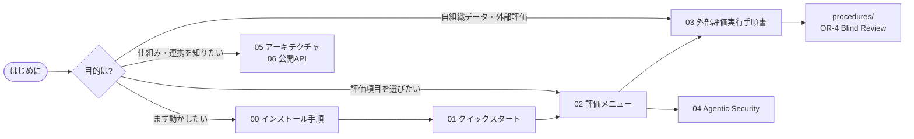

# CyberMatch ドキュメント案内

CyberMatch Framework のドキュメントは、**「何をしたいか」から読む場所が決まる**ように並べています。
番号順に読めば、試す → 評価する → 仕組みを理解する の順に進めます。

## 読者別のおすすめルート

| 読者 | 最初に読む | 次に読む |
|---|---|---|
| 初めて触る人・デモ担当 | [00 インストール手順](00_installation.md) → [01 クイックスタート](01_quickstart.md) | [02 評価メニュー](02_evaluation_menu.md) |
| 防御製品・防御策を比較評価したい人 | [02 評価メニュー](02_evaluation_menu.md) | [../scenarios/demos/README.md](../scenarios/demos/README.md) |
| 外部評価者・共同研究者 | [03 外部評価実行手順書](03_external_evaluation_guide.md) | [08 用語集](08_glossary.md) |
| AIエージェントの安全性を評価したい人 | [04 Agentic Security](04_agentic_security.md) | [02 評価メニュー](02_evaluation_menu.md) の `agentic` / `resilience` |
| 開発者・システム連携担当 | [05 アーキテクチャ](05_architecture.md) | [06 公開API方針](06_public_api.md)、[07 依存関係方針](07_dependency_policy.md) |
| LLM説明機能のレビュー担当 | [03 外部評価実行手順書](03_external_evaluation_guide.md) 8章 | [OR-4 Blind Human Review 手順書](procedures/or4_blind_human_review_20260915.md) |

## 文書一覧

| # | 文書 | 内容 | 想定読者 |
|---|---|---|---|
| 00 | [インストール手順](00_installation.md) | 前提条件、用途別のインストール方式、動作確認、1.x からの更新、トラブル対応 | 全員 |
| 01 | [クイックスタート](01_quickstart.md) | 環境構築から最初の評価・結果確認まで(約15分) | 全員 |
| 02 | [評価メニュー](02_evaluation_menu.md) | 8つの評価レーンの「問い・コマンド・出力・読み方」、入力資産の一覧 | 評価者 |
| 03 | [外部評価実行手順書](03_external_evaluation_guide.md) | 同梱replay、HITL pilot、独自telemetry、LLM shadow比較の詳細手順 | 外部評価者 |
| 04 | [Agentic Security 評価](04_agentic_security.md) | 自律エージェントの境界逸脱・脅威情報汚染などの評価モデル | 研究者 |
| 05 | [アーキテクチャ](05_architecture.md) | 層構造、依存方向、Evidence Bundle の流れ | 開発者 |
| 06 | [公開API方針](06_public_api.md) | 安定APIの範囲、互換性・非推奨ルール | 連携開発者 |
| 07 | [依存関係方針](07_dependency_policy.md) | extras構成、lockファイルの運用 | 開発者 |
| 08 | [用語集](08_glossary.md) | Evidence Bundle、SUT、HITL、evidence class などの用語 | 全員 |
| 09 | [対象限定対処の共通基盤](09_scoped_response_guide.md) | C0のデモ、対処契約、状態遷移、証拠検証、既存形式との互換性 | 開発者・評価者 |
| 10 | [CTI・Skillsの工程・テスト設計](10_cti_skills_implementation_plan.md) | 実装状況、T0/S0の設計入力、受入条件、次の実装単位 | 開発者・レビュー担当 |
| 11 | [CTI・ASM文脈ハンティング（T2）](11_cti_asm_context_hunting_guide.md) | CTI/ASM相関、priority計算、仮説と調査予算、Finding trace、CLIと出力の読み方 | 開発者・評価者・レビュー担当 |
| 12 | [能動防御・閉ループ評価（T3）](12_active_defense_closed_loop_evaluation_guide.md) | 4モード比較、ログ欠損、状態付き模擬世界、identity限定対処、paired評価 | 開発者・評価者・レビュー担当 |
| 13 | [Token化replay・任意接続（T4a／T4b）](13_tokenized_replay_and_optional_integration_guide.md) | replay data quality、検知適合性、attacker結果通知、shadow Pilot、独立UI | 開発者・評価者・レビュー担当 |
| 14 | [外部CTI・ASM取得の開始判定（将来F1〜F3）](14_external_cti_asm_acquisition_readiness.md) | 取得前ゲート、信頼境界、source別の最小化、実取得へ進む承認条件 | 運用設計者・開発者・レビュー担当 |
| 15 | [native Agent Skills評価](15_native_agent_skills_evaluation_guide.md) | 承認済みbinding、決定論的選択、要約検査、模擬tool境界、評価CLI | 開発者・評価者・レビュー担当 |
| 16 | [外部Agent Skills S4b審査](16_external_agent_skills_s4b_guide.md) | 固定source、license審査、hash allowlist、No-Egress worker、Linux CI | 開発者・セキュリティレビュー担当 |
| - | [対象限定対処の設計判断記録](procedures/scoped_response_contract_decisions.md) | C0の契約・証拠・時刻・既存形式との互換性に関する判断 | 開発者・レビュー担当 |
| - | [procedures/OR-4 Blind Human Review](procedures/or4_blind_human_review_20260915.md) | 2026-09-15実施分のLLM説明候補ブラインド評価手順(記録) | レビュー担当 |

## リポジトリ内のその他のガイド

| 場所 | 内容 |
|---|---|
| [../README.md](../README.md) / [../README_JP.md](../README_JP.md) | プロジェクト概要(英語 / 日本語) |
| [../scenarios/demos/README.md](../scenarios/demos/README.md) | GUIデモ(製品比較・Deception・OT)の実演手順 |
| [../pilots/phase3/PILOT_INTAKE_TEMPLATE.md](../pilots/phase3/PILOT_INTAKE_TEMPLATE.md) | 外部pilot受付・承認記録テンプレート |
| [../models/local_llm/README.md](../models/local_llm/README.md) | ローカルLLM(Qwen2.5)の配置場所と検証値 |
| [../fuzzing/corpus/README.md](../fuzzing/corpus/README.md) | ファジング用シードコーパスの扱い |
| [../fuzzing/allowlists/README.md](../fuzzing/allowlists/README.md) | 外部コマンド実行の許可リスト条件 |

> **補足:** `docs/` 直下にある `CYBERMATCH_*.md` などのファイルは、開発過程の計画・報告資料であり Git 管理外です。
> 評価者向けの正式な文書は、上の表に載っているものだけです。
