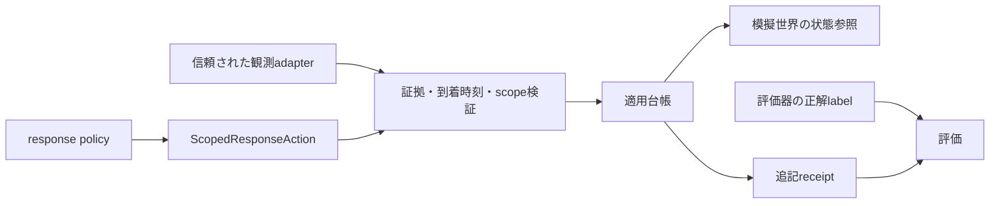

# 設計判断記録: 対象限定対処の共通契約と適用台帳

- 日付: 2026-09-26
- 状態: 共通C0を実装。実装者による契約・回帰テストを実施
- 関連計画: CTI・ASM統合ハンティングv2.0／Agent Skills検証評価v2.0
- 利用手順: [対象限定対処の共通基盤](../09_scoped_response_guide.md)

## 1. 背景

既存feedbackはnodeとedgeを持ちますが、identity単位の対象やrun/tenantを保持しません。既存schemaにfieldを追加すると、過去成果物のcanonical hashや呼出契約を変える可能性があります。

両拡張が独自の対処要求を持つと、同じidentity失効について時刻・対象・冪等性の意味が分かれます。そのため、共通契約と適用状態を共有し、拡張runnerだけから使う構成を採用しました。

## 2. 採用した判断

| 判断 | 内容 | 根拠 |
|---|---|---|
| 独立契約 | `ScopedResponseAction / ResponseReceipt` v1.0を追加 | 旧feedbackのwireを変更しない |
| 型とworkflowの分離 | 型はcontracts、台帳はthreat_hunting | contractsからFinding/engineへ依存しない |
| 対象必須 | 空配列拒否、actionとscopeの組合せ固定 | 暗黙の全対象操作を防ぐ |
| 次stepから適用 | requestedより後にeffective、半開区間 | 同stepの操作を後から取り消さない |
| 到着時刻を検査 | event.stepとavailable_stepを分離 | 遅延ログからの過去遡及を防ぐ |
| 新規証拠 | Finding IDではなく対象別event IDで延長判断 | 同じ根拠の再包装による無限延長を防ぐ |
| receipt追記 | 状態遷移ごとに不変recordを作る | 要求と効果、期限を区別 |
| 限定変換 | node隔離だけをlegacyへ変換 | 対象・証拠を欠落させない |
| 日本語文書 | 利用手順、ADR、工程表、実行reportを日本語化 | 開発・評価担当者が同じ意味で読める |

## 3. 境界と責務

この図のpolicyはFindingのscoreや業務ルールで対処候補を決めます。C0自体はpolicyの品質を推定せず、policy hashのallowlist、対象、証拠、時刻を検査します。

観測に任意の真値を隠し込む悪意ある同一processのcallerを隔離する設計ではありません。OS隔離は外部Skill workerの別工程です。C0は既知のoracle field混入と因果関係の破綻を検査します。

## 4. 契約の補足決定

v2計画から実装へ移す際、以下を明確化しました。

| 論点 | 決定 |
|---|---|
| action IDに含むfield | action_id以外の全field。reason_codeも意味的fieldとして含める |
| 配列の正規化 | createではsort/deduplicate。wire入力では非canonicalを拒否 |
| clockの飛び越し | 0から1stepずつ。未処理の開始stepを後付け適用しない |
| 冪等再submit | 元の要求時刻と異なる現在stepでも既知IDなら再処理しない |
| 拒否後の再審査 | 同一IDは再審査しない。新しい証拠・時刻で別要求を生成 |
| 複数対象 | 全条件を満たしたときだけ全対象へ適用。部分成功なし |
| 複数Findingのlegacy変換 | 証跡損失が生じるので拒否 |
| 同じ観測の別Finding | 新規証拠と数えない |
| 別対象の新規観測 | 元の対象への期間延長を正当化しない |
| 登録済み観測の変更 | 同IDで内容が変われば拒否 |

### 4.1 状態遷移の検証表

| 初期状態 | 入力 | 次状態 | receipt |
|---|---|---|---|
| 未登録 | 型不正 | 未登録 | 例外、成功扱いにしない |
| 未登録 | 有効契約だが対象等不一致 | rejected | 効果時刻null、対象空 |
| 未登録 | 検証合格 | pending | まだ作らない |
| pending | 効果開始step | applied | 指定の対象・期間 |
| applied | 有効期間内の再submit | applied | 既存receiptを返すだけ |
| applied | 終了step | expired | 元の適用期間を参照 |
| expired | 同じID再submit | expired | 既存receiptを返すだけ |

## 5. 検討した代替案

| 代替案 | 採用しなかった理由 |
|---|---|
| 旧feedbackへidentity field追加 | 既存hash・schemaの互換性に影響 |
| 空subjectを全対象と解釈 | 観測不足時に広範囲へ効果が拡大する |
| Finding IDだけで再発行を判定 | 別recipe・別IDで同じ証拠を再利用できる |
| pendingもreceiptの成功に含める | 効果の未発生を阻止成功と誤計上する |
| request receiptから検知精度を測る | 検知器のgold label・独立評価が必要 |

## 6. 利点と制約

CTIとSkillsは同じ型・時刻・冪等性を再利用でき、旧シナリオの挙動を維持できます。一方、世界状態との接続はそれぞれのrunnerで実装する必要があります。

今回のデモは固定Findingから始まります。新規認証の実処理、session無効化、通信の遮断、attackerの経路変更は未接続です。これらをC0の単体テスト成功から推論しません。

台帳は1回のrunを単一の呼出順で再生するインメモリ実装です。永続化・process間排他・並行submit・入力件数の上限管理は提供しません。利用側runnerはrunの長さと観測件数を制限し、tickを世界操作より前に実行してください。実サービスの高負荷・障害復旧要件に流用する場合は別途設計が必要です。

HMACによる仮名化も、数学的な匿名化保証やすべてのPII混入の物理的排除を意味しません。T1/T4ではfield allowlist・変換・保存範囲のテストを追加します。

## 7. 変更と移行

既存のfeedbackファイルは変更せず、新しいschema registry種別を追加しました。新規ユーザーは`cybermatch_core.contracts`の型、または`cybermatch_core.scoped_response`の台帳・デモを利用します。

共通C0のAPIを変更する場合は、本ADR、schema、fixture、公開API文書、対応テストをまとめて変更します。action IDの意味的payloadを変更する場合は契約version変更が必要です。
