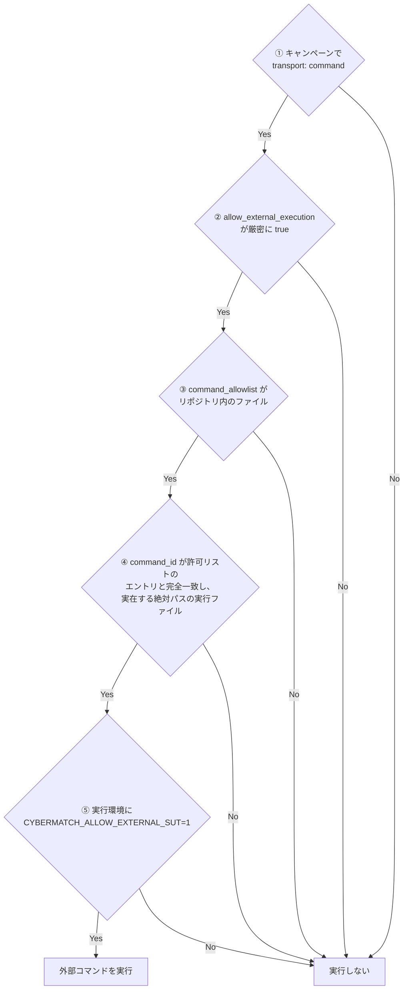

# 外部コマンドの許可リスト

実在の外部SUT(評価対象システム)をコマンドとして実行する機能は、既定で**無効**です。
次の5条件が**すべて**満たされたときだけ実行されます。

| # | 条件 | 設定場所 |
|---|---|---|
| 1 | `transport: command` を選択している | キャンペーン JSON |
| 2 | `allow_external_execution` が厳密に `true` | キャンペーン JSON |
| 3 | `command_allowlist` がリポジトリ内のファイルを指す | キャンペーン JSON |
| 4 | `command_id` が、実在する絶対パスの実行ファイルを持つエントリと完全一致する | 許可リスト JSON |
| 5 | `CYBERMATCH_ALLOW_EXTERNAL_SUT=1` が設定されている | 実行時の環境変数 |

## 実行時の制約

- コマンドは `shell=False` で実行されます(シェルを経由しない)。
- 引数には `{input}` と `{output}` のプレースホルダーを**両方**含める必要があります。
- タイムアウト・実行レート・応答サイズ・リトライ回数に上限が適用されます。
- 外部環境の障害は、製品の検知失敗ではなく `infrastructure_error` または `inconclusive` に分類されます。

> **禁止事項:** 本番環境のエンドポイントや認証情報を許可リストに書かないでください。
