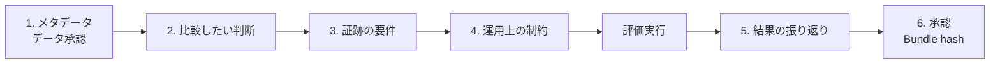

# CyberMatch Phase 3 Pilot 受付記録(テンプレート)

このテンプレートは、人間が参加する pilot の証跡を記録するためのものです。
**特定された参加者が生成物をレビューするまで、pilot を完了扱いにしないでください。**

使い方: このファイルを評価ごとにコピーし(例: `pilot_intake_<pilot-id>.md`)、Git 管理外の承認済み保存先で記入します。
手順全体は [03 外部評価実行手順書 7.1](../../docs/03_external_evaluation_guide.md#71-この経路を使う前の承認) を参照してください。

## 1. Pilot メタデータ

| 項目 | 記入欄 |
|---|---|
| Pilot ID | |
| 実施日 | |
| 参加者の役割(不要な個人情報は書かない) | |
| Evidence class | `replay-backed` / `external-sut-backed` |
| データセットまたは SUT の識別子 | |
| データ利用承認の参照番号 | |

## 2. 比較したい判断

| 項目 | 記入欄 |
|---|---|
| 参加者が下す必要のある判断 | |
| 比較する選択肢 | |
| 必要な確信度と、許容できる不確かさ | |

## 3. 証跡の要件

| 項目 | 記入欄 |
|---|---|
| 必要な成果物 | |
| 必要な来歴情報 (provenance) | |
| 必要なドリルダウン経路 | |
| 評価器のみに留めるべき証拠(正解ラベル等) | |

## 4. 運用上の制約

| 項目 | 記入欄 |
|---|---|
| 許容できる最大実行時間 | |
| データ量の上限 | |
| セキュリティ / プライバシー上の制約 | |
| 環境上の制約 | |

## 5. 結果の振り返り

| 項目 | 記入欄 |
|---|---|
| 参加者は成果物だけで比較結果を説明できたか | `yes` / `no` |
| 不足していた証跡 | |
| 誤解を招く・曖昧な表示 | |
| GUI への改善要望 | |
| フォローアップの担当者と期日 | |

## 6. 承認

| 項目 | 記入欄 |
|---|---|
| 参加者の確認 | |
| 評価者の確認 | |
| Evidence Bundle hash | |
